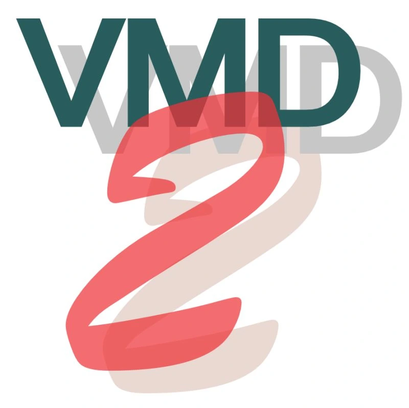

> **系列标签：** `技术文档` · `VMD` · `安装` · `可视化` · `Tachyon` · `POV-Ray` · `macOS` · `Ubuntu` · `Windows`

分子动力学跑完，轨迹 / 静帧常要进 **VMD**（Visual Molecular Dynamics，常用分子可视化软件）看构象、调表示、出出版级图。本文讲 **怎么装**、**怎么从命令行启动**（Mac / Ubuntu），**Windows（含 WSL）该怎么选**，顺带一节 **极简 Tcl**（够读改 `vmd.tcl`），以及 **高级渲染出图**（VMD 自带渲染器、透明背景用 POV-Ray、分辨率与 AO）。

官方下载与说明以 [VMD 主页](https://www.ks.uiuc.edu/Research/vmd/) 为准（需注册后下载；版本号会变）。底座环境见 [Mac与Ubuntu开发环境配置](T19-Mac与Ubuntu开发环境配置.md)；Windows 先看 [WSL2安装与配置](T02-WSL2安装与配置.md)。出图工作流总览见 [从模拟到论文图的工作流](T18-从模拟到论文图的工作流.md)；实战里用脚本出图的例子见 [COF膜-水体系短程模拟与可视化](../02-实战案例/C06-COF膜-水体系短程模拟与可视化.md)。

| 你在哪 | 建议 |
|--------|------|
| **Mac** | 下文第二节：拖 `.app` + 命令行别名 |
| **Ubuntu / 实体机 Linux** | 下文第三节：官方 Linux 二进制 |
| **Windows** | 下文第四节：**装 Windows 原生 VMD**；**不要指望 WSL 里舒服地跑** |
| **透明背景 / 出版静帧 / 调分辨率** | 跳到**第七节**：高级渲染出图 |
| **要改 `vmd.tcl`** | 先看第六节极简 Tcl |



---

## 一、装哪一套？

| 平台 | 推荐安装物 | 命令行入口 |
|------|------------|------------|
| macOS | 官网 **MacOS X** 磁盘镜像里的 **VMD.app** | `open -a …` 或 `…/Contents/MacOS/startup.command` |
| Ubuntu / Linux | 官网 **LINUX** / **LINUXARM64** 等预编译包 | 安装脚本生成的 `vmd` |
| Windows | 官网 **Windows** 自解压安装包 | 开始菜单 / 安装目录下的 `vmd.exe` |
| **WSL 里的 Ubuntu** | **不推荐**把 VMD 当主可视化环境 | 见第四节 |

> **Tips：** VMD 是带 **OpenGL**（实时三维绘图接口）窗口的桌面程序。终端里敲 `vmd` 只是启动器；真正干活的是图形界面（或无头批处理渲染，仍依赖本机/显示相关库）。纯 SSH、无转发、无虚拟显示时，别指望「只装二进制就能在登录节点看轨迹」。

---

## 二、Mac：安装与命令行启动

### 1. 安装

1. 打开 [VMD 下载页](https://www.ks.uiuc.edu/Research/vmd/)，注册后下载 **MacOS** 对应版本（Apple Silicon 选 ARM 包；Intel 选 x86）。  
2. 打开 `.dmg`，把 **VMD\*.app** 拖进 **`/Applications`**。  
3. 首次从访达打开若被拦截：系统设置 → 隐私与安全性 → 仍要打开。

本机若已是 `VMD2b1.app` 一类名字，下文把 `VMD2b1` 换成你 Applications 里的实际名称即可。

### 2. 启动 GUI

```bash
open -a VMD2b1
```

或访达双击 `/Applications` 里的图标。

### 3. 命令行（推荐配别名）

DMG 安装通常**不会**把 `vmd` 放进 `PATH`。可直接调用启动脚本：

```bash
/Applications/VMD2b1.app/Contents/MacOS/startup.command
```

带 Tcl 脚本（例如实战包里的 `vmd.tcl`）：

```bash
cd /path/to/工作目录
/Applications/VMD2b1.app/Contents/MacOS/startup.command -e vmd.tcl
```

在 `~/.zshrc`（或 `~/.bashrc`）加别名后 `source` 一次：

```bash
alias vmd='/Applications/VMD2b1.app/Contents/MacOS/startup.command'
```

之后：

```bash
vmd
vmd -e vmd.tcl
```

> **Tips：** 别名里的 `.app` 名以你机器为准；升级大版本后若改名，记得改别名。

---

## 三、Ubuntu（实体机 / 双系统）：安装与命令行启动

### 1. 下载与解压

1. 从官网下载对应架构的 **LINUX** 或 **LINUXARM64** 预编译包（`.tar.gz`）。  
2. 解压，进入目录，按包内 `README` / 安装说明操作。典型流程是：

```bash
cd vmd-X.Y.Z          # 解压后的目录名以官网为准
# 编辑 configure 里的安装前缀（如 $HOME/local/vmd）后：
./configure
cd src
make install
```

把安装前缀下的 `bin` 加入 `PATH`（写入 `~/.bashrc`）：

```bash
export PATH="$HOME/local/vmd/bin:$PATH"   # 路径按你 configure 的前缀改
```

### 2. 依赖（常见）

预编译包依赖本机 **OpenGL / X11** 相关库。若启动报缺库，可先装（Ubuntu 示例，包名随发行版微调）：

```bash
sudo apt update
sudo apt install -y libgl1 libglu1-mesa libxinerama1 libxi6 \
  libxcursor1 libxrandr2 libxkbcommon0
```

Wayland 下若窗口异常，可试在 Xorg 会话登录，或查当前版本发行说明。

### 3. 启动

```bash
vmd
vmd -e vmd.tcl
```

在 VMD Tk Console 里也可：

```tcl
source vmd.tcl
```

---

## 四、Windows：用原生 VMD；WSL 基本别指望

### 1. 推荐：Windows 原生安装

1. 官网下载 **Windows** 自解压安装包，以管理员权限安装。  
2. 开始菜单启动 **VMD**，或在「命令提示符 / PowerShell」里调用安装目录下的 `vmd.exe`（路径以安装向导为准）。  
3. 跑脚本时，在含 `vmd.tcl` 的目录：

```bat
vmd -e vmd.tcl
```

（若未进 PATH，写 `vmd.exe` 的完整路径。）

分析、装盒、Lammps 仍可在 [WSL2安装与配置](T02-WSL2安装与配置.md) 里做；**可视化单独用 Windows 版 VMD** 打开 WSL 文件系统里的文件（`\\wsl$\…`）或先把 XYZ / 轨迹拷到 Windows 目录。

### 2. WSL 里装 Linux 版 VMD？——不推荐

你的直觉大体对：**不要把「在 WSL 里装 Ubuntu 版 VMD」当常规方案。**

| 点 | 说明 |
|----|------|
| **本质** | VMD 要稳定的 **OpenGL 交互窗口**；WSL 的强项是命令行与 Linux 工具链，不是重型科学可视化桌面 |
| **WSLg** | 新版 WSL 能跑一部分 Linux GUI，但对 VMD 这类老牌 OpenGL 程序仍常见黑屏、闪退、无硬件加速 |
| **远程 / X** | 另搭 VcXsrv 等转发可行，但配置碎、体验差，教学与日常出图成本高 |
| **结论** | Windows 用户：**原生 VMD**；算在 WSL，图画在 Windows（或换 Mac / 实体 Ubuntu） |

> **Tips：** 集群上常见做法是：算完下轨迹到本机，用本机 VMD 出图；或在有 GPU / 图形节点的可视化机上开 VMD。登录节点 SSH 无显示时不要硬开。

---

## 五、冒烟检查

装好后任选其一：

```bash
vmd -dispdev text -e /dev/null    # 部分平台可用；仅测启动器
# 或直接：
vmd
```

GUI 能出主窗口、Tk Console 能敲命令即通过。再试：

```bash
vmd -e vmd.tcl
```

若脚本报找不到 `result_atoms.xyz` 等，先 `cd` 到文件所在目录再启动（相对路径相对**启动时的当前目录**）。

---

## 六、极简 Tcl（够改 `vmd.tcl`）

VMD 的脚本语言是 **Tcl**（Tool Command Language；Tk Console 里敲的也是）。不必系统学 Tcl：会下面几条，就能读懂、改掉实战包里的 `vmd.tcl`。

### 1. 注释、变量、取值

```tcl
# 井号到行末是注释
set ncof 810              ;# 赋值；分号后可再写一条
set iwat1 [expr {$ncof + $nwat - 1}]   ;# 算术用 expr；花括号里写表达式
puts "water index $iwat0 .. $iwat1"    ;# 打印；双引号里 $变量 会展开
```

- **`set a 1`**：给 `a` 赋值。  
- **`$a`**：取变量值。  
- **`[ … ]`**：先算括号里的命令，把结果嵌进外层（类似「子命令」）。  
- **`expr {…}`**：算术与比较；表达式建议放在 `{}` 里。

### 2. 字符串：`""` 与 `{}`

| 写法 | 行为 |
|------|------|
| `"hello $ncof"` | 展开 `$ncof` |
| `{hello $ncof}` | **不**展开，字面量（路径、选择语句常这样写） |

```tcl
set fname "result_atoms.xyz"
if {![file exists $fname]} {
  puts "ERROR: $fname not found."
  return
}
```

`![file exists …]`：文件不存在时为真。`return` 结束当前脚本。

### 3. 跑脚本的两种方式

```bash
vmd -e vmd.tcl          # 启动时执行
```

```tcl
source vmd.tcl          # 已在 VMD Tk Console 里
```

`source` = 读入并执行该文件；改完脚本可反复 `source`，不必每次重启 VMD。

### 4. VMD 命令也是 Tcl 命令

菜单能点的，多半能在脚本里写成命令，例如：

```tcl
mol new result_atoms.xyz type xyz waitfor all
display projection Orthographic
color Display Background white
mol representation VDW 0.4 12.0
mol selection {index 0 to 809}
mol addrep top
render TachyonInternal out.tga
```

看不懂某行时：在 Tk Console 里把那一行单独敲一遍；或查 [VMD User's Guide](https://www.ks.uiuc.edu/Research/vmd/current/ug/) 命令索引。实战完整脚本见 [COF膜-水体系短程模拟与可视化](../02-实战案例/C06-COF膜-水体系短程模拟与可视化.md) 的 `vmd.tcl`。

> **Tips：** Tcl 对空格敏感（`set a 1` 中间要有空格）。报错信息常带行号，从那一行往上看 `set` / 括号是否配对。

---

## 七、高级渲染出图

调好视角与 Representations（表示方式：VDW、Licorice 等）后，用 **File → Render…**（或 Tk Console 里的 `render …`）把当前场景写成图片。常见选项：

| 渲染器 | 另装？ | 特点 | 典型用途 |
|--------|--------|------|----------|
| **Snapshot** | 否 | 抓取 OpenGL 窗口；快；无完整光线追踪 | 快速存图；对话框 **Resolution** 可 Double/Triple |
| **TachyonInternal** | 否（编进 VMD） | 内置 **光线追踪**（按光线求交上色，比实时 OpenGL 更细）；省事；分辨率 ≈ 窗口大小 | 日常出版静帧、教学插图 |
| **Tachyon**（外部） | 一般否（随 VMD 包） | 可改 `-res`、`-aasamples`（抗锯齿采样数） | 要精确控制分辨率 / 抗锯齿 |
| **POV3（POV-Ray）** | **要**（见下） | 可输出带 **alpha**（透明度通道）的 PNG（`+UA`） | **透明背景**；半透明材质时很慢，慎用 |

互动预览可开 **Display → Rendermode → GLSL**（用 GPU 着色器做更光滑的实时预览；需 OpenGL / 驱动正常），只影响窗口观感，终渲仍走上表。

阴影与 AO（在 **Display → Display Settings** 打开；对 Tachyon / POV-Ray 终渲生效，互动 OpenGL 窗口往往几乎看不出）：

- **不开**：画面偏「平」——没有被挡住的暗影，缝里、球与球接触处也偏亮，像塑料模型打均匀光。  
- **Shadows（阴影）**：按主光源方向投射硬影，物体彼此遮挡处会出现影子，体积感更强。  
- **Amb. Occl.（环境光遮蔽，AO）**：缝隙、接触面、孔洞等「不容易被环境光照到」的地方额外变暗，轮廓更有立体感；这也是终渲有时比窗口「更黑」的主要原因。  
- **AO Ambient / AO Direct**：大致是环境光与直射光的比例。Ambient 高 → 整体更亮、暗部不那么死；Direct 高 → 明暗对比更狠。二者常调到和大约为 1 再微调。

```tcl
# 可写进 vmd.tcl；建议放在 scale / rotate 前
display shadows on
display ambientocclusion on
display aoambient 0.85
display aodirect 0.15
```

面板操作同上。画面发黑时可抬高 **AO Ambient**、降低 **AO Direct**，或先关 Amb. Occl. 对比。也可在 **Graphics → Materials** 里提高当前材质的 **Ambient**（脚本如 `material change ambient AOChalky 0.3`），让暗部不那么死黑。

**AO 材质与其它材质：** `AOChalky` / `AOShiny` / `AOEdgy` 并不是另一种算法，仍是普通 Material，只是参数针对 **开了 Amb. Occl. 的 Tachyon 出图** 调过——Ambient 通常更低，缝里的 AO 暗影更明显；Chalky 偏哑光、Shiny 略有高光、Edgy 边缘更利落。Diffuse、Glassy、Transparent 等照样可用；开 AO 时若画面偏平或暗部被「垫亮」，可改用 AO 系列，或把当前材质的 Ambient 调低。不开 AO 时 AO 材质没有特别优势。半透明水雾等仍用 **Transparent** 一类，不必硬套 AO 系列。**Transparent + POV-Ray** 组合极慢，见下文。

官方 Tachyon+AO 短教程：[Publication Figure Rendering With Tachyon](https://www.ks.uiuc.edu/Research/vmd/minitutorials/tachyonao/)。

下面分两块：**透明背景（要装 POV-Ray）**，以及 **各模式如何调分辨率（可写进脚本）**。

### 1. 透明背景：安装并配置 POV-Ray

普通 Snapshot / Tachyon / TachyonInternal **一般写不出带 alpha 通道的透明背景**（背景仍是实色）。需要把分子扣进幻灯片 / 排版软件时，另装 **POV-Ray**（Persistence of Vision Raytracer），在 VMD 里选 **POV3**，命令加 **`+UA`**（透明背景）与 **`+FN`**（PNG）。VMD 调的是命令行 `povray`，不是带编辑器的 GUI。

**安装**

macOS（推荐 Homebrew）：

```bash
brew install povray
which povray          # 例如 /opt/homebrew/bin/povray
povray --version
```

Apple Silicon 多为 `/opt/homebrew/bin/povray`；Intel Mac 常为 `/usr/local/bin/povray`。

Ubuntu / Debian：

```bash
sudo apt install povray
which povray
```

Windows：官网 [povray.org/download](https://www.povray.org/download/)。把 CLI 加入 PATH，或在 Render Command 里写绝对路径。

**在 VMD 里出透明底**

1. **File → Render…** → Render using 选 **POV3**；Filename 用 `xxx.png`。  
2. Render Command 示例（路径换成你的 `which povray`）：

```text
/opt/homebrew/bin/povray +W%w +H%h -I%s -O%s.png +X +A0.3 +FN +UA
```

| 参数 | 作用 |
|------|------|
| `+FN` | 输出 PNG |
| `+UA` | **透明背景** |
| `+W%w +H%h` | 分辨率 = 当前窗口（快；试光） |
| `+W1600 +H1200` | 固定像素 |
| `+W%w2 +H%h2` | 约 2× 窗口 |
| `+W%w0 +H%h0` | 约 **10×**（很慢，终渲才用） |

**写进 `~/.vmdrc` 或 `vmd.tcl`（免每次手打）**

```tcl
# Dock 打开的 VMD 常没有 brew 的 PATH → 写绝对路径
# Intel Mac：/usr/local/bin/povray
render options POV3 {/opt/homebrew/bin/povray +W%w +H%h -I%s -O%s.png +X +A0.3 +FN +UA}
```

改完重启 VMD，或 `source ~/.vmdrc` / `source vmd.tcl`。打开 POV3 时应已填好；**不要**点 Restore default。

> **Tips：** 透明**背景**（`+UA`）≠ 分子 **Transparent** 材质。后者在 POV-Ray 里极慢、易像卡住——要半透明分子时优先 **Tachyon(Internal)**；POV-Ray 更适合「看起来不透明的材质 + 透明底」。材质不必限于某几种：Glass / EdgyGlass 等也可，只是 POV-Ray 下越透明越慢。

### 2. 各模式如何调分辨率

| 模式 | 怎么调 | 说明 |
|------|--------|------|
| **Snapshot** | 对话框 **Resolution**（Double / Triple）+ 拉大窗口 | Render Command（如 `/usr/bin/open %s`）**不能**提分辨率 |
| **TachyonInternal** | `display resize 1600 1200` 或拖大窗口 | 终渲 ≈ 窗口像素 |
| **Tachyon**（外部） | Render Command 加 **`-res W H`** | 可同时改 `-aasamples`（如 12→24，更慢） |
| **POV3** | **`+W` / `+H`**（见上表） | 勿一上来用 `%w0` |

可写入 `~/.vmdrc` / `vmd.tcl`（路径按本机改；Tachyon 一行若 VMD 已填绝对路径，只追加 `-res` / `-aasamples`）：

```tcl
# Tachyon：分辨率与抗锯齿（可按需启用）
# render options Tachyon {tachyon %s -format TARGA -o %s -res 2000 2000 -aasamples 12}

# POV-Ray：透明背景；试光用窗口尺寸，终渲再加大 +W/+H
render options POV3 {/opt/homebrew/bin/povray +W%w +H%h -I%s -O%s.png +X +A0.3 +FN +UA}
```

面板等价操作：TachyonInternal → 拉大窗口后 Start；Tachyon → 命令末尾加 `-res 2000 2000`；POV3 → 改 `+W`/`+H`；Snapshot → 只用 Resolution 下拉框。

临时渲一张（Tk Console）：

```tcl
display resize 1600 1200
render TachyonInternal preview.tga
# render POV3 alpha.png    ;# 已设置 render options POV3 时
```

### 3. 怎么选渲染器（简表）

| 需求 | 建议 |
|------|------|
| 白/黑底、要快 | Snapshot 或 TachyonInternal |
| 白/黑底、要阴影/AO、可有半透明 | **Tachyon / TachyonInternal** |
| 透明背景、分子偏不透明 | **POV3** + `+UA`（§七.1） |
| 透明背景又要强半透明 | Tachyon 渲实底再抠图，或绿幕 Snapshot；**少用 POV-Ray + Transparent** |

> **Tips：** 先低分辨率 / 必要时关 AO 试光，满意再拉高。**MSMS**（分子表面算法）等仅在需要特定表面表示时另装，与上述静帧无必然关系。

---

## 八、常见问题

**Q：Mac 上 `vmd` 找不到命令？**  
A：正常。DMG 不写 PATH。用 `open -a …` 或给 `startup.command` 做别名（第二节）。

**Q：Ubuntu 启动报缺 `.so`？**  
A：按第三节装 OpenGL / X11 相关库；确认下载的是本机架构（x86_64 vs ARM64）。

**Q：WSL 里 `apt` 装不了官方 VMD？**  
A：官方主推预编译包，不是 apt 源。即便解压装上，GUI/OpenGL 仍容易跪——改用 **Windows 原生 VMD**。

**Q：Render 里没有 Tachyon？**  
A：确认用的是官网完整二进制而非残缺自编译；Mac/Linux 看 `VMDDIR` 下是否有 `tachyon_*`。极少数精简包需重装完整版。

**Q：AO 开了 / Tachyon 渲出发黑，窗口里却还好？**  
A：正常——互动 OpenGL 几乎不算完整 AO/硬阴影，**File → Render** 才算。抬高 **AO Ambient**、降低 **AO Direct**，或先关 Amb. Occl.；也可提高材质 **Ambient**（Graphics → Materials）。见第七节。

**Q：`pbc box` 线宽难调（细了没、粗了胖）？**  
A：Tachyon 把线当圆柱；≤0.3 常被抗锯齿吃掉。白底用 **`-color black -width 0.4`**（先 `pbc box -off`），并提高渲染分辨率（§七.2）。

**Q：怎么提高渲染分辨率？**  
A：见**第七节.2**（Snapshot / TachyonInternal / Tachyon / POV3 各不相同）。

**Q：透明背景怎么做？POV-Ray 很慢？**  
A：见**第七节.1**。`+FN +UA`；慢多半是 **Transparent 材质**或 **`+W%w0`（10×）**——先换实体感更强的材质、分辨率用 `+W%w +H%h`；半透明分子改用 Tachyon。

**Q：`vmd.tcl` 里 `$ncof` 报错 can't read？**  
A：变量要先 `set`；或写错了名字。在 Tk Console 敲 `puts $ncof` 看是否已定义。

---

## 小结

1. **Mac**：拖 `.app` → `open -a` 或 `startup.command` / 别名 `vmd`。  
2. **Ubuntu**：官网 Linux 包 → `configure` + `make install` → `PATH` 里的 `vmd`。  
3. **Windows**：装**原生** VMD；**WSL 不适合**当 VMD 主环境。  
4. **Tcl 极简**：`set` / `$` / `expr` / `source`；VMD 菜单操作多可写成脚本命令。  
5. **高级出图（第七节）**：先认清 Snapshot / Tachyon(Internal) / POV3；透明背景装 POV-Ray + `+UA`；分辨率按模式用窗口、`-res` 或 `+W`/`+H`，并可写进 `vmd.tcl`；有强半透明时优先 Tachyon，少用 POV-Ray + Transparent。

---

## 学习路径

**前置**

- [分子模拟工作平台搭建](T01-分子模拟工作平台搭建.md)
- [Mac与Ubuntu开发环境配置](T19-Mac与Ubuntu开发环境配置.md)（Mac / Ubuntu）
- [WSL2安装与配置](T02-WSL2安装与配置.md)（仅 Windows 用户；算在 WSL，图画在原生 VMD）

**相关**

- [从模拟到论文图的工作流](T18-从模拟到论文图的工作流.md)
- [MDAnalysis轨迹分析入门](T22-MDAnalysis轨迹分析入门.md)（导出结构 / 轨迹后再进 VMD）
- [COF膜-水体系短程模拟与可视化](../02-实战案例/C06-COF膜-水体系短程模拟与可视化.md)（`vmd.tcl` 实战）
