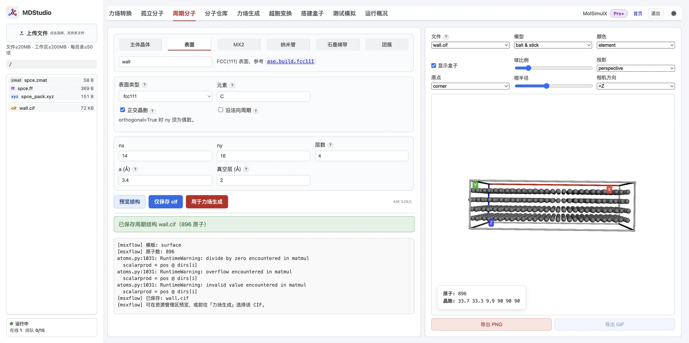
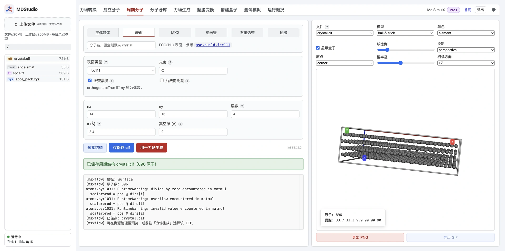
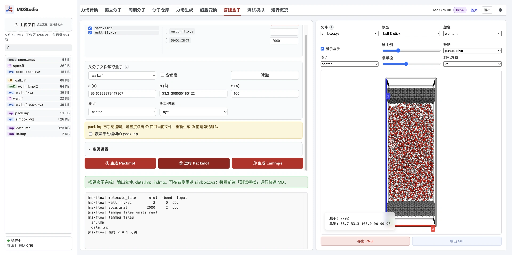

> **系列标签：** `实战案例` · `受限溶液` · `界面建模` · `SPC/E` · `MDStudio` 

**受限溶液**——溶液被夹在两块固体板之间、或塞进纳米孔道——是电极双电层、孔道输运、润湿与吸附层等课题的共同起点。体相溶液只要把分子丢进周期盒子跑 NPT；受限体系要搭的是**板—溶液—板**三明治：上下固体基质提供几何约束与界面，溶液只在缝隙里排布。

通法不依赖「夹的是什么液体」。本篇用 **SPC/E 水** 当最简单的算例，在 **MDStudio** 里把三明治搭通；换成电解质、有机溶剂或离子液体，只是中间组分不同——**板固定、溶液填缝、手改 `pack.inp`** 这一套不变。

本例 **MDStudio 工作区相关文件**见文末资源包（站点 **VIP 免下载**）。



---

## 一、本例体系

| 部件 | 角色 | 本例 |
|------|------|------|
| **上下板** | 同质固体墙（两份同一结构） | 碳的 **fcc(111)** 表面 slab（`wall.cif` → `wall_ff.xyz` + `wall.ff`） |
| **中间溶液** | 受限流体 | **SPC/E 水** 2000 个（分子仓库 `spce.zmat`） |
| **盒子** | 横向与墙对齐，z 加高 | 从 `wall.cif` 读 a/b，把 **z 改为 100 Å** |

上下两板钉在 z ≈ ±40 Å，水填在两板之间。x、y 周期，z 留高给后续机械控压活塞留空间。

> **关键：** 搭建盒子默认给每个物种写 `inside box`（整盒随机）。板必须改成 `fixed` 钉在两端，否则会被当成普通分子乱丢。整条流水线里**唯一要手改的文件**是 `pack.inp`。

---

## 二、操作步骤

### 1. 从分子仓库导入 SPC/E 水

打开[分子仓库](../../在线工具/00-MDStudio/M08-MDStudio分子仓库.md)，找到 **`spce`** 水模型并导入工作区。库内水模型自带 `.zmat` + `.ff`，**不必再走力场生成**。后面装盒时用 `spce.zmat`。

### 2. 用周期分子建固体墙

打开[周期分子](../../在线工具/00-MDStudio/M07-MDStudio周期分子.md)，选 **表面（surface）**，按下面填：

| 参数           | 本例取值                        |
| ------------ | --------------------------- |
| 表面类型         | `fcc111`                    |
| 元素           | `C`                         |
| a            | `3.4` Å                     |
| 分子名          | `wall`                      |
| nx / ny / 层数 | `14` / `16` / `4`（4 层 slab） |
| 真空层          | `2` Å                       |

真空层请至少留一点（本例 **2 Å**）。若设为 0，顶层会落在晶胞上表面（`fract_z = 1`），与底层在周期意义下重合，预览里往往只看见 **3 层**。加薄真空后四层都能分开显示；后面搭盒子时会把 z 改成 100 Å，这点真空不影响最终受限高度。

可用「预览结构」看一眼（应能数出 4 层），再点「仅保存 cif」，得到 `wall.cif`。



### 3. 力场生成：墙用电荷 / 拓扑均为 none

打开[力场生成](../../在线工具/00-MDStudio/M09-MDStudio力场生成.md)：

1. 输入选文件 `wall.cif`
2. **电荷方法**选 **`none`**（全原子电荷为 0）
3. **分子拓扑**选 **`none`**（不识别键连，只写质量 / LJ 等非键项）
4. 运行，得到 `wall_ff.xyz` 与 `wall.ff`

刚性墙一般不需要成键与静电；`topo=none` + `charge=none` 最省事。σ、ε 仍决定墙对水的范德华作用，生成后可在[资源管理器](../../在线工具/00-MDStudio/M04-MDStudio资源管理器.md)里打开 `wall.ff` 核对。

> 若界面上看不到电荷 `none`，多半是当前会员档的电荷列表未放出该项——引擎本身支持 CIF + `none`。也可在本地 CLI 用同等参数生成后再上传。

### 4. 搭建盒子：选物种与个数

打开[搭建盒子](../../在线工具/00-MDStudio/M11-MDStudio搭建盒子.md)：

1. 添加物种：**`wall_ff.xyz` 在前**、**`spce.zmat` 在后**（顺序决定后面切分拓扑，勿颠倒）
2. 个数：板填 **`2`**（上下各一），水填 **`2000`**

### 5. 从 `wall.cif` 读盒子，并把 z 改为 100

在「从分子文件读取盒子」里选 **`wall.cif`**，点「读取」：程序填入横向边长 a/b，并把周期边界设为 `xyz`。

把 **z（c）改成 `100`**（Å），给两板之间和后续活塞留高度。然后点「**① 生成 Packmol**」，写出基线 `pack.inp` 与各 `*_pack.xyz`。此时板和水都还是 `inside box`。

### 6. 手改 `pack.inp`：两板 `fixed`，水填缝

到[资源管理器](../../在线工具/00-MDStudio/M04-MDStudio资源管理器.md)打开 `pack.inp`，改成下面这样（把「一份 `number 2` 的随机板」拆成上下各一块 `fixed`）：

```
tolerance 2.5
seed -1
filetype xyz
output simbox.xyz

# 上板：固定在 z = +40，姿态不旋转
structure wall_ff_pack.xyz
  number 1
  center
  fixed 0. 0. 40 0 0 0
end structure

# 下板：固定在 z = -40
structure wall_ff_pack.xyz
  number 1
  center
  fixed 0. 0. -40 0 0 0
end structure

# 溶液（本例：水）：只在两板之间随机填
structure spce_pack.xyz
  number 2000
  inside box -15.0 -15.0 -40.0 15.0 15.0 40.0
end structure
```

要点：

- **`center` + `fixed x y z 0 0 0`**：以板质心钉到 `(0, 0, ±40)`，后三个 `0` 表示不旋转。
- **水的 z 范围**收在两板内侧（这里与板位置同为 `±40`；若发现水钻进板，再略收窄）。
- **`seed -1`**：每次 Packmol 用新随机种子。
- **顺序与个数**仍与表单一致：两块板在前、2000 个水在后。
- 改完后**不要再点 ①**（会覆盖手改）；直接点 ②。真要重生成须勾选「覆盖手动编辑的 pack.inp」，并先备份。

横向 `±15` 只是示意；应以你读到的 a/b 半宽为准，保证与墙平面内对齐。若 ① 生成的 `inside box` 已是正确半宽，改板段时把水那一行的 x/y 范围保留即可。

### 7. 运行 Packmol，生成 LAMMPS

1. 点「**② 运行 Packmol**」→ 得到 `simbox.xyz`。可视化应看到上下两板、中间灌满水。
2. 点「**③ 生成 Lammps**」→ 写出 `data.lmp`、`in.lmp`（type 多时另出 `pair.lmp`）。



> **顺序与个数别再动。** ①→③ 之间改物种顺序或个数，会得到「看着正常、拓扑错乱」的 `data.lmp`。要改就从 ①（勾选覆盖）重来。

---

## 常见问题

**Q：为什么不能只点搭建盒子、非要手改 `pack.inp`？**  
A：默认 `inside box` 会把板也随机丢进盒子。钉在两端必须用 Packmol 的 `fixed`，表单目前不直接暴露。

**Q：墙一定要用碳的 fcc(111) 吗？上下必须不同材料吗？**  
A：不必。本例上下共用同一份 `wall`。要做异质界面，可再生成第二块板、各自一份 `.ff`，在 `pack.inp` 里上下各写一段 `fixed`。

**Q：中间一定要用水吗？**  
A：不必。水只是门槛最低的算例。换成其他溶液：为每种组分准备结构 + `.ff`（或库内模板），装盒按物种填个数；板仍 `fixed`，溶液仍收窄后的 `inside box`。

**Q：水钻进板里或板附近大空洞？**  
A：收窄水的 z 上下限（留在两板内侧），并适当加大 `tolerance`。

**Q：改完 `pack.inp` 点了 ① 被重置？**  
A：① 会覆盖手改版。改完应直接点 ②。

---

## 小结

1. 分子仓库导入 **`spce`**。  
2. 周期分子：表面 **`fcc111` + C + a=3.4**，nx/ny/层数 **14/16/4**，真空层 **2 Å**，保存 **`wall.cif`**。  
3. 力场生成：`wall.cif`，电荷 **`none`**、拓扑 **`none`** → `wall_ff.xyz` / `wall.ff`。  
4. 搭建盒子：`wall_ff.xyz`（2）在前、`spce.zmat`（2000）在后。  
5. 从 **`wall.cif` 读盒子**，把 **z 改为 100**，① 生成 Packmol。  
6. 手改 **`pack.inp`**：两板 `fixed` 在 ±40，水 `inside box` 填缝。  
7. ② Packmol → ③ 生成 Lammps。

---

## 资源下载

**资源包文件名：** `受限溶液建模.zip`  

包内是本例在 MDStudio 里跑通后的**工作区相关文件**

| 文件                                         | 说明                       |
| ------------------------------------------ | ------------------------ |
| `spce.zmat` / `spce.ff`                    | 分子仓库导入的 SPC/E 水          |
| `wall.cif`                                 | 周期分子生成的 fcc(111) 碳墙      |
| `wall_ff.xyz` / `wall.ff` / `wall_ff.mol2` | 力场生成产物（电荷 / 拓扑均为 `none`） |
| `wall_ff_pack.xyz` / `spce_pack.xyz`       | 搭建盒子写出的 Packmol 组分坐标     |
| `pack.inp`                                 | 已改成两板 `fixed`、水填缝的装盒脚本   |
| `simbox.xyz`                               | Packmol 装好的初始构型          |
| `data.lmp` / `in.lmp`                      | ③ 生成的 LAMMPS 数据与输入       |

## 前置阅读 / 下一步

- [分子仓库](../../在线工具/00-MDStudio/M08-MDStudio分子仓库.md) · [周期分子](../../在线工具/00-MDStudio/M07-MDStudio周期分子.md) · [力场生成](../../在线工具/00-MDStudio/M09-MDStudio力场生成.md) · [搭建盒子](../../在线工具/00-MDStudio/M11-MDStudio搭建盒子.md)
- [边界条件与初始条件](../00-知识文档/K07-边界条件与初始条件.md) · [经典全原子力场](../00-知识文档/K03-经典全原子力场.md)
- **下一步**：[LAMMPS机械控压](C02-LAMMPS机械控压.md)
