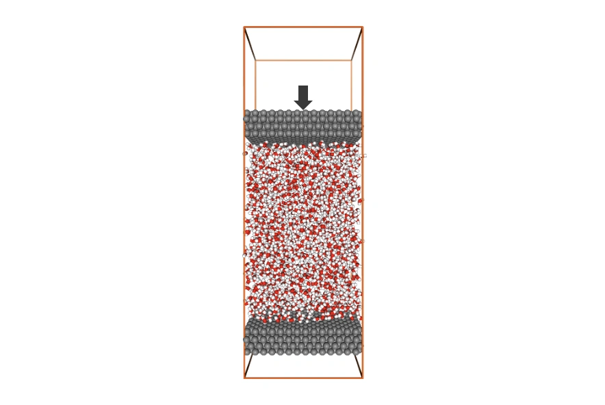
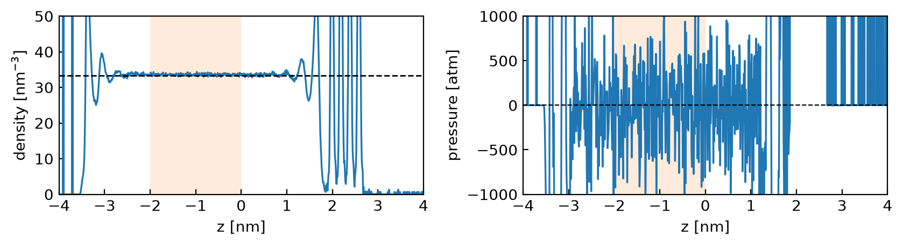
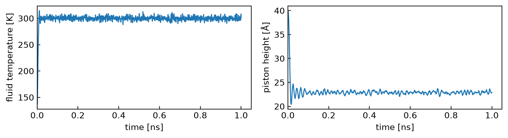

> **系列标签：** `实战案例` · `机械控压` · `界面体系` · `LAMMPS`

体相模拟里控压很省心：`fix npt` 挂上，盒子自己涨缩，压力就稳在你要的值。可一旦体系里有**界面**——水夹在两块固体板之间、液滴、气液共存、电极—电解液——压力就不再是一个均匀的数：界面区的法向、切向应力和体相差很多。全局 barostat 调的是整个盒子的平均维里压力，还会连着固体板一起缩放，结果**体相区的压力根本不是你设的那个值**。

机械控压换个思路：不去缩放盒子，而是把其中一块板当成**刚性活塞**，施加恒定外力 $F=P\cdot A$，只沿法向（z）滑动；另一块板固定当底座。活塞压着流体，体相自然维持在目标压力 $P$（相关讨论见 [J. Chem. Phys. 2018, 148, 064706](https://doi.org/10.1063/1.5011106)）。

| 做法 | 盒子怎么动 | 压力怎么定义 | 本例 |
|------|------------|--------------|------|
| 全局 `fix npt` | 整体缩放 | 全盒平均维里压 | 界面体系不适用 |
| **机械控压（活塞）** | 盒边不动，活塞滑动 | $F=P\cdot A$ 的力平衡 | **本文** |

**本文讲**：活塞控压的数学定义 → 板—水—板体系与分组 → `in.lmp` 关键设置 → 怎么跑 → Notebook 分析。体系从哪来见 [受限溶液建模](C01-受限溶液建模.md)；配套输入与样例输出见文末资源包。



---

## 一、方法背后的数学

本节先钉死「为什么不用全局 barostat」和「活塞力 / 局部压力怎么定义」；下一节起再动手改输入。

### 1. 为什么界面体系不能用全局 barostat

全局 barostat（`fix npt` 的 `iso` / `aniso`）盯着整个盒子的**平均**压力，通过缩放盒子边长把它调到设定值。均匀体相没问题；界面体系有两个麻烦：

| 问题 | 后果 |
|------|------|
| 压力**空间不均匀** | 界面区应力和体相差很多，「整体平均 = 1 atm」不代表体相就是 1 atm |
| 盒子缩放会**连固体板一起动** | 板的晶格被拉伸 / 压缩，界面结构失真；板本该是刚性基质 |

机械控压绕开这两点：盒子横向与法向边长都不靠 barostat 去涨缩；压力靠**活塞的力平衡**来定义。

### 2. 活塞力平衡：$F = P \cdot A$

目标压力 $P$、活塞面积 $A=l_x l_y$ 时，活塞总受力大小为

$$
|F|=P\cdot A=P\cdot l_x l_y
$$

本例活塞在流体**上方**，外力沿 $-z$（向下压流体）。LAMMPS `real` 单位下，要把 atm·Å² 换成力（kcal/mol/Å）：

$$
F_z=-\,P\cdot\mathrm{convert}\cdot l_x l_y
$$

再平摊到活塞原子数 $N_\mathrm{piston}=\mathrm{count(upper)}$ 上，由 `aveforce` 施加。平衡时，流体对活塞的反作用力与此外力抵消，活塞高度稳定，压在流体上的就是目标 $P$。

| 符号 | 含义 | 本例 |
|------|------|------|
| $P$ | 目标压力 | `mypress = 1.0` atm |
| $A$ | 活塞面积 | $l_x l_y$（随 thermo 更新） |
| $N_\mathrm{piston}$ | 活塞原子数 | `count(upper)` |
| 自由度 | 活塞只沿 z | `setforce 0 0 NULL` |

活塞本身用 `nve` 积分，**不挂热浴**——它是机械件，动能没有热力学温度的意义。

### 3. 局部压力剖面（验证用）

全局维里压在界面体系里不好用；验证控压是否成功，看沿 z 分层的**局部应力 / 数密度**：

1. `compute stress/atom` 给出每原子应力贡献；  
2. `chunk/atom bin/1d z` 沿法向分箱；  
3. `ave/chunk` 时间平均，写出 $\sigma_{xx},\sigma_{yy},\sigma_{zz}$ 与数密度。

粗略地，局部压强可写成

$$
P(z)\approx -\frac{\sigma_{xx}+\sigma_{yy}+\sigma_{zz}}{3}\cdot\rho_N(z)
$$

（具体单位换算与 Notebook 一致。）判断时看**体相平段**：数密度应接近 SPC/E ~33 nm⁻³；局部压强噪声很大，体相平均落到数十 atm（本例样例约 −10 atm）相对界面 ±10³ atm 的尖峰已经不错，**不必强求精确等于 1 atm**——主判据仍是密度。

公式既定，下面认体系、写输入、跑模拟，再在 Notebook 里按同一套定义出图。

---

## 二、体系来源与分组

目标产物：工作区里的 **`data.lmp`**。本例**不重新搭盒**，直接用 [受限溶液建模](C01-受限溶液建模.md) 同一类板—水—板体系（约 2000 SPC/E 水 + 上下同质碳墙）。搭盒子时已把 **z 设为 100 Å**，活塞滑动空间已留好，本例**不必再** `change_box`。也可直接用文末资源包里的 `data.lmp`。

| 项 | 本例取值 | 说明 |
|----|----------|------|
| **构型** | 板—水—板 | 来自 C01 / 资源包 |
| **状态点** | $T=300\,\mathrm{K}$，$P=1\,\mathrm{atm}$ | 与 `in.lmp` 一致 |
| **原子类型** | type 1 = C，2 = H，3 = O | 墙同质，靠 molecule 区分上下 |

本例约定（与 Packmol 装盒顺序一致）：

| 角色 | 如何识别 | 本例 |
|------|----------|------|
| **上墙 → 活塞** | `molecule 1` | 896 个 C，约在 $z\approx +40$ Å |
| **下墙 → 底座** | `molecule 2` | 896 个 C，约在 $z\approx -40$ Å |
| **流体** | `type 2 3`（H / O） | 2000 个 SPC/E 水 |

按角色分组：

```lammps
group   upper   molecule  1          # 上板 → 活塞
group   lower   molecule  2          # 下板 → 底座（本脚本不积分 → 固定）
group   wall    molecule  1 2
group   fluid   type      2 3        # 水（H + O）
```

> **若你的 `data.lmp` 上下墙 type 本就不同**，也可 `group upper type 1`、`group lower type 2 …`，不必依赖 molecule。同质墙时务必用 molecule 或坐标 region 区分上下，不要只写 `group wall type 1` 然后整组当活塞。

---

## 三、`in.lmp` 关键设置

整条流水线（与资源包 `in.lmp` 一致）：

```text
读 data.lmp → 分组 → 冻墙最小化
      → 上板 aveforce / setforce / nve（活塞）
      → 流体 NVT + SHAKE
      → thermo（T、活塞高度）+ 沿 z 应力/密度剖面
      → 生产 1 ns
```

下面只抠**和机械控压直接相关**的几处；力场、PPPM、邻域列表等与常规 SPC/E 脚本相同。

### 1. 固定底座、最小化

先**临时冻住两墙**做能量最小化，消除建模重叠，再解冻、清零步数：

```lammps
fix freeze wall setforce 0 0 0
minimize 0.0 1.0e-8 1000 100000
unfix freeze
reset_timestep 0
```

生产段里：**下板不挂任何 time-integration**（没有 `nve` / `nvt`），坐标停在最小化后的位置，相当于固定底座。若更想显式锁死，也可另加 `fix lower_freeze lower setforce 0 0 0`。

> 若盒子沿 z 太矮、活塞顶到边界：带电体系请保持三向周期（PPPM 要求），用 `change_box all z delta 0 50 units box` 加高上端，而不是改成 `boundary p p s`。

### 2. 机械控压核心

把目标压力换成活塞每个原子该受的力；`setforce` 锁死 x、y；活塞用 `nve` 积分：

```lammps
variable  mytemp   equal 300.0     # 流体目标温度 [K]
variable  mypress  equal 1.0       # 目标压力 [atm]

velocity  upper set 0 0 0 units box

variable  atm2Pa  equal 101325.0
variable  A2m     equal 1.0e-10
variable  Na      equal 6.022e23
variable  convert equal ${atm2Pa}*${A2m}*${A2m}*${A2m}*${Na}/4.184/1000

# 单个活塞原子受力 = -P * 面积 / 活塞原子数（负号 = 向下压流体）
variable  force   equal -${mypress}*${convert}*lx*ly/count(upper)

fix  aveforce  upper aveforce 0 0 ${force}
fix  setforce  upper setforce 0 0 NULL
fix  upper_nve upper nve
```

逐条看：

- **`force`**：总力 $=P\cdot(l_x l_y)$，再平摊到 `count(upper)`；`convert` 做单位换算（见第一节）。  
- **`aveforce`**：把设定总力均分给整组活塞。  
- **`setforce ... 0 0 NULL`**：x、y 合力清零；z 写 `NULL` 表示**不覆盖**——保留 `aveforce` 与原子间作用力。  
- **`nve`**：活塞无热浴牛顿积分。

### 3. 只给流体控温 + 刚性水约束

温度只对**流体**有意义，热浴只挂 `fluid`，并用流体自己的温度反馈：

```lammps
compute    fluid_temp fluid temp
variable   fluid_temp equal c_fluid_temp

fix        myshake all shake 0.0001 20 0 b 1   # SPC/E：约束 O–H（bond type 1）

fix        mynvt fluid nvt temp ${mytemp} ${mytemp} 1000
fix_modify mynvt temp fluid_temp              # 用流体温度驱动热浴，排除墙

velocity   fluid create ${mytemp} ${myrand} mom yes rot yes
```

`fix_modify ... temp fluid_temp` 是关键：不加的话 NVT 会用默认全体温度，把固定的墙也算进自由度，控温就偏了。

### 4. 输出：热力学量 + 局部应力 / 密度剖面

除常规热力学外，额外盯**活塞高度**和**沿 z 的局部应力 / 密度剖面**：

```lammps
variable upper_cmz equal xcm(upper,z)

thermo_style custom step time v_fluid_temp atoms &
                        pxx pyy pzz lx ly lz v_upper_cmz
thermo_modify flush yes
thermo 1000
```

局部应力：

```lammps
compute mystress all stress/atom NULL
compute mybins   all chunk/atom bin/1d z center 0.1 units box discard yes
fix     stress_profile all ave/chunk 1000 100 100000 mybins &
        c_mystress[1] c_mystress[2] c_mystress[3] density/number &
        norm all ave running overwrite file result_profile_stress.log

run 1000000    # 1e6 步 × 1 fs = 1 ns
```

轨迹用 `dump … xsu ysu zsu`；本例 Notebook 主要做可视化与剖面，不做扩散。

---

## 四、怎么运行模拟

把资源包解压到同一目录（至少要有 `in.lmp` 与 `data.lmp`），进入该目录后：

```bash
# 串行：先确认能跑通
lmp -in in.lmp

# 本机并行（核数别占满整机）
mpirun -np 4 lmp -in in.lmp
```

二进制名随安装方式而异（`lmp` / `lmp_mpi` / `lmp_serial` 等），见 [Lammps安装简明教程](../01-技术文档/T20-Lammps安装简明教程.md)。

本例 1 ns 生产（约 8000 原子、`timestep 1.0`）在普通多核台式机上约需数小时量级；先把 `run 1000000` 临时改小（如 `run 20000`）冒烟一遍，确认没有报错、活塞没飞，再放开跑满。也可直接用资源包里的样例输出跑 Notebook，不必先重跑。

跑完后当前目录会出现：

| 文件 | 用途 |
|------|------|
| `log.lammps` | 流体温度、活塞高度等 |
| `result_profile_stress.log` | 沿 z 的应力 / 数密度剖面 |
| `result_atoms.lammpstrj` | 轨迹（可视化） |
| `result_atoms.data` | 写出的构型（分析 topo） |

---

## 五、Notebook 分析

本地先按 [分子模拟工作平台搭建](../01-技术文档/T01-分子模拟工作平台搭建.md) 配好 `myenv`，在资源包目录打开 `simul_analysis.ipynb`，**自上而下依次运行**（顺序与 [计算扩散与粘度](C03-计算扩散与粘度.md) 一致：先 thermo，再轨迹，再剖面，最后汇总）。

`_helper_functions.py` 与 C03 共用同一套通用接口（当前 `1.1.0` / `2026-07-26`）。换体系时改 notebook 顶部的文件名、`dt_fs` 与 `RESNAMES` 即可。

### 1. 温度与活塞高度

`read_result_thermo("log.lammps", segment=-1)` 读最后一个 thermo 块。列名小写并去掉 `v_` / `c_` 前缀，因此对应 `fluid_temp`、`upper_cmz`。

| 量 | 期望 |
|----|------|
| **流体温度** | 稳在 ~300 K（热浴 + `fix_modify`） |
| **活塞高度 `upper_cmz`** | 很快收敛到平台（力平衡） |



### 2. 轨迹可视化

用统一入口加载拓扑 + dump（元素映射优先从同目录 `data.lmp` 的 `Masses` 注释读取）：

```python
from _helper_functions import load_lammps_universe

u = load_lammps_universe(
    "./result_atoms.data",
    "./result_atoms.lammpstrj",
    dt_fs=1.0,
    resnames=["wall"] * 2 + ["H2O"] * 2000,
)
```

`nglview` 侧视墙–流体–墙；显示时可用 `wrap`。需要静态图时调用
`save_nglview_frame(view, "last_frame.png")`（默认最后一帧；`frame=k` 可选任意帧）。
本例不做扩散分析，不必另开 unwrap Universe。

### 3. 密度与局部压力剖面

读 `result_profile_stress.log`（`fix ave/chunk`），按**第一节**的定义画出沿 z 的数密度与局部压强。体相平均值取 **$z\in[-2,0]$ nm**（避开墙与界面尖峰）。

| 量 | 期望 | 说明 |
|----|------|------|
| **体相密度** | ≈ 33 nm⁻³ | **主判据**：接近 SPC/E 300 K / 1 atm 体相值；$z\in[-2,0]$ nm 平均 |
| **局部压力** | 体相段落在数十 atm 量级即可 | 本例样例约 **−10 atm**；相对界面尖峰（常达 ±10³ atm）已经很小 |

局部 $P(z)$ 由应力×密度粗算，瞬时噪声极大：**不要指望体相平均精确钉在 1 atm**。样例在 $[-2,0]$ nm 得到约 −10 atm，相对目标 1 atm 只差一点点——在这种剖面里**已经不错**，说明活塞把流体压到了近常压体相。真正用来判成败的是密度是否对上 ~33 nm⁻³：密度对了，机械控压就站住了。

其中「体相密度对上文献值」是最直接的成功判据：活塞压出来的水密度若与已知 SPC/E 体相密度吻合，就说明机械控压在体相维持住了目标压力。



### 4. 结果汇总

Notebook 末尾把平均流体温度、末态活塞高度、体相密度与体相压强写入 `summary_mechanical_baro.csv`。

---

## 六、讨论

### 1. 本例结果是否可靠？

样例输出上跑通 Notebook 后，通常能看到：

| 检查 | 期望 | 判断 |
|------|------|------|
| 流体温度 | ~300 K 平台 | 热浴 + `fix_modify` 生效 |
| 活塞高度 | 快速平台化 | 力平衡找到 |
| 体相密度 | ~33 nm⁻³ | **最关键**：对上 SPC/E 常温常压体相 |
| 局部 $P(z)$ 体相段 | 数十 atm 量级（样例约 −10 atm） | 相对界面 ±10³ atm 的尖峰已很小；**不要求精确 = 1 atm** |

局部压强噪声大、定义又粗：体相平均落到约 −10 atm 相对目标 1 atm 已经很好，优先用密度验收。教学流水线（单次 1 ns）足以演示「活塞控压 + 剖面验证」。正式报数时，应对体相密度 / 压力做块平均或独立重复，并写清分箱宽度与平均窗口（见 [统计误差与块平均](../00-知识文档/K17-统计误差与块平均.md)）。

### 2. 什么时候用机械控压？换体系别照搬

| 场景 | 建议 |
|------|------|
| **均匀体相液体** | 继续用 `fix npt`，不必上活塞 |
| **板—溶液—板、狭缝、液滴旁固体墙** | 机械控压（本文） |
| **电极 / 带电墙** | 仍可活塞控压，但静电边界、镜像与墙电荷要另案 |
| **切向压力 / 剪切** | 本文只控法向；切向需另加速度 / 剪切场 |
| **盒子 z 太矮** | 先加高真空 / 滑动空间，再加压 |

本例选 **SPC/E + 同质碳墙**，是因为流程短、判据清楚（体相密度有文献锚点）。换高粘度溶剂、离子液体或柔软大分子时，活塞平衡与剖面收敛都可能更慢——时长与重复次数要按弛豫重估，不能按 1 ns 水的经验硬套。

---

## 常见问题

**Q：`aveforce` 和逐原子 `addforce` 有什么区别？**  
A：`addforce` 给每个原子都加同样大小的力；`aveforce` 是把设定的**总力**平摊给整组，并抵消组内力的不均，让活塞作为一个整体受一个净外力——正是我们要的「刚性盖子」效果。

**Q：为什么活塞用 `nve` 而不是 `nvt`？**  
A：活塞是机械部件，它的动能不代表热力学温度；给它挂热浴反而会往体系里塞 / 抽能量。让它 `nve` 自由响应流体的反作用力即可。

**Q：`setforce upper 0 0 NULL` 里的 `NULL` 是什么意思？**  
A：`setforce` 把指定方向的合力**设为该值**；写数字会覆盖掉所有力，写 `NULL` 表示这个方向不动（保留 `aveforce` 的外力 + 原子间作用力）。所以 x、y 设 0（活塞不横漂），z 设 `NULL`（活塞照常沿 z 受力运动）。

**Q：下板为什么不写 `fix setforce lower 0 0 0` 也能固定？**  
A：LAMMPS 里没有挂上 time-integration 的原子默认不更新坐标。本例只给 `upper` 挂了 `nve`、给 `fluid` 挂了 `nvt`，`lower` 自然停住。显式 `setforce` 冻结也可以，效果等价、可读性更强。

**Q：局部压力剖面为什么在界面处剧烈振荡？体相平均怎么是 −10 atm 而不是 1 atm？**  
A：界面附近分子分层排布，应力张量本来就随 z 强烈起伏，这是物理现象、不是 bug。体相局部压由应力×密度粗算，噪声极大，**不要求精确等于目标 1 atm**；样例在 $[-2,0]$ nm 约 −10 atm，相对界面 ±10³ atm 的尖峰已经很好。判成败优先看体相密度是否 ~33 nm⁻³。

**Q：可以用它控切向压力 / 做剪切吗？**  
A：本文只在法向（z）加压。切向控制或剪切需要另配（如给活塞设切向速度、或加剪切场），不在本文范围。

---

## 小结

1. **原理**：界面体系压力空间不均匀，全局 `fix npt` 会连板一起缩放；机械控压用 $F=P\cdot A$ 定义法向压力，用局部密度 / 应力剖面验证。  
2. **体系**：读 C01 / 资源包的板—水—板 `data.lmp`；`molecule 1/2` 分上下墙，`type 2 3` 为流体。  
3. **`in.lmp`**：冻墙最小化 → 上板 `aveforce` + `setforce 0 0 NULL` + `nve` → 流体 NVT（`fix_modify` 用 `fluid_temp`）+ SHAKE → thermo + `ave/chunk` 剖面。  
4. **运行**：`lmp -in in.lmp`（或 `mpirun …`），得到 log、剖面与轨迹。  
5. **Notebook**：thermo → 轨迹 → 密度/压力剖面 → 汇总；体相密度对上 SPC/E 文献值即验证控压成功。

---

## 资源下载

**资源包文件名：** `Lammps机械控压.zip`

| 文件 | 说明 |
|------|------|
| `data.lmp` | 板—水—板初始构型 |
| `in.lmp` | 机械控压生产脚本（本例完整输入） |
| `log.lammps` | 样例热力学日志（含流体温度、活塞高度） |
| `result_profile_stress.log` | 沿 z 的应力 / 数密度剖面 |
| `result_atoms.data` / `result_atoms.lammpstrj` | 样例终态与短轨迹（分析可视化用） |
| `simul_analysis.ipynb` | thermo → 轨迹 → 密度/压力剖面 → 汇总 |
| `_helper_functions.py` | 通用读轨迹 / thermo、XYZ 导出、坐标移动、nglview 出图（v1.1.0） |

本地请先按 [分子模拟工作平台搭建](../01-技术文档/T01-分子模拟工作平台搭建.md) 配好 `myenv`，再按 [Lammps安装简明教程](../01-技术文档/T20-Lammps安装简明教程.md) 能跑 LAMMPS。

---

## 学习路径

**前置**

- [受限溶液建模](C01-受限溶液建模.md)（体系从哪来）
- [常见系综与控温控压](../00-知识文档/K11-常见系综与控温控压.md)
- [边界条件与初始条件](../00-知识文档/K07-边界条件与初始条件.md)
- [Lammps安装简明教程](../01-技术文档/T20-Lammps安装简明教程.md)

**相关**

- [轨迹分析与宏观性质](../00-知识文档/K16-轨迹分析与宏观性质.md)
- [统计误差与块平均](../00-知识文档/K17-统计误差与块平均.md)
- [从模拟到论文图的工作流](../01-技术文档/T18-从模拟到论文图的工作流.md)
- [计算扩散与粘度](C03-计算扩散与粘度.md)（体相输运；与本例共用 helper）
