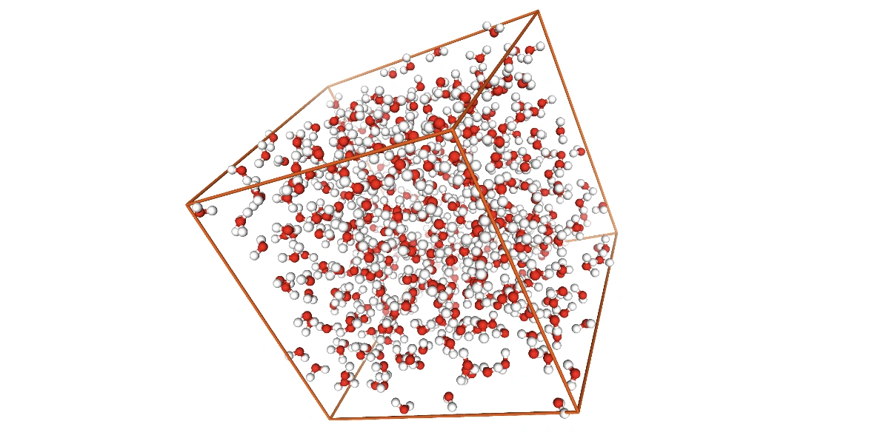
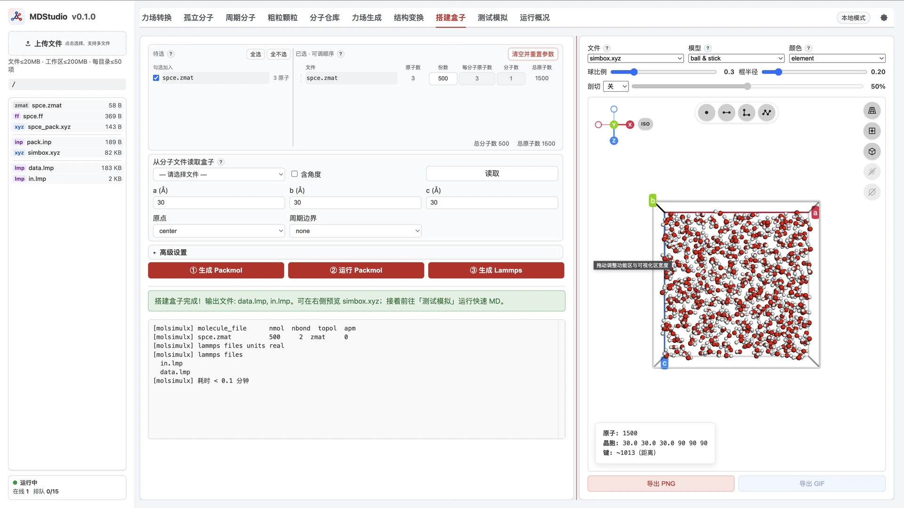
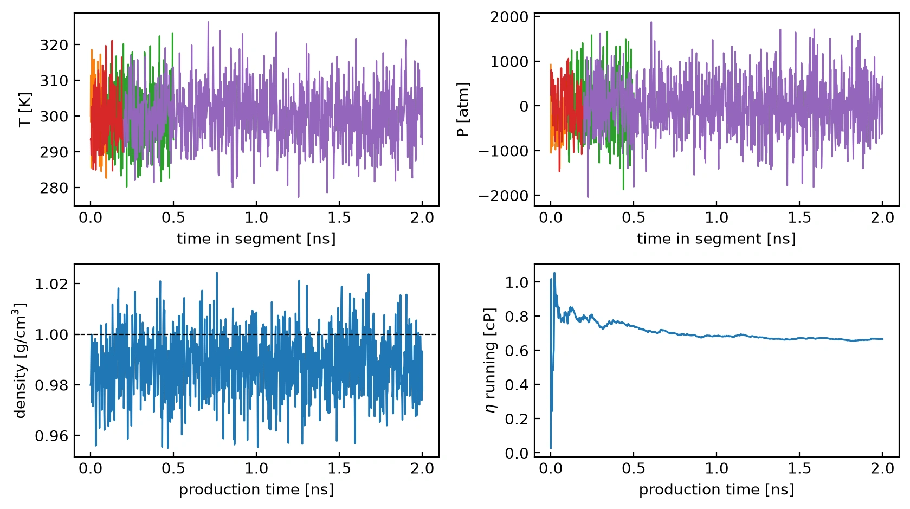
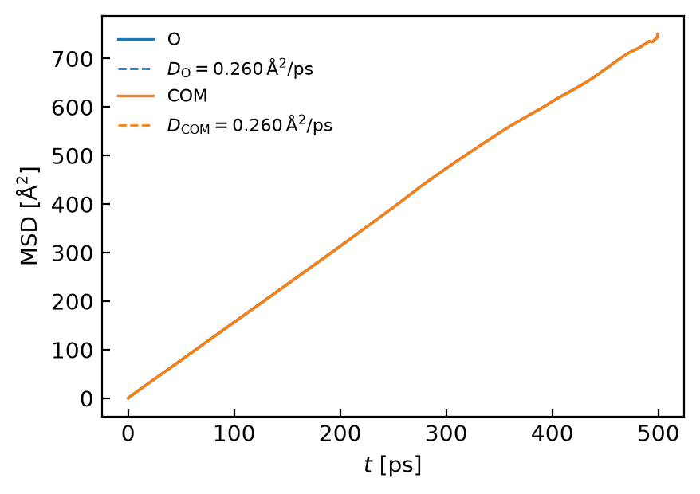
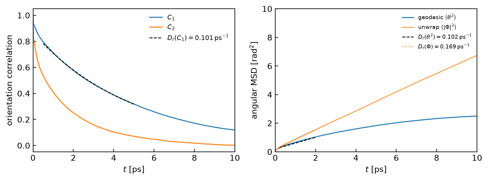
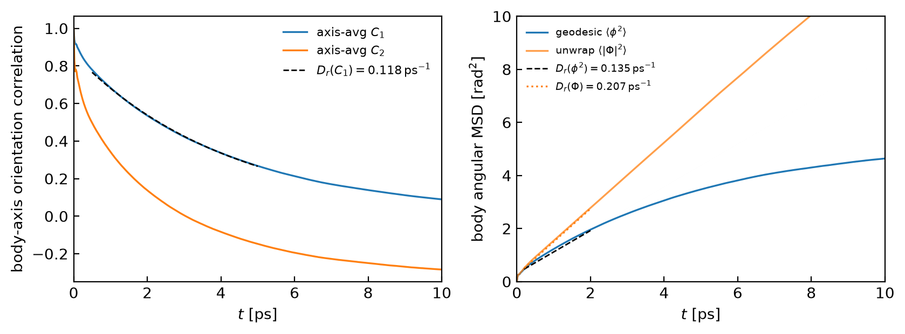
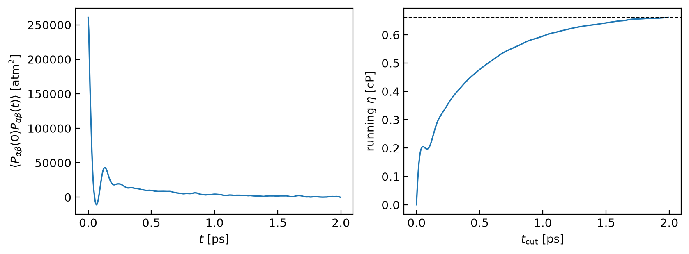

> **系列标签：** `实战案例` · `扩散` · `粘度` · `Green-Kubo` · `MSD`

体相液体常要报三类输运量：**剪切粘度 $\eta$**、**平动自扩散 $D$**、**旋转扩散 $D_r$**。本篇以 **SPC/E 水**为例，体系在 **MDStudio** 里搭好，再接 LAMMPS 与分析 Notebook：

| 量 | 主路径 | 在哪算 |
|----|--------|--------|
| **剪切粘度 $\eta$** | Green–Kubo：应力非对角元自相关积分 | **LAMMPS 内**（`fix ave/correlate`） |
| **平动扩散 $D$** | Einstein：质心 / 氧原子 MSD 长时斜率 $/6t$ | **轨迹后处理**（坐标须 **unwrap**） |
| **转动扩散 $D_r$** | 偶极或 body：$C_1$ + 测地线角 MSD（$/4$ 或 $/6$）；unwrap 对照 | **轨迹后处理**（角度解耦；坐标须 **unwrap**；密短轨迹） |

本例三条量都走**平衡涨落**路线：不加剪切场 / 温度梯度，只在平衡生产段里从应力相关、质心位移、分子取向相关里抠输运系数（与非平衡 MD 相对；总图见 [输运系数谱系](../00-知识文档/K21-输运系数谱系.md)）。平动与转动的 dump 都写 `xsu ysu zsu`——平动要连续质心轨迹；转动要分子内 O–H 几何不被盒边折断，偶极 $\mathbf u$ 才靠得住。

概念地图另见 [轨迹分析与宏观性质](../00-知识文档/K16-轨迹分析与宏观性质.md)。下面先把公式钉死，再动手搭模型。

**本文讲**：三种量的数学定义（含六种 $D_r$ 入口与应用）→ MDStudio 搭体相 SPC/E → `in.lmp` 关键设置 → 怎么跑 → 与 `simul_analysis.ipynb` 对齐的分析流程。配套输入、样例 log / 相关文件与 Notebook 见文末资源包（**轨迹过大，不打包**；需自行跑完再分析）。



---

## 一、计算方法背后的数学

三条量的共同点：**不加外场**，用平衡态的时间相关 / 均方位移换输运系数——这就是平衡法（Green–Kubo 或 Einstein）。信号来自热涨落，往往比能量、密度更吵，所以后面会单独谈统计与时长。本节只写本例实际用到的定义；与非平衡法的对照见 [输运系数谱系](../00-知识文档/K21-输运系数谱系.md)。

### 1. 剪切粘度：Green–Kubo

剪切粘度描述**动量怎么横传**——相邻流层交换动量的快慢。平衡路线用压强张量的**非对角元**（剪切应力涨落）做自相关，再对时间积分：

$$
\eta_{\alpha\beta}=\frac{V}{k_B T}\int_0^{\infty}\!\langle P_{\alpha\beta}(0)\,P_{\alpha\beta}(t)\rangle\,dt,\qquad
\alpha\beta\in\{xy,xz,yz\}
$$

本例对三条剪切分量平均：

$$
\eta=\frac{1}{3}\big(\eta_{xy}+\eta_{xz}+\eta_{yz}\big)
$$

| 符号 | 含义 | 本例单位 |
|------|------|----------|
| $V$ | 体系体积 | ų（取生产段 thermo 平均） |
| $T$ | 温度 | K |
| $P_{\alpha\beta}$ | 应力张量非对角元 | atm（LAMMPS `real`） |
| $\langle\cdots\rangle$ | 对时间原点（及平衡系综）平均 | — |

实践要点：

- 相关函数 $C(t)=\langle P(0)P(t)\rangle$ 通常几皮秒内衰减，其后是**长时噪声尾**；积分实际上做到某个截断 $t_\mathrm{cut}$（本例相关窗 / 截断约 **2 ps**），而不是真积到 $\infty$。  
- LAMMPS 用 `fix ave/correlate` 累加 $C(t)$；Notebook 再做梯形积分并完成 atm²·Å³·fs → Pa·s → cP 的单位换算。  
- 同一物理量也有 Einstein 型写法（对应力时间积分的均方取斜率）；本例**只走 GK**。

### 2. 平动自扩散：Einstein MSD

平动 $D$ 问的是示踪分子质心**跑多开**。三维 Einstein 关系：

$$
\mathrm{MSD}(t)=\big\langle\big|\mathbf r(t)-\mathbf r(0)\big|^2\big\rangle,\qquad
D=\lim_{t\to\infty}\frac{\mathrm{MSD}(t)}{6t}
$$

等价地，在 MSD–$t$ 图的**长时线性区**拟合斜率，再除以 6：

$$
\mathrm{MSD}(t)\approx 6Dt\quad(t\text{ 足够大})\quad\Rightarrow\quad D=\frac{\mathrm{slope}}{6}
$$

| 要点                  | 说明                                                                                                                                   |
| ------------------- | ------------------------------------------------------------------------------------------------------------------------------------ |
| **用谁的 $\mathbf r$** | 平动 $D$ 是**分子质心**的量。SPC/E 质心几乎在氧上，本例同时算 **O 原子**与 **分子质心** 作对照                                                                        |
| **必须 unwrap**       | $\mathbf r(t)$ 须是连续（未折回盒内）的坐标；周期折回会压平 MSD、$D$ 偏小。本例 dump `xsu ysu zsu`                                                               |
| **拟合窗**             | 丢掉亚皮秒弹道区；在线性区拟合（本例约从数～数十 ps 起）。太早偏大，太晚噪声大                                                                                            |
| **单位**              | 轨迹用 Å、时间用 ps 时，$D$ 的单位是 Ų/ps；$1\,\mathrm{Å^2\,ps^{-1}}=10^{-4}\,\mathrm{cm^2\,s^{-1}}$，故常报成 $\times 10^{-5}\,\mathrm{cm^2\,s^{-1}}$ |

Green–Kubo 的平动写法是速度自相关积分 $D=\frac13\int\langle\mathbf v(0)\cdot\mathbf v(t)\rangle\,dt$；本例**只用轨迹 MSD**，不算 VACF。

### 3. 旋转扩散：取向相关与角 MSD

平动看质心位移；转动看分子**取向**忘掉初态有多快。二者应**解耦**：先由（已 unwrap 的）原子坐标构造取向量，再只对取向做统计——质心平动不进入 $C_1$ / 角 MSD。

SHAKE 把 SPC/E 变成**形状固定的刚体**，但水**不是轴对称**：绕偶极轴旋转会改变两个 H 的位置。因此 Notebook 给出**两条路径 × 三种统计**，共六种 $D_r$ 入口——它们回答的问题不同，**不必数值相同**。

| 路径 | Notebook | 跟踪什么 | 自由度 | 回答的问题 |
|------|----------|----------|--------|------------|
| **偶极单轴** | §4 · `orientation="sites"` | 单位向量 $\mathbf u$ | 2（球面 $S^2$） | 偶极轴转多快？ |
| **完整姿态** | §5 · `orientation="body"` | 正交三轴 $R(t)$ | 3（$SO(3)$） | 整个刚体姿态转多快（含绕偶极自旋）？ |

每条路径内部又有三种统计（相关 / 测地线角 MSD / 路径 unwrap），见下。调试时可用 `ROT_N_FRAMES`（或 `n_frames=`）只读密轨迹前 $N$ 帧。

#### （1）偶极单轴：$\mathbf u$、$C_1/C_2$、两条角 MSD

本例偶极方向：

$$
\mathbf u=\frac{\mathbf r_{\mathrm{mid}(H_1,H_2)}-\mathbf r_O}{\big|\mathbf r_{\mathrm{mid}}-\mathbf r_O\big|}
$$

**取向相关**（Legendre；$\,\cos\theta=\mathbf u(0)\cdot\mathbf u(t)$）：

$$
C_1(t)=\big\langle\mathbf u(0)\cdot\mathbf u(t)\big\rangle,\qquad
C_2(t)=\Big\langle\frac{3\big(\mathbf u(0)\cdot\mathbf u(t)\big)^2-1}{2}\Big\rangle
$$

|          | $C_1$              | $C_2$              |
| -------- | ------------------ | ------------------ |
| $t=0$    | $1$                | $1$                |
| 长时（各向同性） | $\to 0$            | $\to 0$            |
| 各向同性旋转扩散 | $\sim e^{-2D_r t}$ | $\sim e^{-6D_r t}$ |
| 本例角色     | **主拟合**            | 对照（衰减应明显快于 $C_1$）  |

$$
C_1(t)\approx A\,e^{-2D_r t}\quad\Rightarrow\quad D_r=-\frac{1}{2}\frac{\mathrm{d}}{\mathrm{d}t}\ln C_1
$$

常用对照时间 $\tau_1=1/(2D_r)$（$C_1$ 的特征时间）。

**A. 测地线夹角（与 $C_1$ 一致的 Einstein 写法）**

$$
\theta(t)=\arccos\!\big(\mathbf u(0)\cdot\mathbf u(t)\big)\in[0,\pi],\qquad
\big\langle\theta(t)^2\big\rangle\approx 4D_r\,t\quad(\text{早期；2 个角自由度})
$$

**B. 角度 unwrap（单轴累计旋转矢量）**

$$
\mathrm{d}\mathbf{\Phi}=\theta_{\mathrm{step}}\hat{\mathbf n},\quad
\mathbf{\Phi}(t+\Delta t)=\mathbf{\Phi}(t)+\mathrm{d}\mathbf{\Phi},\quad
\big\langle\big|\mathbf{\Phi}(t)-\mathbf{\Phi}(0)\big|^2\big\rangle
$$

这是路径长度型角位移：短窗可接近测地线，**长窗往往偏高**（来回摆动被累加进 $\|\Phi\|$）。主报数用 $C_1$ / 测地线；unwrap 作演示与短窗对照。

#### （2）完整姿态：体坐标系 $R(t)$ 与三种量

每个刚性水建随体正交三轴（列向量组成旋转矩阵 $R$；把体坐标映到实验室坐标）：

$$
\mathbf e_1\parallel\mathbf r_{\mathrm{mid}}-\mathbf r_O
\quad(\text{偶极}),\qquad
\mathbf e_3\parallel(\mathbf r_{H_1}-\mathbf r_O)\times(\mathbf r_{H_2}-\mathbf r_O)
\quad(\text{平面法向}),\qquad
\mathbf e_2=\mathbf e_3\times\mathbf e_1
$$

$$
R(t)=\big[\mathbf e_1(t)\ \mathbf e_2(t)\ \mathbf e_3(t)\big]
$$

（两 H 按原子序号排序，避免帧间交换导致轴翻转。）相对姿态

$$
R_{\mathrm{rel}}(t)=R(t)\,R(0)^{\mathsf T}
$$

可写成轴角 / 旋转矢量 $\mathbf{\phi}=\phi\hat{\mathbf n}$（$\phi\in[0,\pi]$）。`orientation="body"` 给出与单轴平行的三种入口：

| 方法 | 定义 | 各向同性早期 / 拟合 | 本例角色 |
|------|------|---------------------|----------|
| **① 轴平均 $C_1$** | $\displaystyle C_1=\frac13\sum_{i=1}^{3}\langle\mathbf e_i(0)\cdot\mathbf e_i(t)\rangle$ | $\sim A e^{-2D_r t}$ | 主报数之一；三轴都进相关 |
| **② 测地线 $\phi$** | $\phi=\arccos\!\big((\mathrm{Tr}\,R_{\mathrm{rel}}-1)/2\big)$，$\langle\phi^2\rangle$ | $\approx 6D_r t$（**3** 个转动自由度） | 主报数；与 ① 交叉检验 |
| **③ 姿态 unwrap** | 逐步 $R(t+\Delta t)R(t)^{\mathsf T}\to\mathrm{d}\mathbf{\Phi}$，再 $\langle\|\Delta\mathbf{\Phi}\|^2\rangle$ | 早期 $\approx 6D_r t$；长窗仍可能偏高 | 连续刚体角位移演示；短窗对照 |

要点：

- 单轴角 MSD 用 **$/4$**；完整姿态用 **$/6$**——差在 $S^2$ vs $SO(3)$ 的自由度。  
- SHAKE 只保证刚体几何；**完整姿态**才跟踪绕偶极轴的转动。  
- 水三个主轴扩散率可以不同；上表单一 $D_r$ 是各向同性**有效值**（本例不拆 $D_{xx},D_{yy},D_{zz}$）。

#### （3）六种 $D_r$：怎么选、用在哪

| 入口 | 适合报什么 | 典型应用场景 | 不适合 / 注意 |
|------|------------|--------------|----------------|
| **偶极 $C_1$** | 偶极重取向时间 $\tau_1=1/(2D_r)$ | **介电弛豫 / Debye**、与实验偶极相关时间对照；溶剂化动力学里「偶极忘了初态有多快」；极性溶剂文献里最常见的单轴 $D_r$ | 看不到绕偶极的自旋；非极性分子若只关心某个键轴，可改用键向量而非偶极 |
| **偶极 $C_2$** | 二阶取向相关 | **NMR**（如 $^2$H 四极弛豫常与 $C_2$ 相关）、拉曼 / 光学各向异性相关的时间尺度；检查各向同性时是否约比 $C_1$ 快 3 倍 | 本例不单独拟合 $D_r(C_2)$，只作曲线对照 |
| **偶极测地线 $\langle\theta^2\rangle/4t$** | 与 $C_1$ 同物理的 Einstein 写法 | Methods 里「相关 + 角 MSD」双报；教学上核对拟合窗是否落在早期线性区 | 须用**夹角**而非路径长；拟合窗太长会弯、偏小 |
| **偶极 unwrap** | 连续角路径长度 | **细长棒 / 纤维**文献里常见的累计角位移；演示「取向怎么一步步转」 | 水等各向同性液体长窗易**偏高**；不宜作唯一正式 $D_r$ |
| **body 轴平均 $C_1$** | 完整刚体重取向（三轴平均） | 关心**整个分子姿态**（含自旋）：刚体水 / 小分子溶剂与流体力学摩擦对照；与偶极 $C_1$ 对比可看出「自旋是否明显参与」 | 仍是有效各向同性 $D_r$，不是完整扩散张量 |
| **body 测地线 $\langle\phi^2\rangle/6t$** | $SO(3)$ 上的 Einstein $D_r$ | 与 body $C_1$ 交叉检验；刚体姿态扩散的标准角 MSD 定义 | 拟合窗同样要早；与偶极 $/4$ 不要混用因子 |
| **body unwrap** | 连续刚体角路径 | 短窗与测地线对照；可视化 tumble 路径 | 同单轴 unwrap：长窗路径偏置 |

**本例怎么报：** 偶极侧以 **$C_1$ + 测地线** 为主（与多数 SPC/E / 介电文献对齐）；body 侧同样报 **轴平均 $C_1$ + 测地线**。两种路径数值可差一截——定义不同，写 Methods 时写清 `sites` 还是 `body`、拟合窗多少。unwrap 两列进 `summary_transport.csv` 作对照，正式摘要不必当唯一 $D_r$。

### 4. 三条输运路径对照

| 量 | 微观输入 | 相关 / 位移量 | 如何得到系数 |
|----|----------|---------------|--------------|
| $\eta$ | $P_{xy},P_{xz},P_{yz}$ | $\langle P(0)P(t)\rangle$ | $\displaystyle\frac{V}{k_BT}\int_0^{t_\mathrm{cut}} C(t)\,dt$，三条平均 |
| $D$ | unwrap 后的 $\mathbf r_\mathrm{com}$ 或 $\mathbf r_O$ | $\mathrm{MSD}(t)$ | 长时斜率 $/6$ |
| $D_r$（偶极） | $\mathbf u$ | $C_1$；$C_2$；$\langle\theta^2\rangle$；unwrap $\mathbf{\Phi}$ | $C_1\sim A e^{-2D_r t}$；早期 $\langle\theta^2\rangle/4t$ |
| $D_r$（完整姿态） | $R(t)$ | 轴平均 $C_1$；$\langle\phi^2\rangle$；unwrap $\mathbf{\Phi}$ | 同上相关拟合；早期角 MSD $/6t$ |

公式既定，下面搭体系、写输入、跑模拟，再在 Notebook 里按同一套定义出数。

## 二、搭模型（MDStudio）

目标产物：工作区里的 **`data.lmp`**。本例定死为体相周期盒子里的 SPC/E（与 C01「板—水—板」不同，装盒用默认 `inside box`，**不必**改 `pack.inp`）。

| 项 | 本例取值 | 说明 |
|----|----------|------|
| **模型** | **SPC/E**（三点刚性水） | 文献 $D$、$\eta$、$D_r$ 对照多；仓库自带 `.zmat` + `.ff` |
| **规模** | **500** 个水（资源包即此） | 教学时长够用；正式报数再扫盒长（[有限尺寸效应](../00-知识文档/K18-有限尺寸效应.md)） |
| **状态点** | $T=300\,\mathrm{K}$，$P\approx 1\,\mathrm{atm}$ | 与 `in.lmp` 一致 |
| **原子类型** | type 1 = H，type 2 = O | 后续 `pair_coeff` / SHAKE / 分析选原子都按此 |

### 1. 导入 SPC/E

1. 打开 [MDStudio分子仓库](../../在线工具/00-MDStudio/M08-MDStudio分子仓库.md)。  
2. 分类选 **Water**，找到 **`spce`**，导入当前工作区。  
3. 确认出现结构与配套 `.ff`——**不要**再对水走力场生成。

### 2. 搭建体相盒子

1. 打开 [MDStudio搭建盒子](../../在线工具/00-MDStudio/M11-MDStudio搭建盒子.md)。  
2. 物种只选 SPC/E；份数填 **500**。  
3. 边长按液态水约 $1\,\mathrm{g\,cm^{-3}}$ 估（约 $33\,\mathrm{nm^{-3}}$ 时，500 水立方边长约 **2.5 nm**），或略松交给后面 NPT 收密度。资源包初始盒约 $30\times30\times30$ Å。  
4. 走完「生成 Packmol → 运行 Packmol → 写出 `data.lmp`」；**无需**改 `pack.inp`。



### 3. 冒烟（可选）与下载

在 [MDStudio测试模拟](../../在线工具/00-MDStudio/M12-MDStudio测试模拟.md) 跑极短步数，确认拓扑、SHAKE、静电与能量不炸。正式算输运**不要**用冒烟轨迹。

在 [MDStudio资源管理器](../../在线工具/00-MDStudio/M04-MDStudio资源管理器.md) 打包下载 `data.lmp`。也可直接用文末资源包里已写好的 `data.lmp` + `in.lmp`。

---

## 三、`in.lmp` 关键设置

整条流水线（与资源包 `in.lmp` 一致）：

```text
最小化 → NVT 100 ps + NPT 400 ps（共 500 ps 平衡）
      → NPT 生产 2 ns
           ├─ 全程：fix ave/correlate → η（GK）
           ├─ 全程：疏轨迹（0.5 ps）→ 平动 D
           └─ 前 200 ps：密轨迹（20 fs）→ 转动 Dr
```

下面只抠**和扩散 / 粘度直接相关**的几处；力场、PPPM、SHAKE 等与常规 SPC/E 脚本相同。

### 1. 时长与 dump 步长（可调变量）

```lammps
variable        nvt_steps       equal   100000          # NVT eq 100 ps
variable        npt_eq_steps    equal   400000          # NPT eq 400 ps
variable        prod_steps      equal   2000000         # NPT production 2 ns
variable        rot_steps       equal   200000          # dense dump only first 200 ps

variable        dump_trans_every equal  500             # 0.5 ps → COM MSD
variable        dump_rot_every   equal  20              # 20 fs  → orientation
```

| 变量 | 含义 |
|------|------|
| `prod_steps` | 生产总长 2 ns（`timestep = 1 fs`） |
| `dump_trans_every` | **平动**疏轨迹：每 0.5 ps 一帧，覆盖全程 |
| `dump_rot_every` / `rot_steps` | **转动**密轨迹：每 20 fs，但只开前 **200 ps**（水取向衰减只有数 ps，不必整条 ns 密存） |

> **Tips：** 水转动快——$C_1$ 量级约数皮秒。密轨迹用「短窗口 + 高频 + 多分子平均」；平动用「长窗口 + 中低频」。不要为了 $D_r$ 把 2 ns 都按 20 fs 存盘。

### 2. 平动 / 转动轨迹：必须 dump `xsu ysu zsu`

```lammps
dump            dump_trans  all  custom  ${dump_trans_every}  &
                result_traj_trans.lammpstrj  id  mol  type  xsu  ysu  zsu
dump_modify     dump_trans  sort id

dump            dump_rot  all  custom  ${dump_rot_every}  &
                result_traj_rot.lammpstrj  id  mol  type  xsu  ysu  zsu
dump_modify     dump_rot  sort id
```

要点：

- 写的是 **`xsu ysu zsu`（scaled unwrapped）**，不是周期折回后的 `x y z`。MDAnalysis 读入后得到连续笛卡尔坐标。  
- **平动**：质心 / 氧轨迹不被盒边折断，MSD 才线性。  
- **转动**：分子内 O–H 相对几何不被折断，偶极 $\mathbf u=\mathbf r_{\mathrm{mid}}-\mathbf r_O$ 才连续——这是坐标 unwrap；后面还有取向上的**角度 unwrap**（累计 $\mathbf{\Phi}$），二者别混。  
- 两套 dump **同一字段**，差别只在频率与时长：生产前半段同时写疏 + 密；`run ${rot_steps}` 后 `undump dump_rot`，后半段只留疏轨迹 + 粘度相关。

```lammps
run             ${rot_steps}
undump          dump_rot
run             ${prod_rest}      # prod_steps - rot_steps
```

### 3. 粘度：Green–Kubo + `fix ave/correlate`

```lammps
variable        corr_nevery     equal   5
variable        corr_nrepeat    equal   400
variable        corr_nfreq      equal   2000   # = nevery * nrepeat；thermo 必须对齐

variable        pxy             equal   pxy
variable        pxz             equal   pxz
variable        pyz             equal   pyz

fix             visc_corr  all  ave/correlate  ${corr_nevery}  ${corr_nrepeat}  ${corr_nfreq}  &
                v_pxy  v_pxz  v_pyz  type auto  file result_viscosity_correlate.dat  &
                ave running
```

| 参数 | 本例 | 含义 |
|------|------|------|
| `Nevery` | 5 | 每 5 步采一次应力 |
| `Nrepeat` | 400 | 相关窗长 $5\times400\times1\,\mathrm{fs}=2\,\mathrm{ps}$ |
| `Nfreq` | 2000 | 写出 / 更新相关函数的频率（须为 `Nevery*Nrepeat` 的倍数） |
| 相关量 | $P_{xy},P_{xz},P_{yz}$ | 三条剪切分量，后处理平均 |

脚本里再用 `trap(f_visc_corr[…])` 做梯形积分，乘上体积、温度与单位换算，得到运行中的 `v_viscosity_cP`（写入 thermo，便于盯收敛）。**正式报数**建议以 `result_viscosity_correlate.dat` 在 Notebook 里积分、并自选截断 $t_\mathrm{cut}$（见第四节）。

**易踩坑：** `thermo` 输出频率必须与 `corr_nfreq` 一致。若 thermo 比 `Nfreq` 更密，而 thermo 里又引用了 `f_visc_corr` / `v_viscosity_cP`，会报：

```text
Fix in variable not computed at compatible time
```

本例生产段因此写成：

```lammps
thermo_style    custom  step  time  temp  press  density  vol  v_viscosity_cP
thermo          ${corr_nfreq}
```

另外，`print` 里若要用到 `v_viscosity_cP`，必须写在 `unfix visc_corr` **之前**。

### 4. 平衡与生产系综（对照）

| 阶段 | 设置 | 说明 |
|------|------|------|
| 最小化 | `minimize` | 消重叠 |
| 约束 | `fix shake … b 1 a 1` | SPC/E 刚化 O–H 与角 |
| 平衡 | NVT 100 ps → NPT 400 ps | 先热平衡，再收密度 |
| 生产 | **继续 NPT 2 ns** | 本例粘度与扩散都在 NPT 下采样；结束时 `write_data result_atoms.eq.data` / `result_atoms.prod.data` |

平衡段**不开**生产 dump、也不挂 `ave/correlate`，避免把未平衡的应力 / 坐标混进统计。

---

## 四、怎么运行模拟

把资源包解压到同一目录（至少要有 `in.lmp` 与 `data.lmp`），进入该目录后：

```bash
# 串行（调试）
lmp -in in.lmp

# 并行示例
mpirun -np 4 lmp -in in.lmp
```

二进制名随安装而异（`lmp` / `lmp_mpi` / `lmp_serial` 等），见 [Lammps安装简明教程](../01-技术文档/T20-Lammps安装简明教程.md)。

跑完后目录里应有：

| 文件 | 用途 |
|------|------|
| `log.lammps` | 温度、压力、密度、运行粘度等 |
| `result_traj_trans.lammpstrj` | 疏轨迹 → 平动扩散 |
| `result_traj_rot.lammpstrj` | 密短轨迹 → 转动扩散 |
| `result_viscosity_correlate.dat` | 应力自相关 → GK 粘度 |
| `result_atoms.eq.data` / `result_atoms.prod.data` | 平衡末 / 生产末构型（分析 topo） |

整条约 2.5 ns（0.5 ns 平衡 + 2 ns 生产），500 水、桌面并行大约数小时量级，视机器而定。资源包**不含**平动 / 转动 dump（体积过大）；跑完得到 `result_traj_*.lammpstrj` 等文件后，再在同目录打开 Notebook 分析。

---

## 五、Notebook 分析

本地先按 [分子模拟工作平台搭建](../01-技术文档/T01-分子模拟工作平台搭建.md) 配好 `myenv`。把资源包与**自跑得到的** `result_traj_*.lammpstrj` 放在同一目录，打开 `simul_analysis.ipynb`，**自上而下依次运行**（后面单元依赖前面的 `prod`、轨迹 Universe 等）。Notebook 章节顺序与本文一致：

```text
1 Thermo → 2 轨迹可视化 → 3 平动 → 4 偶极转动 → 5 body 转动 → 6 GK 粘度 → 7 汇总
```

分析代码拆在几个模块里：

| 模块 | 职责 |
|------|------|
| `_helper_functions.py` | 读 `log.lammps`、MDAnalysis 读 LAMMPS dump、`save_nglview_frame`（v1.1.0） |
| `_translational_diffusion.py` | 平动 MSD → $D$（`mode="selection"` / `"com"`；`n_frames` / `TRANS_N_FRAMES`） |
| `_rotational_diffusion.py` | 偶极 / body：$C_1$、$C_2$、测地线与 unwrap 角 MSD（`n_frames` / `ROT_N_FRAMES`） |
| `_viscosity_analysis.py` | 读 `ave/correlate`、GK 积分 |

第一个代码单元集中了本例参数：`TOPO`、`SELECT_O` / `SELECT_H`、`DT_TRANS_FS=500`、`DT_ROT_FS=20`，以及调试用的 `TRANS_N_FRAMES` / `ROT_N_FRAMES`（正式报数都改 **`None`**）。

### 1. 温度与压力

用 `read_result_thermo("log.lammps", …)` 把 log 里各段 thermo 块读成 DataFrame。生产被拆成两段 `run`（密轨迹前 / 后），脚本会按需合并最后两块得到 `prod`。

看四条：

| 量 | 期望 |
|----|------|
| **温度** | 稳在 ~300 K |
| **压力** | 在 1 atm 附近起伏（液体瞬时压波动大属正常） |
| **密度** | ~0.99–1.0 g/cm³（SPC/E 量级） |
| **`viscosity_cp`（若有）** | 运行积分，末值可与后处理对照，但噪声大 |



### 2. 轨迹可视化

用 MDAnalysis 读 `result_atoms.eq.data` + `result_traj_trans.lammpstrj`，仅显示时 `wrap`；后面扩散分析须保持 unwrap，**另开** Universe。静态图可用 `save_nglview_frame(view)`（默认最后一帧）。

### 3. 平动扩散

按**第一节**的 Einstein 关系。轨迹须 **unwrap**（本例已 dump `xsu ysu zsu`）。同一 `Universe` 上两条路径互相对照：

**（A）氧原子 MSD** — `mode="selection"`，`select=SELECT_O`（`type 2`）

**（B）分子质心 MSD** — `mode="com"`，`compound="residues"`

拟合窗口可调（如 `t_min_ps=20`）；窗口落在弹道区会偏大，落在噪声区会飘。`TRANS_N_FRAMES` 非空时只读疏轨迹前 $N$ 帧（便于调试出图）；正式 $D$ 设为 `None`。汇总表默认写入氧与 COM 两列。

> **常见翻车：** 若 dump 的是周期折回的 `x y z`，MSD 会很快饱和、$D$ 偏小。本例从源头 dump unwrap，后处理不必再手工解折叠。



### 4. 转动扩散（偶极轴）

密轨迹 `result_traj_rot.lammpstrj`（默认生产前 200 ps、每 20 fs）。调用：

```python
rdiff.rotational_diffusion(
    u_rot, orientation="sites",
    origin_select=SELECT_O, target_select=SELECT_H, n_target=2,
    dt_fs=DT_ROT_FS, n_frames=ROT_N_FRAMES,
    c1_t_min_ps=0.5, c1_t_max_ps=5.0,
    amsd_t_min_ps=0.2, amsd_t_max_ps=2.0,
)
```

| 入口 | 做法 | 本例角色 |
|------|------|----------|
| **$C_1$ / $C_2$** | 偶极 Legendre 相关；$C_1\approx A e^{-2D_r t}$ | **$C_1$ 主报数**；$C_2$ 对照 |
| **测地线角 MSD** | $\theta=\arccos(\mathbf u\cdot\mathbf u')$，$\langle\theta^2\rangle\approx 4D_r t$（早期） | 主报数；与 $C_1$ 交叉检验 |
| **角度 unwrap** | 逐步累加 $\mathrm{d}\mathbf{\Phi}$，再 $\langle\|\Delta\mathbf{\Phi}\|^2\rangle$ | 演示；长窗易偏高 |

**用在哪：** 与介电 / Debye、溶剂偶极弛豫、多数 SPC/E 转动文献对齐时，优先报这里的 $C_1$（并可附 $\tau_1=1/(2D_r)$）和测地线。



### 5. 转动扩散（完整姿态 body frame）

同一 `u_rot`，改为 `orientation="body"`（拟合窗参数相同）。由 O + 两 H 建 $R(t)$；角 MSD 前因子改为 **6**：

| 入口 | 做法 | 本例角色 |
|------|------|----------|
| **轴平均 $C_1$ / $C_2$** | $\frac13\sum_i\langle\mathbf e_i(0)\cdot\mathbf e_i(t)\rangle\approx A e^{-2D_r t}$ | 主报数之一 |
| **测地线 $\phi$** | $R_{\mathrm{rel}}=R(t)R(0)^{\mathsf T}$ 的转角，$\langle\phi^2\rangle\approx 6D_r t$ | 主报数 |
| **姿态 unwrap** | 逐步 rotvec 累加后再 MSD | 短窗对照；长窗仍可能偏高 |

**用在哪：** 需要「整颗刚体转多快」、或要和偶极结果对比「自旋贡献」时跑这一节。数值常比偶极略高——定义含第三转动自由度，属预期，不是算错。

实现见 `_rotational_diffusion.py`（`body_frames_from_sites`）。



> **怎么读两套 $D_r$：** 偶极路径回答「偶极轴转多快」；body 路径回答「整个刚体姿态转多快」。写 Methods 时写清用的是哪一种、拟合窗多少。选型表见**第一节（3）**。

### 6. 粘度（Green–Kubo）

按**第一节**的公式，在 Notebook 里积分（LAMMPS 运行中的 `v_viscosity_cP` 仅作对照）：

1. `read_ave_correlate_last("result_viscosity_correlate.dat")` 取**最后一个**相关块（统计最充分）。  
2. $V$、$T$ 取生产段 thermo 平均。  
3. 对三条剪切相关平均后做梯形积分，乘 $V/(k_B T)$ 与单位换算 → $\eta$（Pa·s / cP）。  
4. 用 `t_cut_fs`（如 2000 fs = 相关窗长）截断：相关函数长时噪声大，截太晚会被噪声主导，截太早则积分未收敛。

同时可对照 log 里运行中的 `viscosity_cp` 末值；两者不必完全一致，量级应对得上。应力相关噪声大——教学用 2 ns 能出图；要对准文献 SPC/E 粘度，往往需要更长生产或多段独立重复（见 [统计误差与块平均](../00-知识文档/K17-统计误差与块平均.md)）。



### 7. 结果汇总

最后一节把 $T$、$P$、密度、$D_\mathrm{O}$ / $D_\mathrm{COM}$、六种 $D_r$（偶极 / body × $C_1$ / 测地线 / unwrap）、$\eta$ 写成 `summary_transport.csv`。若 `TRANS_N_FRAMES` / `ROT_N_FRAMES` 非空，表中扩散数只反映前 $N$ 帧——**对照文献或写进论文前务必改回 `None` 重跑**。

## 六、讨论

### 1. 如何做统计平均？

输运量比能量、密度更吃统计：相关时间长、单次积分噪声大，**帧数 ≠ 独立样本数**。实践上常把下面几条叠着用（细节见知识文档）：

| 做法 | 本例怎么用 | 去哪读 |
|------|------------|--------|
| **先确认平衡** | 生产段 $T$、$P$、密度已稳住再拟合 / 积分 | [平衡判据与收敛](../00-知识文档/K13-平衡判据与收敛.md) |
| **块平均** | 把长轨迹或相关函数积分切成块，用块间分散写误差条（不要拿总帧数硬除） | [统计误差与块平均](../00-知识文档/K17-统计误差与块平均.md) |
| **独立重复** | 换初速 / 初构再跑几条，报「$n$ 次平均 ± 标准差」 | 同上（[统计误差与块平均](../00-知识文档/K17-统计误差与块平均.md) 第三节） |
| **多时间原点 / 多分子平均** | MSD、$C_1$、角 MSD 本身已对分子与时间原点平均；拟合窗口写进 Methods | [轨迹分析与宏观性质](../00-知识文档/K16-轨迹分析与宏观性质.md) |
| **三条剪切分量平均** | GK 粘度对 $P_{xy},P_{xz},P_{yz}$ 平均，再视需要做块 / 多段重复 | [输运系数谱系](../00-知识文档/K21-输运系数谱系.md) |
| **有限尺寸** | 体相 $D$ 随盒长偏大是常见系统误差；正式报数应扫 $L$ 或做 Yeh–Hummer 类修正 | [有限尺寸效应](../00-知识文档/K18-有限尺寸效应.md) |

教学流水线（单次 2 ns）足以走出可重复的分析步骤；**写成论文数字**时，至少应有块平均或独立重复之一，并写清拟合窗 / $t_\mathrm{cut}$。

### 2. 本例算出的值是否可靠？

下面数字来自本例完整生产轨迹上跑通的 `simul_analysis.ipynb`（资源包不附轨迹，需自备或自跑），汇总见 `summary_transport.csv`（单次 2 ns 生产、未做块平均 / 独立重复）。结论按**教学可演示**标准写；正式 Methods 报数仍建议加误差条（见上一节）。

**自洽检查**

| 检查 | 本例 | 结论 |
|------|------|------|
| 氧 vs 质心 $D$ | $D_\mathrm{O}=2.503$、$D_\mathrm{COM}=2.503$（×10⁻⁵ cm²/s） | 几乎重合——质心≈O，流程自洽 |
| 偶极 $D_r(C_1)$ vs 测地线 | ~0.101 vs ~0.102 ps⁻¹ | 同量级、差很小——取向定义与拟合窗合理 |
| 偶极 $C_1$ vs body $C_1$ | ~0.10 vs ~0.12 ps⁻¹ | body 略高属预期（含第三转动自由度）；不要强行拉齐 |
| 温度 / 密度 | $\langle T\rangle=300.0\,\mathrm{K}$，$\langle\rho\rangle=0.988\,\mathrm{g\,cm^{-3}}$ | 状态点到位 |
| 瞬时压平均 | $\langle P\rangle\approx 8\,\mathrm{atm}$（目标 1 atm） | 液体小体系压力涨落极大，**看密度比看 $\langle P\rangle$ 更靠谱**；不单独据此判失败 |

**与文献 / 模型预期对照**

| 量 | 本例结果 | 文献 / 预期（SPC/E，~300 K） | 判断 |
|----|----------|------------------------------|------|
| 密度 | 0.988 g/cm³ | ~0.99–1.00 g/cm³ | **可靠**（NPT 收密度成功） |
| $D$（O / COM） | $2.50\times 10^{-5}\,\mathrm{cm^2\,s^{-1}}$（即 ~0.25 Ų/ps） | $N\sim 500$ 时常见约 $2.4$–$2.7\times 10^{-5}$；外推无限大盒约 $2.7$–$3.0\times 10^{-5}$（有限尺寸会压低 $D$，见 [有限尺寸效应](../00-知识文档/K18-有限尺寸效应.md)） | **教学可靠**；与同尺寸文献同量级。要比 $D_0$ 或实验（~2.3）需扫盒长 / 修正，本例未做 |
| $D_r$（偶极 $C_1$） | ~0.10 ps⁻¹（$\tau_1=1/(2D_r)\approx 5\,\mathrm{ps}$） | SPC/E 偶极 / OH 一阶相关时间常在数 ps 量级 | **量级可靠**；与测地线互证。文献定义（偶极 / 键轴、拟合窗）不同会差一截，报数时写清 |
| $D_r$（body） | $C_1$ ~0.12、测地线略高；unwrap 更高 | 完整姿态文献较少；应与偶极分开报 | **教学可演示**；正式报数写清 `orientation="body"`，unwrap 不作唯一值 |
| $\eta$（GK，$t_\mathrm{cut}=2\,\mathrm{ps}$） | 0.66 cP | 文献 GK / 有限尺寸估约 **0.64–0.70 cP**（如 Tazi *et al.*, *J. Phys.: Condens. Matter* **24**, 284117 (2012) 报 $\eta_\mathrm{GK}\approx 0.68\pm 0.02$）；实验水 ~0.89 cP | **对 SPC/E 模型可靠**（落在文献带内）。SPC/E 本身 visc 偏低是模型问题，不是本脚本算错。单次 2 ns、固定截断——**误差条未估**，论文级请加长 / 多段重复 |

**总判断**

- **密度、$D$、偶极 $D_r$、$\eta$ 量级都对得上 SPC/E 文献**；O/COM、偶极 $C_1$/测地线两两自洽，说明 unwrap、取向解耦与 GK 单位换算没有明显翻车。body 路径作完整姿态对照，勿与偶极强行比成同一数字。  
- 本流水线适合**教学演示与流程验收**。若写进论文：给 $D$ 做有限尺寸讨论或修正；给 $\eta$ 做块平均 / 独立重复并扫 $t_\mathrm{cut}$；$\langle P\rangle$ 不要当控压失败的铁证。  
- 实验水（$D$ 更小、$\eta$ 更大）与 SPC/E 有系统偏差——对比时先问「对模型还是对实验」。

### 3. 水好算；换体系时别照搬时长

本例选 **体相 SPC/E**，是因为：

- 分子小、运动快：$D$ 的 MSD 线性区、取向 $C_1$ 衰减都在 **皮秒–纳秒** 内看得见；  
- 文献对照多，SHAKE + PPPM 流程成熟；  
- 500 水、桌面并行、~2.5 ns 就能走通整条「建模 → 跑 → 分析」链。

**这不代表同一套时长 / dump 频率能直接搬到别的场景。** 换体系时至少重新估这几项：

| 场景 | 往往更难在哪 | 要注意什么 |
|------|--------------|------------|
| **离子液体 / 高粘度溶剂** | $D$ 小、应力相关长时尾更长 | 生产拉到 **数十 ns–更长**；GK 窗与 $t_\mathrm{cut}$ 重定 |
| **大分子 / 聚合物熔体** | 质心扩散极慢；转动／构象弛豫可跨很多数量级 | 疏轨迹要覆盖真正的扩散区；可能根本不适合短 GK 窗 |
| **电解质电导、互扩散** | 除自扩散外还有集体相关 | 采样与误差估计更苛刻，见 [输运系数谱系](../00-知识文档/K21-输运系数谱系.md) |
| **界面 / 受限水** | 有效 $D$、局部粘度定义变了 | 不要拿本例体相脚本硬套；另案（如 C01/C02 体系） |
| **低温、过冷、玻璃化附近** | 弛豫爆炸变慢 | 时长与重复次数都要按 $\tau$ 重估，不能按 300 K 水的 ns 量级 |

经验顺序：**转动 → 平动自扩散 → 粘度（GK）**——后面的更吃轨迹长度与统计。水只是把这条链在短时间内演示清楚；报数或换体系时，把「相关时间够不够、块平均 / 重复做了没有、盒长效应有没有」重新过一遍。

---

## 常见问题

**Q：为什么平动和转动要两套轨迹？**  
A：平动要看 ns 量级的 MSD 线性区，帧可以疏；转动取向几皮秒就衰完，帧必须密，但总长不必整条生产。拆开才能在文件体积和分析质量之间折中。

**Q：生产为什么继续用 NPT，而不是改成 NVT？**  
A：本例脚本选择在 NPT 下同时采应力相关与轨迹，实现简单。若你更在意固定体积下的严格对比，可在平衡收密度后改 NVT 生产，并相应改 thermo / 分析里的体积取值。

**Q：SPC/E 平动 $D$ 用氧还是质心？**  
A：质心几乎在氧上，两者应接近。报数时写清用的是哪一种；Notebook 两种都算便于自检。

**Q：角 MSD 还要不要做角度 unwrap？**  
A：Notebook 会算。单轴用 `unwrap_angular_displacement`，完整姿态用 `unwrap_body_rotvec`。但**报 $D_r$** 时与 $C_1$ 对照请用测地线（单轴 $\langle\theta^2\rangle$/4，body $\langle\phi^2\rangle$/6）；路径积分长窗会偏高，适合演示连续角位移或细长棒文献里的累计角位移。

**Q：SHAKE 了为什么还要完整姿态？偶极不够吗？**  
A：SHAKE 只固定几何，水仍非轴对称。偶极轴看不到绕偶极的自旋；`orientation="body"` 用三轴 $R(t)$ 才跟踪完整刚体姿态。两套 $D_r$ 物理含义不同，不必强求数值一致。

**Q：六种 $D_r$ 我该报哪一个？**  
A：对水 / 极性溶剂与介电对照 → **偶极 $C_1$**（可附测地线）。关心整颗刚体姿态或与偶极对比自旋贡献 → **body $C_1$ + 测地线**。$C_2$ 看图即可；unwrap 进表作对照，一般不作唯一正式值。选型与应用见第一节表。

**Q：`TRANS_N_FRAMES` / `ROT_N_FRAMES` / `n_frames` 有什么用？**  
A：只分析对应轨迹前 $N$ 帧，方便调试接口与出图。正式报数设为 `None` 用完整平动 / 转动轨迹；否则 `summary_transport.csv` 里的 $D$、$D_r$ 不能直接当全长结果。

**Q：`Fix in variable not computed at compatible time` 怎么回事？**  
A：`thermo` 比 `fix ave/correlate` 的 `Nfreq` 更密，却在 thermo 里引用了尚未更新的 fix 变量。把 `thermo` 设成 `${corr_nfreq}` 即可。

---

## 小结

1. **公式**：$\eta$ 用应力 GK；$D$ 用 unwrap MSD $/6$；$D_r$ 可走**偶极单轴**（$C_1$、$\langle\theta^2\rangle/4t$）或**完整姿态**（轴平均 $C_1$、$\langle\phi^2\rangle/6t$）；unwrap 作对照。应用上：介电 / 偶极弛豫 → 偶极 $C_1$；完整刚体姿态 → body。  
2. 在 MDStudio 搭 **500 个 SPC/E** 体相盒子，得到 `data.lmp`。  
3. `in.lmp`：**GK 粘度**用 `ave/correlate`；**平动**疏 dump **`xsu ysu zsu`**；**转动**前 200 ps 密 dump。  
4. 本机 / 集群 `lmp -in in.lmp` 跑完。  
5. Notebook：thermo → 轨迹 → 平动 → 偶极转动 → body 转动 → GK → 汇总；调试用 `TRANS_N_FRAMES` / `ROT_N_FRAMES`，正式报数改 `None`。样例量级：$D\approx 2.50\times 10^{-5}\,\mathrm{cm^2\,s^{-1}}$，偶极 $D_r\approx 0.10\,\mathrm{ps^{-1}}$，$\eta\approx 0.66\,\mathrm{cP}$。

---

## 资源下载

**资源包文件名：** `计算扩散与粘度.zip`（**VIP 下载**）

> **不含轨迹：** `result_traj_trans.lammpstrj` / `result_traj_rot.lammpstrj` 体积过大（约数百 MB），不打进 zip。请用包内 `in.lmp` + `data.lmp` 自行跑完，再在同一目录跑 Notebook。

| 文件 | 说明 |
|------|------|
| `data.lmp` | 500 SPC/E 初始构型 |
| `in.lmp` | 平衡 + 生产（GK 粘度 + 双 dump） |
| `log.lammps` | 样例热力学日志 |
| `result_viscosity_correlate.dat` | 样例应力自相关（可不跑满也可先练 GK 积分） |
| `result_atoms.eq.data` 等 | 样例构型（分析 topo / 可视化） |
| `simul_analysis.ipynb` | thermo → 轨迹 → 平动 → 偶极转动 → body 转动 → GK → 汇总 |
| `_translational_diffusion.py` 等 | notebook 依赖的分析模块 |
| `summary_transport.csv` | 样例汇总表（对照量级） |

---

## 学习路径

**前置**

- [MDStudio分子仓库](../../在线工具/00-MDStudio/M08-MDStudio分子仓库.md)
- [MDStudio搭建盒子](../../在线工具/00-MDStudio/M11-MDStudio搭建盒子.md)
- [输运系数谱系](../00-知识文档/K21-输运系数谱系.md)
- [轨迹分析与宏观性质](../00-知识文档/K16-轨迹分析与宏观性质.md)
- [Lammps安装简明教程](../01-技术文档/T20-Lammps安装简明教程.md)

**相关**

- [平衡判据与收敛](../00-知识文档/K13-平衡判据与收敛.md)
- [有限尺寸效应](../00-知识文档/K18-有限尺寸效应.md)
- [统计误差与块平均](../00-知识文档/K17-统计误差与块平均.md)
- [受限溶液建模](C01-受限溶液建模.md)（同是 SPC/E，但是板—水—板）
- [Lammps机械控压](C02-Lammps机械控压.md)
