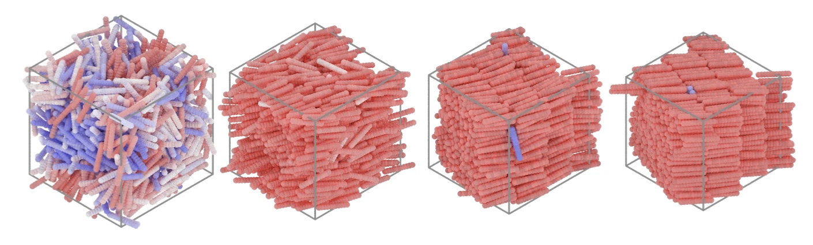
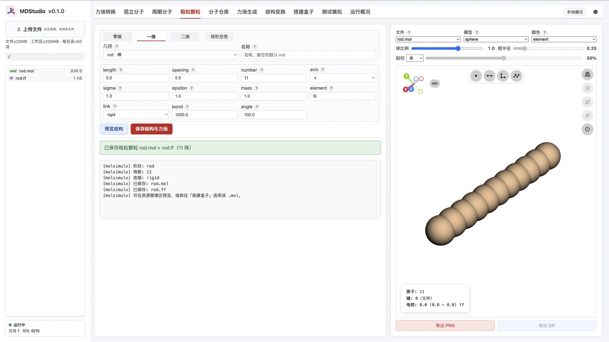
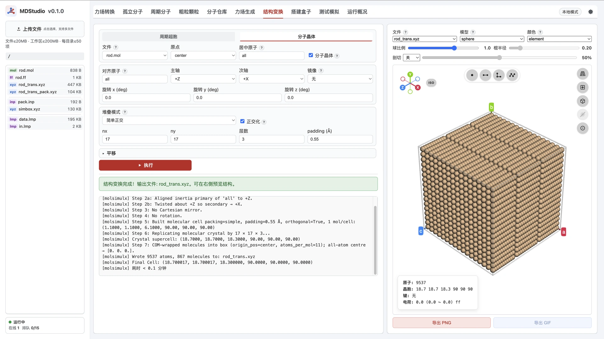
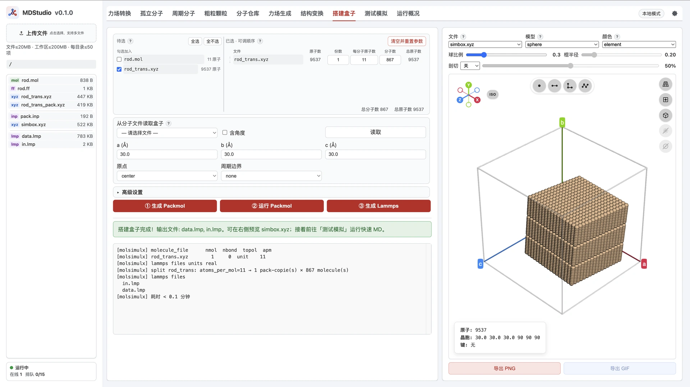
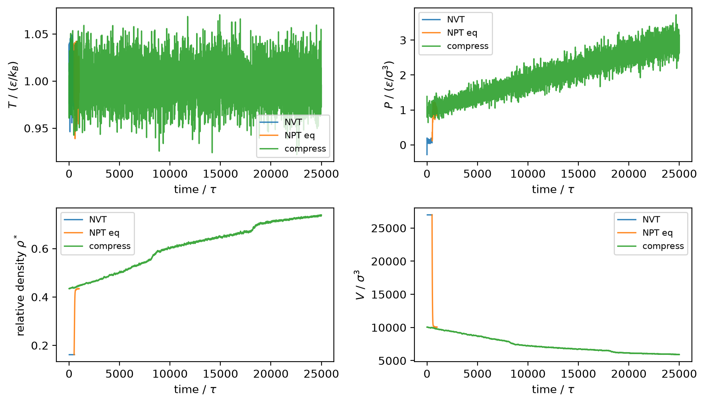
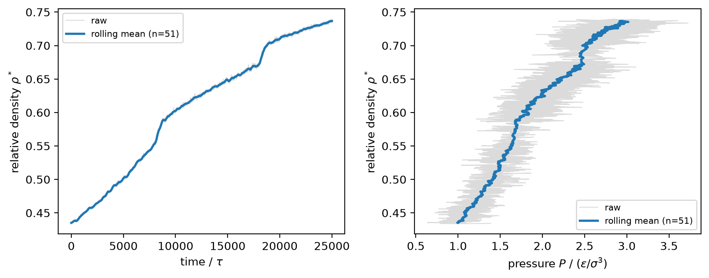
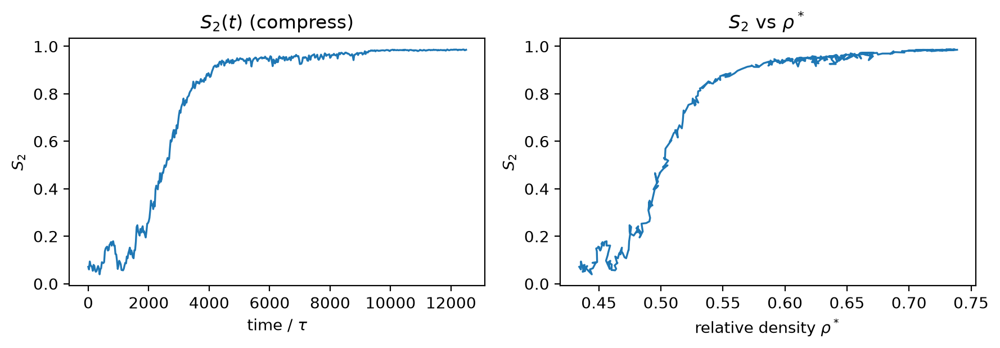

> **系列标签：** `实战案例` · `自组装` · `纳米棒` · `粗粒化` · `MDStudio` · `序参数` · `fresnel`

**各向异性**纳米颗粒（棒、盘、螺旋……）形状不对称；一挤到足够高的密度，就可能从无序液体走向向列、层状甚至晶体——这就是**自组装**（self-assembly）：无需外加「装配指令」，靠相互作用与熵即可形成有序结构。实验里常靠耗尽吸引、溶剂挥发或外场诱导；模拟里要先有一个**能代表颗粒形状**的粗粒模型，再在可控压力 / 密度下观察有序化。

**重叠球**（overlapping-sphere）模型把一根棒拆成一串互相重叠的刚性珠子：形状好控、相互作用好写。本篇以 **MDStudio** 为主路径：**粗粒颗粒**造单棒 → **结构变换**排出密堆积多棒构型 → **搭建盒子**写出 LAMMPS 输入，再接动力学与分析 Notebook。

| 量 / 步骤 | 主路径 | 在哪做 |
|-----------|--------|--------|
| **单棒几何** | 一维 `rod`，link = rigid | **MDStudio 粗粒颗粒** |
| **多棒密堆积** | 分子晶体 / 密堆积姿态与扩胞 | **MDStudio 结构变换** |
| **LAMMPS 输入** | ①②③ 把密堆积块放入盒并写出 `data.lmp` / `in.lmp` | **MDStudio 搭建盒子** |
| **动力学** | Langevin + 刚体 + 低压松弛 → 加压 | **LAMMPS**（`in.lmp`） |
| **有序化判据** | 相对密度 $\rho^*$ / 压力、向列序 $S_2$、可视化 | **轨迹后处理**（Notebook） |

**本文讲**：重叠球棒的几何与相互作用约定 → MDStudio 造棒、密堆积、出输入 → `in.lmp` 关键设置 → 怎么运行模拟 → 与 `simul_analysis.ipynb` 对齐的分析流程。输入与分析脚本见文末资源包（生产轨迹可自行跑完再分析；正式长跑可不进包）。

概念背景见[粗粒化与加速模型](../00-知识文档/K04-粗粒化与加速模型.md)、[对比单位与无量纲化](../00-知识文档/K15-对比单位与无量纲化.md)、[序参量与相变](../00-知识文档/K20-序参量与相变.md)。MDStudio 操作详解见[粗粒颗粒](../../在线工具/00-MDStudio/M13-MDStudio粗粒颗粒.md)、[结构变换](../../在线工具/00-MDStudio/M10-MDStudio结构变换.md)、[搭建盒子](../../在线工具/00-MDStudio/M11-MDStudio搭建盒子.md)。



---

## 一、模型与方法背后的数学

硬棒（**spherocylinder**：圆柱段两端各加半球帽）在密度升高时，可以走出一条经典相序：

| 相 | 英文 | 直观图像 |
|----|------|----------|
| 各向同性液体 | isotropic | 取向与位置都无序 |
| 向列 | nematic | 棒大致朝同一方向，质心仍像液体 |
| 层状 | smectic | 有取向，且沿某方向出现层状密度调制 |
| 晶体 | crystal | 取向与三维位置都有序 |

中间还可能出现旋转晶体（plastic / rotator solid）等，具体分支取决于长径比 $L/D$。Bolhuis 与 Frenkel 用硬球棒把这条相图系统地画了出来（[Bolhuis & Frenkel, *J. Chem. Phys.* 1997](https://doi.org/10.1063/1.473404)）。本例用**软排斥 Mie 势**逼近硬核、用 Langevin 热浴 + 加压走教学路径，不求复现完整硬棒相图，但读结果时心里要有这条「无序 → 有取向 → 有层 → 有晶格」的梯子。

本节先钉死「棒怎么表示」「珠子怎么相互作用」「加压看什么」；下一节起再动手在 MDStudio 里摆珠子。

### 1. 重叠球棒：几何

一根棒状颗粒用 spherocylinder 描述：圆柱段长 $L$、直径 $D$，两端各一半球。重叠球模型把它写成沿轴线等距分布的 $N$ 个直径为 $D$ 的球，球心落在长为 $L$ 的线段上：

$$
\Delta \ell=\frac{L}{N-1},\qquad
\mathbf r_i=\mathbf r_0+i\,\Delta\ell\,\hat{\mathbf u},\quad i=0,\ldots,N-1
$$

| 符号 | 含义 | 本例建议 |
|------|------|----------|
| $L$ | 轴线上端到端长度（圆柱段；与文献习惯一致） | `length = 5`（对比单位） |
| $D$ | 球直径（≈ LJ 长度参数 $\sigma$） | $\sigma=1\Rightarrow D=1$ |
| $N$ | 珠数 | `number = 11` → $\Delta\ell=0.5$ |
| $\Delta\ell$ | 相邻球心距 | 宜 $\le 0.5D$，减轻珠间「凹槽」伪效应 |

MDStudio「粗粒颗粒 · 一维 rod」正是按 length / spacing / number 联动摆珠；link 选 **rigid** 时不写键，留给 LAMMPS `fix rigid` 把整根棒当刚体积分。

### 2. 相对密度 $\rho^*$（相对 close packing）

棒相图文献常把密度画成相对**密堆积**（close packing）棒数密度的约化量（如 [Liu & Widmer-Cooper, 2019](https://doi.org/10.1063/1.5096193)），便于和不同长径比的结果对照：

$$
\rho^*=\frac{\rho}{\rho_{cp}},\qquad
\rho_{cp}=\frac{2}{\sqrt{2}+(L/D)\sqrt{3}}
$$

这里 $\rho=N_\mathrm{rod}/V$ 为棒数密度（单位体积内的棒根数），$\rho_{cp}$ 为理想密堆积时的棒数密度。LAMMPS `units lj` 且质量为 1 时，thermo 的 `density` 是原子数密度 $\rho_\mathrm{atom}=N_\mathrm{atom}/V$；又 $N_\mathrm{atom}=N_\mathrm{rod}\,N$，故

$$
\rho=\frac{\rho_\mathrm{atom}}{N}
$$

本例 $L=5$、$D=1$、$N=11$。下文与 Notebook 中的密度图**统一画 $\rho^*$**，不再直接画 LAMMPS 原子数密度。

### 3. 珠–珠相互作用：软排斥（伪硬球）

真硬球要用事件驱动 MD；教学里常用**连续伪硬球 Mie 势**（截断并平移，使截断处势与力连续）逼近硬核排斥：

$$
U(r)=A\,\varepsilon\left[\left(\frac{\sigma}{r}\right)^{50}-\left(\frac{\sigma}{r}\right)^{49}\right],
\qquad
A=50\left(\frac{50}{49}\right)^{49},
\qquad
r_\mathrm{cut}=\frac{50}{49}\sigma
$$

同一根棒内的珠子**不**算对势（`neigh_modify exclude molecule/intra` + `fix rigid`），形状由刚体约束维持。温度取对比单位 $k_BT/\varepsilon=1$，质量 $m=1$，时间单位 $\tau=D\sqrt{m/(k_BT)}$（见 [对比单位与无量纲化](../00-知识文档/K15-对比单位与无量纲化.md)）。

| 项 | 本例约定 |
|----|----------|
| **单位** | LAMMPS `units lj`（生产脚本） |
| **势** | `pair_style mie/cut`，$n=50$, $m=49$ |
| **刚体** | `fix rigid … molecule` |
| **热浴** | Langevin；$T=1$ |
| **压浴** | Berendsen；先极低压松弛，再逐步加压看有序化 |

MDStudio 粗粒颗粒默认写出的是单 type **LJ**（对比 $\sigma=\varepsilon=1$），便于预览。**正式自组装生产**以资源包 `in.lmp` 的 Mie + `units lj` 为准；密堆积与装盒得到的坐标与分子分组仍直接沿用。

### 4. 动力学与加压路径

珠子在 Mie 保守力之外，还受 Langevin 热浴的摩擦与随机力，使温度稳定在目标值；整根棒由 `fix rigid` 作为刚体整体平动 / 转动。教学路径：

```text
密堆积初态（结构变换给出）
        → 极低压松弛（取向打乱，接近各向同性）
        → 逐步加压（或升密度）
        → 向列 / 层状 / 晶体（视长径比与压力）
```

密堆积只是**方便生成无重叠的多棒起点**；正式采样往往先在很小的压力下让体系「融化」成无序取向，再加压爬相序——否则看到的「有序」可能只是初态记忆。本例先跑通「能出输入、能刚体 Langevin、能看 $S_2$ 与 $\rho^*$」；完整相图扫描留给加长生产。

### 5. 有序化怎么定量

**棒轴 $\hat{\mathbf u}$：** 每一根棒的指向。本例用同一分子首尾珠心差向量归一化：

$$
\hat{\mathbf u}=\frac{\mathbf r_{\mathrm{end}}-\mathbf r_{\mathrm{start}}}{|\mathbf r_{\mathrm{end}}-\mathbf r_{\mathrm{start}}|}
$$

**指向子（director）$\hat{\mathbf n}$：** 整盒棒的「集体取向」。由全体 $\hat{\mathbf u}_i$ 构造二阶取向张量

$$
Q=\left\langle\frac{3}{2}\hat{\mathbf u}\hat{\mathbf u}^{\mathsf T}-\frac{1}{2}\mathbf I\right\rangle
$$

取 $Q$ 的最大本征值对应的本征向量，即为瞬时 $\hat{\mathbf n}$。

**向列序参量 $S_2$（标量）：** 即 $Q$ 的最大本征值，也可写成对指向子的平均：

$$
S_2=\left\langle\frac{3}{2}(\hat{\mathbf u}_i\cdot\hat{\mathbf n})^2-\frac{1}{2}\right\rangle
$$

$S_2\approx 0$ 近似各向同性；$S_2$ 明显升高标志**向列**有序——棒大致朝同一方向，但质心仍可像液体一样流动。

**向列之后还要什么？** 层状还要求沿某一方向的**密度调制 / 层间距**；晶体还要三维位置有序。那些是**另一类序参量**（密度相关函数、层结构因子等），不是把 $S_2$ 再抬高一点就能代替的。Notebook 教学优先钉牢 $S_2$ 与 $P$–$\rho^*$；层状 / 晶体判据可参考 [Liu & Widmer-Cooper, *J. Chem. Phys.* 2019](https://doi.org/10.1063/1.5096193)。概念总图见 [序参量与相变](../00-知识文档/K20-序参量与相变.md)。

公式既定，下面在 MDStudio 里造一根棒、排出密堆积、再写出输入。

---

## 二、搭模型（MDStudio）

目标产物：工作区里的 **`data.lmp`**（多根刚性重叠球棒）以及配套的控制脚本。流水线是：

```text
粗粒颗粒（单棒） → 结构变换（密堆积多棒） → 搭建盒子（①②③ 放入盒并写出 data.lmp / in.lmp）
```

单棒几何来自「粗粒颗粒」，**不经过**力场生成（粗粒珠的 LJ 参数只作占位；生产对势以 `in.lmp` 的 Mie 为准）。

| 项 | 本例取值 | 说明 |
|----|----------|------|
| **单棒** | `rod`，$L=5$，$N=11$，link = **rigid** | $\Delta\ell=0.5$，$\sigma=\varepsilon=\mathrm{mass}=1$ |
| **密堆积** | 分子晶体 · fcc；主轴对齐 $+Z$；$n_x{=}n_y{=}17$，$n_z{=}3$；padding `0.55` | 棒间距约留 $0.05$；**867** 根棒、**9537** 珠（资源包同此） |
| **状态点** | $T=1$（lj）；极低压松弛后加压 | 与 `in.lmp` 一致 |
| **原子类型** | 单 type（粗粒颗粒默认） | 同质珠；不同棒靠分子编号区分 |

### 1. 粗粒颗粒：造一根刚性棒

1. 打开 [MDStudio粗粒颗粒](../../在线工具/00-MDStudio/M13-MDStudio粗粒颗粒.md)。  
2. 选 **一维** → 几何 **`rod`**。  
3. 按表填写（名称可用 `rod`）：

| 参数 | 取值 |
|------|------|
| length | `5` |
| number | `11`（spacing 会自动成 `0.5`） |
| axis | `x` |
| sigma / epsilon / mass | `1` / `1` / `1` |
| link | **rigid** |

4. 「预览结构」：勾选右侧 **实际尺寸** 可核对珠子按 $\sigma$ 接触。  
5. 「保存结构与力场」→ 得到 `rod.mol` + `rod.ff`。

> **Tips：** `rod` 与 `chain` 几何相同；`chain` 默认成键。自组装刚体棒务必用 **rod + rigid**，不要用 chain。



### 2. 结构变换：单棒 → 密堆积多棒

1. 打开 [MDStudio结构变换](../../在线工具/00-MDStudio/M10-MDStudio结构变换.md)。  
2. 输入选上一步的 `rod.mol`。  
3. 走 **分子晶体** 子模式，按表填写：

| 参数 | 取值 |
|------|------|
| 姿态 | 主轴对齐 $+Z$ |
| 晶格 | **fcc**（面心立方密堆积） |
| $n_x$ / $n_y$ / $n_z$ | `17` / `17` / `3` |
| padding | `0.55`（棒间距约留 $0.05$，减轻刚放入盒时的硬重叠） |

4. 写出 `*_trans.xyz`：第二行仍引用 `rod.ff`，并带上密堆积后的盒子信息。

本教学设置得到 **867** 根棒、**9537** 珠的规则密堆积块，方便一次性放下很多棒且少重叠。后面跑动力学时，通常先在**极低压力**下松弛，让取向打乱、接近各向同性；再**逐步加压**，依次观察向列等有序相。



### 3. 搭建盒子：把密堆积块放进盒并写出输入

密堆积文件还不是最终的 LAMMPS 输入。打开 [MDStudio搭建盒子](../../在线工具/00-MDStudio/M11-MDStudio搭建盒子.md)，主路径仍走完整 **① → ② → ③**：

1. 物种选上一步的 `*_trans.xyz`（配套 `rod.ff`）；**份数 = 1**（整块密堆积当作一个坐标文件）。  
2. 在该物种行填 **atoms_per_mol = 单棒珠数**（本例 `11`）。这样 ③ 写出 `data.lmp` 时，会按「每 11 个原子一根棒」切开分子编号，后面 `fix rigid` 才能按棒锁刚体。细节见 [搭建盒子](../../在线工具/00-MDStudio/M11-MDStudio搭建盒子.md) §3.1。  
3. **① 生成 Packmol**：写出 `pack.inp` 与打包用坐标。这里 Packmol 的角色是把**整块密堆积结构放进模拟盒**（不是随机撒几百根单棒）。  
4. **② 运行 Packmol**：得到盒内的 `simbox.xyz`。  
5. **③ 生成 Lammps**：写出 `data.lmp` / `in.lmp`（及如有的 `pair.lmp`）。

本例后面会先松弛到接近无序、再加压爬相序，所以一开始把整块密堆积**随机放入一个较大的盒子**里即可，不必像 [受限溶液建模](C01-受限溶液建模.md) 那样改 `pack.inp` 做板—水—板。若你希望**一开始就是有序密堆、盒子刚好贴合**，可以仿照 C01 里用 `fixed` 固定墙的做法，在 `pack.inp` 里把整块密堆积**固定摆进合适尺寸的盒子**。生产脚本里务必保留 `fix rigid … molecule`；若珠间距仍偏紧，LAMMPS 开头可用短最小化 / 软势预平衡。

> **Tips（对照：随机装多根单棒）：** 若只要稀溶液、无序初态，或少数棒并控制方位，仍可物种选单棒 `rod`、填份数，用 Packmol **随机摆放**——这和 C01 里「多组分随机装盒」是同一类用法。规则密堆积本身应在「结构变换」完成；搭建盒子里的 Packmol 负责**入盒**，不要指望它替你排出晶体阵。



### 4. 下载

在 [MDStudio资源管理器](../../在线工具/00-MDStudio/M04-MDStudio资源管理器.md) 打包下载 `rod.mol` / `rod.ff` / `*_trans.xyz` / `data.lmp` / `in.lmp`。也可直接用文末资源包已写好的构型与脚本。正式有序化请用资源包 `in.lmp`（`units lj` + Mie + Langevin + Berendsen）。

---

## 三、`in.lmp` 关键设置

整条流水线（与资源包 `in.lmp` 一致；细节以包内文件为准）：

```text
读 data.lmp（多棒）
  → Mie 软排斥 + exclude 分子内
  → 最小化 → 刚体 + Langevin
  → NVT（固定盒）→ 低压 NPT（@ myPstart）
  → 加压：myPstart → myPend（单向）
  → dump 全原子 xsu/ysu/zsu → 分析用
```

**NVT**：体积固定、温度由热浴控制。**NPT**：温度与压力都受控（本例用 Berendsen 各向同性压浴缩放盒子）。下面只抠和自组装直接相关的几处。

### 1. 可调变量

```lammps
variable        rodL            equal   5.0             # 棒长 L（通信截断用）
variable        mytemp          equal   1.0             # 目标温度（lj）
variable        myrand          equal   4003
variable        myPstart        equal   1.0             # 松弛 / 加压起点压
variable        myPend          equal   3.0             # 加压终点压（单向）

variable        nvt_steps       equal   100000          # NVT 热化
variable        npt_eq_steps    equal   100000          # 低压 NPT
variable        compress_steps  equal   5000000         # 低压 → 高压
variable        pdamp           equal   5.0
```

| 变量 | 含义 |
|------|------|
| `myPstart` / `myPend` | 低压松弛压与加压终点；扫相序主要改这两项 |
| `nvt_steps` / `npt_eq_steps` / `compress_steps` | 三段步数（`timestep = 0.005`） |
| `rodL` | 与单棒 `length` 一致，供 `comm_modify` 用 |

### 2. 单位、原子风格与势

```lammps
units           lj
dimension       3
boundary        p p p
atom_style      full

pair_style      mie/cut  1.02040816327                  # rcut = (50/49)σ
pair_modify     shift yes

read_data       data.lmp
mass            * 1
pair_coeff      * *  1.0  1.0  50  49

neighbor        0.3  bin
neigh_modify    delay 0  every 1  check yes
neigh_modify    exclude molecule/intra all              # 棒内珠不算对势
```

| 要点 | 说明 |
|------|------|
| `units lj` | 对比单位；$T=1$，$\sigma=\varepsilon=m=1$ |
| Mie 50–49 | 伪硬球；截断 $(50/49)\sigma\approx 1.0204$ |
| `exclude molecule/intra` | 同一棒内珠子不算对势，交给刚体约束 |
| `atom_style full` | 与 `data.lmp` 一致；靠 `mol` 编号区分棒 |

资源包 `data.lmp` 已按 lj / 对比几何写出。若你从 MDStudio 另下一份带 `real` 头的 data，**不要**与本脚本混用两套单位。

### 3. 刚体 + Langevin + 通信截断

```lammps
variable        commcutoff      equal   ${rodL}/2.0+0.1
comm_modify     mode single  cutoff  ${commcutoff}

timestep        0.005

group           rods    type  1
fix             rigid   rods  rigid/small  molecule
fix             lang    all   langevin  ${mytemp}  ${mytemp}  1.0  ${myrand}  zero yes
```

`fix rigid … molecule` 按分子锁刚体；Langevin 恒温（`zero yes` 去掉净力漂移）。通信截断约 $L/2$，避免刚体跨处理器时被「截断」。MDStudio 的 link=`rigid` 只表示**不写键**，积分时仍要本段的 `fix rigid`。

### 4. 三段动力学：NVT → 低压 NPT → 加压

```lammps
# 1. NVT：盒边固定
run             ${nvt_steps}

# 2. 低压 NPT
fix             press  all  press/berendsen  iso  ${myPstart}  ${myPstart}  ${pdamp}
run             ${npt_eq_steps}

# 3. 加压：P 在本段内从 myPstart 扫到 myPend（单向，无回程）
unfix           press
fix             press  all  press/berendsen  iso  ${myPstart}  ${myPend}  ${pdamp}
run             ${compress_steps}
```

| 阶段 | 压浴 | 目的 |
|------|------|------|
| NVT | 无 | 热化、打散局部应力 |
| 低压 NPT | `iso` @ `myPstart` | 取向进一步松弛、密度贴近低压 |
| 加压 | `iso` `myPstart`→`myPend` | 诱发向列 / 更高有序 |

### 5. 热力学与轨迹输出

```lammps
thermo_style    custom  step  time  temp  press  pxx  pyy  pzz  lx  ly  lz  vol  density
thermo_modify   flush yes
thermo          ${thermo_every}

dump            mydump  all  custom  ${dump_every}  &
                result_atoms.lammpstrj  id  mol  type  xsu  ysu  zsu
dump_modify     mydump  sort id
```

- **`log.lammps`**：温度、压力分量、边长、体积、密度（无单独 `result_thermo.log`）。  
- **轨迹**：加压段写全原子 **`xsu ysu zsu`**（scaled unwrapped：解折叠后的约化坐标；与 [计算扩散与粘度](C03-计算扩散与粘度.md) 相同字段），便于算棒轴时不被周期边界「折断」。  
- 改 dump 字段时，Notebook 读取约定一并改。

---

## 四、怎么运行模拟

本机先按 [分子模拟工作平台搭建](../01-技术文档/T01-分子模拟工作平台搭建.md) 配好环境。LAMMPS 需含 **MOLECULE、RIGID**，以及对势 **MIE**（`pair_style mie/cut`）。安装见 [Lammps安装简明教程](../01-技术文档/T20-Lammps安装简明教程.md)。

把资源包解压到同一目录（至少要有 `in.lmp` 与 `data.lmp`），进入该目录后：

```bash
# 串行（调试）
lmp -in in.lmp

# 并行示例
mpirun -np 4 lmp -in in.lmp
```

二进制名随安装而异（`lmp` / `lmp_mpi` / `lmp_serial` 等），见安装教程。集群提交点到为止，见 [集群与SLURM简明教程](../01-技术文档/T10-集群与SLURM简明教程.md)。

脚本三段一体跑完（**无需**另改 restart 开关）：

| 阶段 | 内容 | 默认步数（可改变量） |
|------|------|----------------------|
| **NVT** | 刚体 + Langevin，盒边固定 | `nvt_steps`（$10^5$） |
| **低压 NPT** | Berendsen @ `myPstart` | `npt_eq_steps`（$10^5$） |
| **加压** | `myPstart` → `myPend`（单向） | `compress_steps`（$5\times10^6$） |

跑完后目录里应有：

| 文件 | 用途 |
|------|------|
| `log.lammps` | $T$、$P$、$p_{xx/yy/zz}$、边长、体积、密度 |
| `result_atoms.lammpstrj` | 加压段全原子轨迹（`xsu ysu zsu`）→ 取向 / $S_2$ |
| `result_atoms.data` | 最小化 + 赋速后构型 |
| `result_atoms.eq.data` | NVT + 低压 NPT 末构型 |
| `result_atoms.prod.data` | 加压末构型 |

加压段轨迹体积大，**不进资源包**；自行跑完再在同目录打开 Notebook 分析。压力窗口改 `myPstart` / `myPend` 即可；教学路径**不必**做回程降压（讨论见 §六.2）。

---

## 五、Notebook 分析

本地先按 [分子模拟工作平台搭建](../01-技术文档/T01-分子模拟工作平台搭建.md) 配好 `myenv`。把资源包与**自跑得到的** `result_atoms.lammpstrj` 放在同一目录，打开 `simul_analysis.ipynb`，**自上而下依次运行**：

```text
1 轨迹可视化 → 2 热力学 → 3 ρ*–时间 / ρ*–压力 → 4 S₂ → 5 汇总 → 6 Fresnel 渲染
```

| 模块 | 职责 |
|------|------|
| `_helper_functions.py` | 读 `log.lammps`、MDAnalysis 读 dump、`save_nglview_frame` |
| `_nematic_order.py` | $\rho^*$ 换算；首尾珠 → $\hat{\mathbf u}$ → $Q$ → $S_2$ |
| `_render_by_fresnel.py` | 指定帧 / 快照序列路径追踪渲染 |

第一个代码单元集中了本例参数：`TOPO`、`TRAJ`、`N_BEADS`、`ROD_L` / `ROD_D`、`DT_DUMP`，调试用的 `S2_N_FRAMES`（正式报数改 **`None`**），以及 Fresnel 快照的 `SNAP_STRIDE` / `SNAP_N`（默认每隔 50 帧共 10 张）。棒数由拓扑原子数自动推断。密度图一律用相对密度 $\rho^*$（§一.2）。

### 1. 轨迹可视化

用 `result_atoms.eq.data` + `result_atoms.lammpstrj`。**显示**时对坐标做周期折回（`wrap`）；后面算 $S_2$ 须保持 **unwrap**（解折叠），**另开** Universe。静态图可用 `save_nglview_frame(view)`。

### 2. 热力学：温度、压力、相对密度、体积

`read_result_thermo("log.lammps", segment=None)` 读全部块。自定义 thermo 从 NVT 起才有 `time` / `volume` / `density`；把 `density` 换成 $\rho^*$ 后画 $T(t)$、$P(t)$、$\rho^*(t)$、$V(t)$。加压段应看到 $P$、$\rho^*$ 一起上升。



### 3. 相对密度–时间 / 相对密度–压力

加压生产段画一行两列：左 $\rho^*(t)$，右 $\rho^*(P)$。左图常能看到**两次明显密度跳跃**，大致对应 **nematic–smectic** 与 **smectic–crystal**；**isotropic–nematic** 在 $\rho^*(t)$ 上往往不醒目，需要下一节的 $S_2$。右图瞬时压力涨落大，对 $P$、$\rho^*$ 做滚动平均后，对照左图可粗估转变压力（教学定性，不强求精确相界）。



### 4. 向列序 $S_2$

对每一帧、每一根棒，用首尾珠算 $\hat{\mathbf u}$（公式见 §一.5）；轨迹须 **unwrap**（本例已 dump `xsu ysu zsu`）。用全体 $\hat{\mathbf u}_i$ 构 $Q$、取最大本征值得 $S_2$。样例中 $S_2(t)$ 在加压中段（约 $2000$–$3000\,\tau$）明显抬升，对应 **isotropic–nematic**——这正是密度图看不清、序参量必须上场的地方。Notebook 同时画 $S_2(t)$ 与 $S_2(\rho^*)$。



### 5. 结果汇总

末尾写入 `summary_self_assembly.csv`（加压段 $P$ / $\rho^*$ 起终点、$S_2$ 早晚窗口均值等）。

### 6. Fresnel 渲染

对粗粒化球珠 / 棒珠体系，[Fresnel](https://fresnel.readthedocs.io/)（[GitHub](https://github.com/glotzerlab/fresnel)、[Glotzer lab](https://glotzerlab.engin.umich.edu/fresnel/)）是很合适的路径追踪渲染手段：几何简单、出图干净，适合展示自组装构型。安装见[分子模拟工作平台搭建](../01-技术文档/T01-分子模拟工作平台搭建.md)（`conda-forge` 的 `fresnel`）。本例用 `_render_by_fresnel.render_snapshot_series`：**每隔 50 帧渲染 10 张**，写入工作目录 `snapshots/`（需自备加压段轨迹）。渲染前按 **residue（整根棒）** wrap（`compound="residues"`，与 nglview 一致），避免跨周期边界的棒被按珠拆断；可按分子（棒）编号着色，或按 $|\hat{\mathbf u}\cdot\hat{\mathbf n}|$ 着色（`cmap="bwr"`，`cmap_range=(0.3, 0.7)`，避开过深蓝 / 红）。本文封面即为若干 Fresnel 渲染的 snapshots，采用了 $|\hat{\mathbf u}\cdot\hat{\mathbf n}|$ 着色。

---

## 六、讨论

### 1. 观察到的相行为与文献几乎一致

教学跑通后，从 $\rho^*(t)$、$S_2(t)$ 与构型可视化可以看到「无序 → 向列 →（更高密度下的）层状 / 晶体方向」的梯子，与硬棒 / 伪硬球棒文献中的相序定性一致（[Bolhuis & Frenkel, 1997](https://doi.org/10.1063/1.473404)；[Liu & Widmer-Cooper, 2019](https://doi.org/10.1063/1.5096193)）。本例加压偏快、体系偏小，相界位置不必与文献数值一一对齐，但趋势应对得上。

### 2. 怎样把结果做得更接近文献

若要更干净的 $P$–$\rho^*$ 曲线、更接近文献的相变点与两相共存区，关键是让加压过程更接近**准平衡**，并减轻**有限尺寸效应**：

- **加大粒子数**：减小有限尺寸带来的相界漂移与涨落（见 [有限尺寸效应](../00-知识文档/K18-有限尺寸效应.md)）；  
- **减缓压力变化速率**（拉长 `compress_steps`）：每一步压力变化后体系有更充分时间弛豫，状态更接近准平衡，避免「赶不上」的动力学滞后；  
- **补做减压回程**：加压之后再把目标压缓缓降回去，迟滞环 / 平台有助于粗估相变点与两相共存区。

统计误差与采样时长见 [统计误差与块平均](../00-知识文档/K17-统计误差与块平均.md)。

### 3. 序参量：密度够不够？

有些相变（如本例 $\rho^*(t)$ 上可见的 nematic–smectic、smectic–crystal 跳跃）用**相对密度**就能定性捕捉；但 **isotropic–nematic** 往往在密度上几乎看不出拐点，必须用取向序参量 $S_2$（以及层状 / 晶体所需的密度调制类序参量）。定义与用法见 [序参量与相变](../00-知识文档/K20-序参量与相变.md)；棒体系中更完整的序参量与动力学分析可参考 [Liu & Widmer-Cooper, *J. Chem. Phys.* 2019](https://doi.org/10.1063/1.5096193)。

### 4. 什么时候该换模型 / 换路径

| 场景 | 建议 |
|------|------|
| **只练 MDStudio 粗粒几何** | 停在第二节 §1–§2（造棒 + 密堆积预览）即可 |
| **硬核棒相行为（对标文献）** | 用本例 Mie + lj + 刚体；相图见 [Bolhuis & Frenkel, 1997](https://doi.org/10.1063/1.473404) |
| **无序 / 稀溶液初态** | 单棒 × N 走 Packmol 随机装盒（对照路径；用法类似 C01） |
| **耗尽吸引 / 棒–聚合物** | 另加聚合物珠或有效吸引；方法见 [Liu & Widmer-Cooper, 2019](https://doi.org/10.1063/1.5096193) |
| **螺旋、盘、壳** | 仍用粗粒颗粒其它几何；分析取向定义要改 |
| **全原子纳米棒** | 走孤立分子 / 力场生成，不是本篇重叠球路线 |

---

## 常见问题

**Q：为什么密堆积之后还要极低压松弛？**  
A：密堆积是建模方便；自组装扫描通常需要先回到接近各向同性的参考态，再加压看有序化。否则你看到的「有序」可能只是初态记忆。

**Q：搭建盒子为什么还要跑 Packmol？**  
A：结构变换给出多棒坐标；搭建盒子的 ①② 把整块结构**放进**目标模拟盒并生成 `simbox.xyz`，③ 再写 `data.lmp`。这和「随机撒很多单棒」不是同一件事。

**Q：MDStudio 的 `.ff` 是 LJ，生产却用 Mie？**  
A：`.ff` 方便对比单位预览；生产脚本显式写 Mie 系数。几何与分子分组来自 `data.lmp`，对势以 `in.lmp` 为准。

**Q：`fix rigid` 和 link=rigid 是一回事吗？**  
A：MDStudio 的 link=rigid 表示**不写键**；LAMMPS 里仍要 `fix rigid` 才在积分时保持刚性。只装盒不写 `fix rigid`，珠子会按对势各自动。

**Q：珠数 $N$、间距 $\Delta\ell$ 怎么选？**  
A：经验上 $\Delta\ell\le 0.5D$。$N$ 太稀，棒侧面凹槽伪效应大；$N$ 太密，白费计算。本例 $L=5$、$N=11$ 是教学默认。

**Q：相对密度 $\rho^*$ 和 LAMMPS 的 density 有什么关系？**  
A：LAMMPS `density`（本例）是原子数密度；棒数密度 $\rho=\rho_\mathrm{atom}/N$，再除以密堆积密度 $\rho_{cp}$ 得到 $\rho^*$（§一.2）。

---

## 小结

1. **模型**：重叠球棒用 $N$ 个球逼近 spherocylinder；珠间软排斥 Mie；棒内刚体。硬棒相序见 [Bolhuis & Frenkel, 1997](https://doi.org/10.1063/1.473404)。  
2. **MDStudio**：粗粒颗粒造棒 → 结构变换密堆积 → 搭建盒子 ①②③ 入盒并写出 `data.lmp`（`atoms_per_mol` 按棒切开）。  
3. **`in.lmp`**：`units lj` + Mie + `fix rigid` + Langevin + Berendsen；极低压松弛后逐步加压。  
4. **分析**：密度统一用相对密度 $\rho^*=\rho/\rho_{cp}$；端珠建 $\hat{\mathbf u}$ → $S_2$；I–N 靠 $S_2$，部分更高阶相变可从 $\rho^*$ 跳跃看出。  
5. **验收**：不炸、松弛后取向打乱、加压变密、$S_2$ 抬升；要对齐文献相界需加大体系、减缓加压并考虑减压回程。

---

## 资源下载

**资源包文件名：** `纳米棒自组装.zip`（**VIP 下载**）

> **不含轨迹与出图：** `result_atoms.lammpstrj`、加压末构型、`result_*.png`、`snapshots/` 体积大或不便随包分发。用包内 `in.lmp` + `data.lmp` 自行跑完，再在同一目录打开 Notebook；热力学可先用包内 `log.lammps` 练分析。

| 文件 | 说明 |
|------|------|
| `rod.mol` / `rod.ff` | 单棒几何与占位 LJ（粗粒颗粒） |
| `rod_trans.xyz` / `rod_trans_pack.xyz` | 密堆积多棒（结构变换 / Packmol 用） |
| `pack.inp` / `simbox.xyz` | 搭建盒子中间产物 |
| `data.lmp` | 多棒初始构型（搭建盒子写出） |
| `in.lmp` | Langevin + 刚体 + 低压松弛 / 加压 |
| `result_atoms.data` | 最小化 + 赋速后构型（样例） |
| `log.lammps` | 样例热力学日志 |
| `simul_analysis.ipynb` | 可视化 → thermo → $\rho^*(t)$/$\rho^*(P)$ → $S_2$ → 汇总 → fresnel |
| `_helper_functions.py` / `_nematic_order.py` / `_render_by_fresnel.py` | Notebook 依赖 |
| `summary_self_assembly.csv` | 样例汇总（对照量级） |

---

## 学习路径

**前置**

- [MDStudio粗粒颗粒](../../在线工具/00-MDStudio/M13-MDStudio粗粒颗粒.md)
- [MDStudio结构变换](../../在线工具/00-MDStudio/M10-MDStudio结构变换.md)
- [MDStudio搭建盒子](../../在线工具/00-MDStudio/M11-MDStudio搭建盒子.md)
- [粗粒化与加速模型](../00-知识文档/K04-粗粒化与加速模型.md)
- [对比单位与无量纲化](../00-知识文档/K15-对比单位与无量纲化.md)
- [序参量与相变](../00-知识文档/K20-序参量与相变.md)
- [Lammps安装简明教程](../01-技术文档/T20-Lammps安装简明教程.md)

**相关**

- [受限溶液建模](C01-受限溶液建模.md)（Packmol 随机 / 多组分装盒对照）
- [Lammps机械控压](C02-Lammps机械控压.md)
- [计算扩散与粘度](C03-计算扩散与粘度.md)（同为体相 + Notebook 分析节奏）
- [轨迹分析与宏观性质](../00-知识文档/K16-轨迹分析与宏观性质.md)
- [朗之万布朗与溶剂介质方法](../00-知识文档/K25-朗之万布朗与溶剂介质方法.md)
- [有限尺寸效应](../00-知识文档/K18-有限尺寸效应.md)
