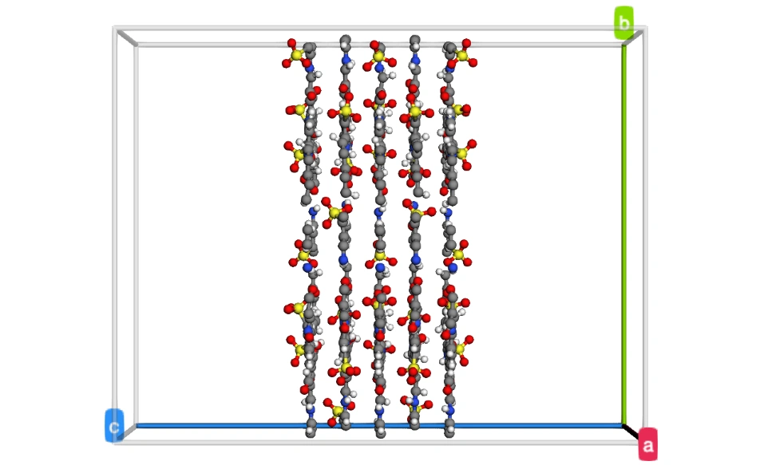
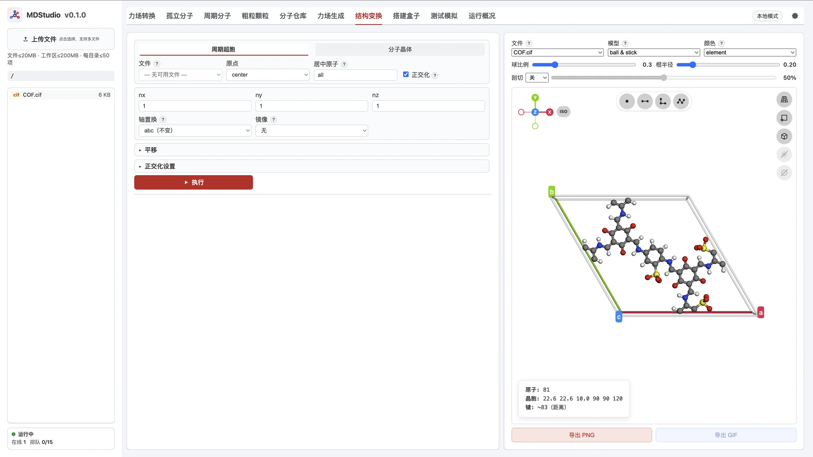
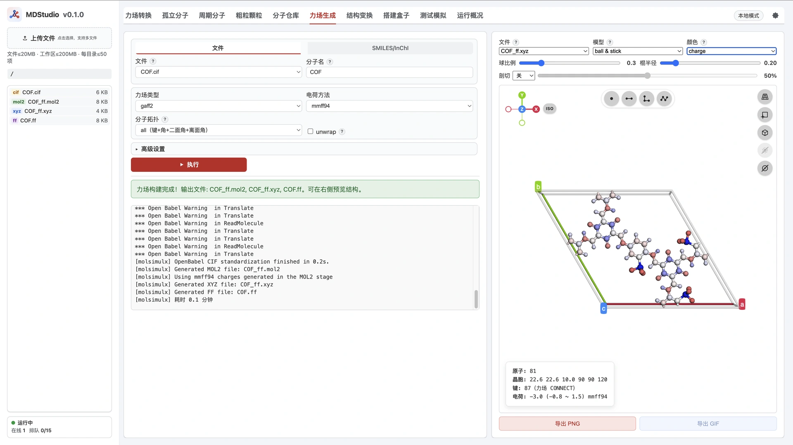
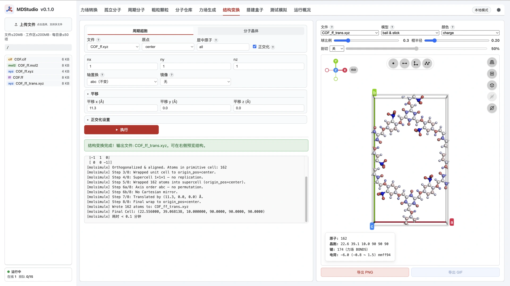
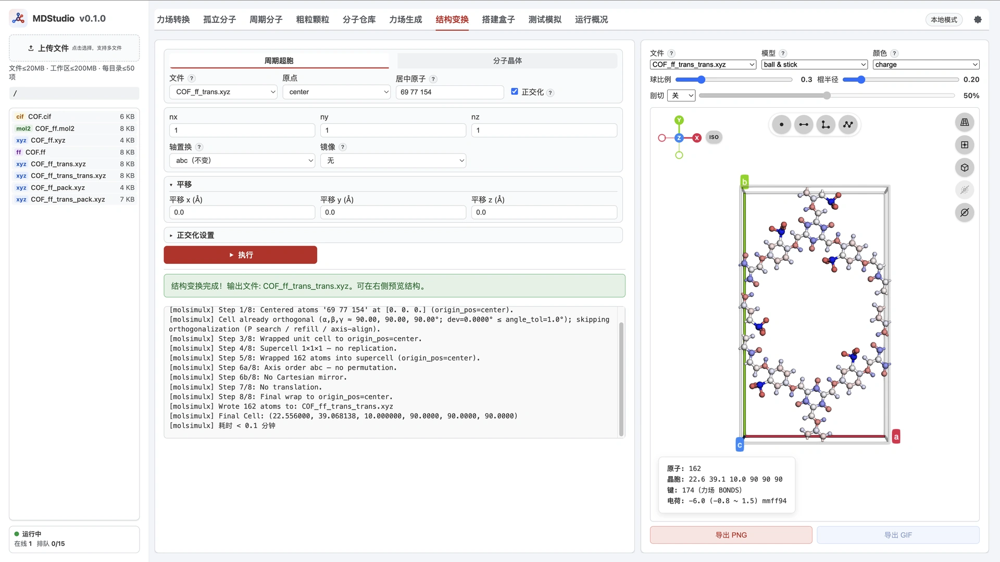
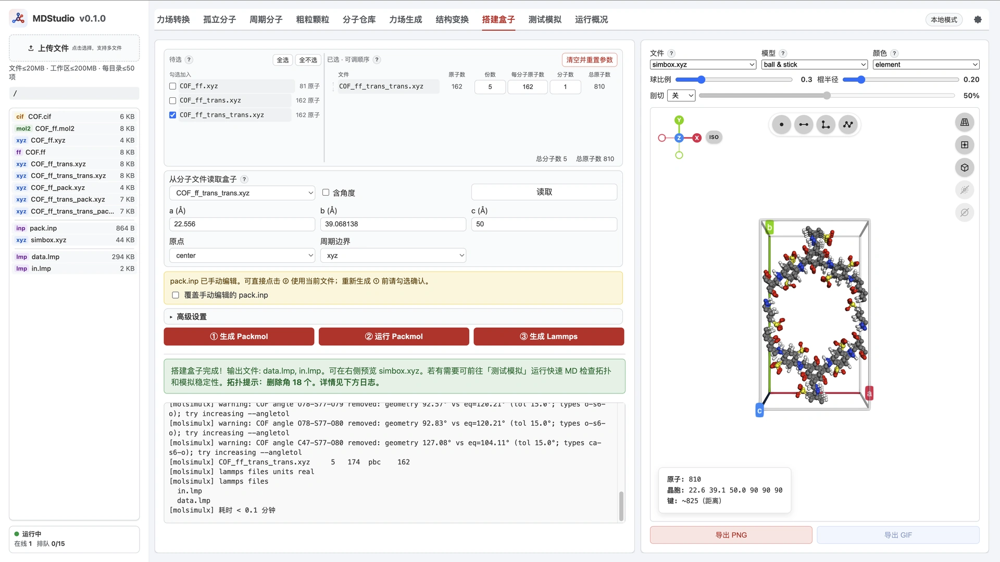
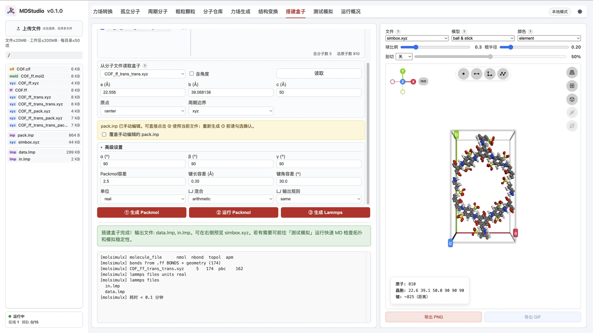
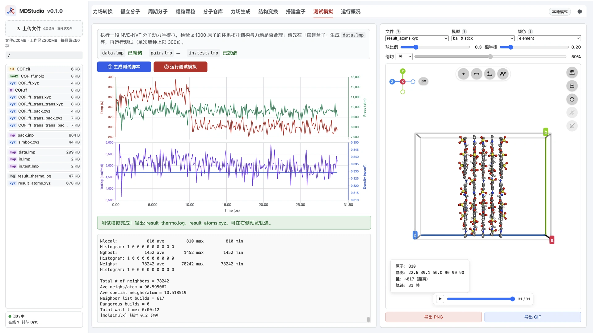

> **系列标签：** `实战案例` · `COF`  · `MDStudio` · `正交化`

**共价有机框架**（covalent organic framework，**COF**）是由轻元素骨架通过共价键连成的多孔晶体；二维 COF 常呈层状堆叠，孔道可容纳溶剂与离子。本篇用示例 **`COF.cif`**（六角斜胞，磺酸基化带电框架）在 **MDStudio** 里走通**五层干膜**建模与拓扑检查。

叠层手法对齐 [受限溶液建模](C01-受限溶液建模.md)：结构变换**只正交化**，**五层与层间距在 Packmol 的 `fixed` 里写死**。

| 步骤 | 做什么 | 在哪做 |
|------|--------|--------|
| 1 | 上传并查看 `COF.cif`（斜胞、键不完整） | 工作区 / 右侧预览 |
| 2 | 力场生成：电荷 **MMFF94**；看键与电荷 | [力场生成](../../在线工具/00-MDStudio/M09-MDStudio力场生成.md) |
| 3 | 周期超胞：**只正交化** + 粗平移，再用孔周原子精居中 | [结构变换](../../在线工具/00-MDStudio/M10-MDStudio结构变换.md) |
| 4 | 搭 5 层干膜：手改 / 用资源包 `pack.inp` → ②③ | [搭建盒子](../../在线工具/00-MDStudio/M11-MDStudio搭建盒子.md) |
| 5 | 测试模拟，看各层拓扑是否完整 | [测试模拟](../../在线工具/00-MDStudio/M12-MDStudio测试模拟.md) |

概念背景见[经典全原子力场](../00-知识文档/K03-经典全原子力场.md)、[边界条件与初始条件](../00-知识文档/K07-边界条件与初始条件.md)。COF / MOF 复杂周期性分子结构等请**自备 CIF 上传**（见[周期分子](../../在线工具/00-MDStudio/M07-MDStudio周期分子.md)）。



---

## 一、本例约定（读操作前扫一眼）

| 项 | 本例 |
|----|------|
| **结构** | `COF.cif`：约 $\mathrm{C_{36}H_{21}N_6O_{15}S_3}$（81 原子 / 原胞）；$a=b=22.556\,\mathrm{Å}$，$c=10.0\,\mathrm{Å}$，$\gamma\approx 120^\circ$ |
| **层数 / 间距** | Packmol **5 层**，$z$ 间隔 **$3.4\,\mathrm{Å}$**，膜放在盒中部 |
| **模拟盒** | 从正交单层读 $a/b$；**$c$ 加高到约 `50` Å**（为后续灌水预留两侧空间） |
| **本篇范围** | **干膜**叠层 + 拓扑冒烟；水 / Na⁺ / 短程跑与可视化 → [COF膜-水体系短程模拟与可视化](C06-COF膜-水体系短程模拟与可视化.md) |
| **电荷** | 教学用 **MMFF94**；生产建议 **RESP**；本材料**不要用 EQeq**（磺酸基化带电框架，EQeq 不支持） |

> **MMFF94 / RESP / EQeq** 都是[力场生成](../../在线工具/00-MDStudio/M09-MDStudio力场生成.md)里的**电荷方法**，不会把力场类型（如 GAFF2）换成 Merck 力场。生产时在同一几何上改选 `resp` 重跑并替换 `.ff` 即可。

---

## 二、操作步骤

### 1. 上传并查看 `COF.cif`

把资源包中的 `COF.cif`（与 `MolSimulX-core/examples/COF.cif` 同源）上传到工作区，在**右侧预览**打开。

- **原点**：一般调到**角点**，让结构落在盒子内部，便于看清晶胞与原子相对位置。  
- **晶胞**：这是**斜胞**（γ≈120°），不是直角盒。  
- **键**：CIF 通常**不含键信息**。预览里按坐标容差画键，**盒子边缘跨周期的键往往画不出来**——本例此时大约只能看到 **~83** 根键。这不代表骨架真断了，只是「文件里没键 + 显示未按周期补全」。

后面力场生成会按共价半径 + 容差识别**含跨边界**的键，键数会变多。



### 2. 力场生成（电荷 MMFF94）

打开 [力场生成](../../在线工具/00-MDStudio/M09-MDStudio力场生成.md)：

1. 输入选 `COF.cif`。  
2. 力场类型：`gaff2`（默认即可）。  
3. **电荷方法：`mmff94`**（教学）。生产请改 **`resp`**；**不要选 `eqeq`**——本例是磺酸基化带电框架，EQeq 不支持。  
4. **分子拓扑：`all`**；**unwrap：关**；键长容差先用 `0.35`。  
5. 运行 → `COF_ff.xyz`、`COF.ff`、`COF_ff.mol2` 等。

打开 **`COF_ff.xyz`** 看预览：

| 检查 | 本例现象 |
|------|----------|
| **键** | 可视化从配套 **`.ff`** 读键；此时包含**跨越边界**的键，大约 **87** 根（比 CIF 预览的 ~83 多） |
| **颜色 → charge** | 可看大致电荷分布；本例单层总电荷约 **-3** |

骨架应连成完整共价网。若仍明显断键，再略调键长容差并重跑，不要急着叠层。



### 3. 结构变换：只正交化（可平移好看孔）

打开 [结构变换](../../在线工具/00-MDStudio/M10-MDStudio结构变换.md) · **周期超胞**。建议分两步：先正交化并**粗平移**，再按孔周特征原子**精居中**——后面做 AB / 更精准错位堆叠时，孔心对齐盒心会省事很多。

**① 正交化 + 粗平移**

| 参数 | 本例 |
|------|------|
| 输入 | `COF_ff.xyz` |
| **正交化** | **开** |
| $n_x$ / $n_y$ / $n_z$ | **`1` / `1` / `1`**（**不要**在这里扩成 5 层） |
| **平移** | 可适量平移（本例 $x$ 方向约 $11.3\,\mathrm{Å}$），让**盒子中心附近**先出现一个完整孔道 |

写出 **`COF_ff_trans.xyz`**（粗平移产物）。正交化后水平方向原子数常约 **×2**，总电荷约变成 **-6**。

**② 再变换一次：用孔周原子精居中（推荐）**

粗平移往往只能把孔「大概」挪到中部。若要后续 **AB 堆叠**或更精准的层间错位，最好让**孔心几乎严格落在盒心**。做法：

1. 仍开结构变换 · 周期超胞；**输入改为上一步的 `COF_ff_trans.xyz`**（已正交，一般不必再开正交化；$n=1,1,1$）。  
2. 在右侧可视化区**悬停**孔周原子，查看 **index**（本例中间孔附近可选三个 S：**69、77、154**——以你当前文件悬停为准；表单「居中原子」为 **0 基**下标，与悬停 index 一致时直接填 `69 77 154`）。  
3. **居中原子**填这些 index（不要用 `all`），再跑一次变换；几何中心会对准盒心，孔心几乎就在盒子正中。

平台会写出 **`COF_ff_trans_trans.xyz`**（在 `…_trans` 后再套一层 `_trans`）。**后面搭盒子请选这个文件**，不要再用粗平移的 `COF_ff_trans.xyz`。注意：

- 两次变换都只是改参考系，**不影响**后续动力学物理（周期边界下整体平移等价）。  
- 变换后原点往往在**盒子中心**；右侧预览可用**调整原点**一类按钮改回角点或你习惯的视角，**这样看结构、后面读盒装盒都更直观**。





### 4. 搭建盒子：五层干膜（先不加水）

打开 [搭建盒子](../../在线工具/00-MDStudio/M11-MDStudio搭建盒子.md)：

1. 物种选 **`COF_ff_trans_trans.xyz`**，**份数 = 5**。  
2. 「从分子文件读取盒子」选 **`COF_ff_trans_trans.xyz`**：使 **x、y 与正交晶胞一致**。  
3. 把 **z（c）放大**，本例改为 **`50`**（Å），后面把五层 $xy$ 平面 COF 放在盒中部，上下留空。  
4. 点 **① 生成 Packmol**（此时五份 COF 多半还是 `inside box`）。

到 [MDStudio资源管理器](../../在线工具/00-MDStudio/M04-MDStudio资源管理器.md) 打开 `pack.inp`，改成下面这样（把「一份 `number 5`」拆成五段 **`fixed`**——Packmol 用语：把分子钉在给定坐标与朝向，而不是在盒内随机投放；层间距 **$3.4\,\mathrm{Å}$**，膜对称放在 $z=0$ 附近；奇偶层绕 $z$ **交替旋转 π**，避免 AA 正对；与资源包 **`pack.inp`** 一致）：

```text
tolerance 2.5
seed -1
filetype xyz
output simbox.xyz

# 五层 COF：沿 z 间隔 3.4 Å；奇偶层绕 z 交替旋转 π（≈180°），减轻 AA 磺酸重叠
# 文件名以搭建盒子 ① 生成的 *_pack.xyz 为准（本例为 COF_ff_trans_trans_pack.xyz）
# fixed x y z  α β γ  → 后三个为绕 x/y/z 的转角，单位是弧度（不是度）
structure COF_ff_trans_trans_pack.xyz
  number 1
  center
  fixed 0. 0. -6.8  0 0 0
end structure

structure COF_ff_trans_trans_pack.xyz
  number 1
  center
  fixed 0. 0. -3.4  0 0 3.141593
end structure

structure COF_ff_trans_trans_pack.xyz
  number 1
  center
  fixed 0. 0.  0.0  0 0 0
end structure

structure COF_ff_trans_trans_pack.xyz
  number 1
  center
  fixed 0. 0.  3.4  0 0 3.141593
end structure

structure COF_ff_trans_trans_pack.xyz
  number 1
  center
  fixed 0. 0.  6.8  0 0 0
end structure
```

也可直接把资源包里的 `pack.inp` 拷进工作区覆盖（确认 `*_pack.xyz` 文件名一致）。

要点（与 [受限溶液建模](C01-受限溶液建模.md) 相同）：

- **`center` + `fixed x y z α β γ`**：质心钉到指定坐标；后三个为绕 $x/y/z$ 的转角，**单位是弧度**。本例奇偶层交替 **`0 0 0` / `0 0 3.141593`（即 π ≈ 180°）**，避免 AA 正对时磺酸 O 层间刺穿。二维 COF 实验里错位 / AB 类堆叠也更常见，这里用交替 π 作教学折中。  
- 相邻层 $z$ 差 = **$3.4\,\mathrm{Å}$**。  
- 改完**不要再点 ①**（会覆盖）；直接点 **② 运行 Packmol** → **③ 生成 Lammps**，得到干膜版 `data.lmp` / `in.lmp`。  
- 右侧应能看到五层膜落在盒中部。改好的 `pack.inp` 建议保留一份备份，勿再点 ① 覆盖。

> **`-SO3` 键角容差（务必看日志）：** 本例磺酸基里，几何上的部分 O–S–O 角大约在 **~93°**（通过可视化区的测键角可确定），而力场里对应角的平衡值约在 **~120°**。③ 生成 Lammps 时若键角容差仍用默认（常为 **15°**），这些角会因与平衡角差太大被**丢掉**，日志里会出现相应**警告**。缺了 O–S–O（以及相关拓扑）后，`-SO3` **撑不住**，后面动力学里容易出问题。做法：把**键角容差**调到约 **30°**，再跑一次 **③ 生成 Lammps**；警告应消失，完整角信息写入 `data.lmp`。键长容差一般不必跟着改。

> **顺序与份数：** 表单里 COF 份数须为 **5**，且与五段 `structure` 一致。①→③ 之间勿改物种顺序 / 个数，否则拓扑易乱。





### 5. 测试模拟（验各层拓扑）

五层 COF 已由 Packmol 摆在盒中部。打开 [测试模拟](../../在线工具/00-MDStudio/M12-MDStudio测试模拟.md) 可先 **① 生成测试脚本**；本例干膜请用下面这份 **`in.test.lmp`**（与资源包一致）覆盖后再 **② 运行**。

**不要**用 `setforce 0` 冻全原子（冻住后验键无意义）。本例对全部骨架原子（C、N）使用 `fix spring/self`：每个骨架原子被弹簧拉回**自己的初始坐标**，层形与间距不易被层间排斥推散；侧基不拴，键 / 角仍出力。

大概插在赋初速之后、thermo 之前：

```lammps
velocity all create ${mytemp} ${myrand} dist gaussian mom yes rot yes

# ---- 全部骨架 C/N：spring/self 拉回各自初始位置 ----
# type：2=nu(N), 3–5=c/ca/ce(C)；若你的 data.lmp 编号不同请改
group backbone type 2 3 4 5
fix pinbb backbone spring/self 100.0

thermo_style custom step v_t_ps temp pe ke etotal press vol density
```

跑段结束后：`unfix pinbb`。$K$ 先用 `100`（`units real`），仍乱可加大；磺酸位阻过大时，Packmol 的 $z$ 间隔可改为 **$3.8$–$4.5\,\mathrm{Å}$**。

完整脚本见资源包 `in.test.lmp`。跑完看 `result_atoms.xyz`：膜在盒中部附近，骨架共价网完整。

> 线上测试有**原子数上限**（当前 1000）与墙钟限制。五层干膜若超限，可先单层冒烟，或下载到本地跑。



---

## 三、讨论

### 1. 为什么 CIF 里键少、力场后又变多？

CIF 不带键；预览只能在**当前映像**里连近邻。力场生成按周期最小镜像判键并写入 `.ff`，**跨边界键**才补全，所以会从 ~83 → ~87。看拓扑请以 **`COF_ff.xyz` + `.ff`**（或 mol2）为准，不要只盯 CIF。

### 2. 为什么正交后总电荷从 −3 变成 −6？

正交惯胞常把水平方向原子数大约加倍，磺酸基化框架的净电荷大致按原子集合加倍，故约 **−3 → −6**。五层干膜若每层复制同一套电荷，体系总电荷约 **−30**——灌水时需加反离子（见 [COF膜-水体系短程模拟与可视化](C06-COF膜-水体系短程模拟与可视化.md)，本例规划 **30** 个配套 Na⁺）。

### 3. 平移孔到盒心有没有物理意义？

没有。只为预览、装盒和对后续 **AB / 错位堆叠**时好对孔。动力学在周期边界下与整体平移等价。粗平移 + 孔周特征原子（如本例 S **69 / 77 / 154**）再居中一次，是为了让孔心尽量落在盒心，不是改化学。

### 4. 力场为什么维持不了 COF 的真实结构？

本例用的是通用有机小分子力场（GAFF2 + MMFF94 电荷），**不是**为二维 COF 晶体参数化的。它通常**过于简化**：缺少可靠的层间势、π–π / 色散与氢键的精细平衡，也未必能复现实验晶胞、层间距或堆叠方式。短时测试里层被推散、间距漂移，往往是力场边界，而不是「拓扑建错了」这么简单。

**不要期望**这套参数在无约束下长期稳住「真实 COF 结构」。建模阶段把几何摆对、拓扑连上；若要保层形 / 孔道，靠 §5 的约束或下面说的简化处理，而不是指望力场自己「长」出正确层间距。

实务上的定位通常是：用约束（或刚性处理）保住**大致正确的孔道几何**；力场主要负责**表面与溶液的相互作用是否合理**——尤其是功能基团与水 / 离子 / 溶质的氢键、静电与范德华。骨架晶体学细节（层间距、堆叠滑移）不必、也往往不能靠通用 FF 复现。若某类官能团是研究重点，有时还会对它做**更精准的力场修饰**（改电荷、LJ、键参数，或换专用参数集），而不是指望整套 GAFF2 默认项一次到位。

### 5. 都 `spring/self` 了，为什么还要建完整拓扑？

取决于 COF 在模拟里扮演什么角色。

| 目的 | 拓扑 | 运动 / 约束 | 类比 |
|------|------|-------------|------|
| COF 只提供**近似刚性孔道**（挡板 / 通道几何） | 力场生成时可**不必**建完整键 / 角 / 二面角；非键 + 电荷往往就够 | `spring/self` 钉骨架，或**干脆不进任何时间积分**（无 `nve` / `nvt`，坐标钉死） | [机械控压](C02-Lammps机械控压.md) 里的墙：底座不积分、活塞另控 |
| 有**柔性部分**：功能化侧基、柔性连接、要看局部振动 / 构象 | **完整拓扑很必要**，侧基才能按键势动 | 骨架仍常需 `spring/self`（或等价钉扎）维持整体层形与孔道；柔性基团放开 | 本例磺酸侧基不拴、骨架拴 |

要点：

- **完整拓扑 ≠ 力场能稳住晶体。** 拓扑回答「原子怎么连、柔性基团怎么动」；整体层间距 / 堆叠仍可能漂——所以即使建了完整拓扑，也常要挑一批原子（如全部 C/N）用 `spring/self` 维持宏观骨架。  
- **刚性孔道场景**不必为了「好看」强行上全套 bonded 项；省拓扑、墙式冻结或弹簧钉扎，往往更干净。  
- 本例教学上走了完整拓扑 + 骨架弹簧：既方便看键网，又演示「力场不够用时如何钉骨架」。

### 6. 下一步：水、短程模拟与可视化

本篇止于**干膜**。加水 / Na⁺、带 COF 约束的短程跑、以及用 MDAnalysis 导出 XYZ、用 **VMD**（`vmd.tcl`）出图，见 [COF膜-水体系短程模拟与可视化](C06-COF膜-水体系短程模拟与可视化.md)。

---

## 常见问题

**Q：为什么不用 EQeq？生产用什么电荷？**  
A：本例是磺酸基化**带电** COF，EQeq **不支持**。教学用 MMFF94；**生产建议 RESP**。

**Q：为什么不在结构变换里设 $n_z=5$？**  
A：变换只负责斜胞→正交；层数与间距放在 Packmol，改层数不必重跑超胞。

**Q：测试模拟按钮灰了 / 原子数超限？**  
A：先单层干膜冒烟；五层请下载到本地跑，或等 [COF膜-水体系短程模拟与可视化](C06-COF膜-水体系短程模拟与可视化.md) 含水短程方案。

**Q：力场跑一会儿层间距就乱了？**  
A：通用 FF 通常**撑不住**真实 COF 层间距（见讨论 §4）。用 `spring/self` / 冻结骨架，或接受「孔道几何由初始构型 + 约束给出」。

**Q：③ 生成 Lammps 时日志警告丢掉 O–S–O 角？**  
A：`-SO3` 几何角 ~93°，力场平衡角 ~120°，默认键角容差（15°）会剔除。把**键角容差**调到 **30°** 再生成一次即可（见 §4）。

**Q：水 / Na 什么时候加？**  
A：本篇不加；见 [COF膜-水体系短程模拟与可视化](C06-COF膜-水体系短程模拟与可视化.md)。

---

## 小结

1. 上传 **`COF.cif`**：原点放角点；斜胞；CIF 预览键不全（~83）。  
2. 力场：**MMFF94**（生产 **RESP**；**不用 EQeq**）→ `COF_ff.xyz` 从 `.ff` 见跨边界键（~87）、总电荷约 **−3**。  
3. 结构变换：**只正交化** → 粗平移得 `COF_ff_trans.xyz` →（推荐）孔周原子精居中得 **`COF_ff_trans_trans.xyz`**；总电荷约 **−6**；原点在盒心时用右侧按钮方便查看。  
4. 搭建盒子：选 **`COF_ff_trans_trans.xyz`** ×5，读盒，$c=50$；用资源包 **`pack.inp`**（五段 `fixed`，奇偶层绕 $z$ 交替 **π**，角度单位**弧度**）→ ②③；若日志丢掉 `-SO3` 的 O–S–O，将**键角容差**调至 **30°** 再③。  
5. **测试模拟**：用文中 / 包内 **`in.test.lmp`**（骨架 `spring/self`）；轨迹上各层拓扑应完整。  
6. **到此为止（干膜）**：通用 FF 不指望稳住真实层间距；刚性孔道可简化拓扑 / 钉死骨架，柔性侧基才需要完整拓扑 + 骨架弹簧。水 / Na / 短程跑与 VMD → [COF膜-水体系短程模拟与可视化](C06-COF膜-水体系短程模拟与可视化.md)。

---

## 资源下载

**资源包文件名：** `多层COF膜体系搭建.zip`（**VIP 下载**）

> **不含：** 测试轨迹 `result_atoms.xyz`（体积大）。用包内 `in.test.lmp` + `data.lmp` 自行跑完即可对照。

| 文件 | 说明 |
|------|------|
| `COF.cif` | 示例六角 COF |
| `COF_ff.xyz` / `COF.ff` / `COF_ff.mol2` | 力场产物（mmff94） |
| `COF_ff_trans.xyz` | 正交化 + 粗平移 |
| `COF_ff_trans_trans.xyz` | 再精居中后的单层（**装盒用这个**） |
| `COF_ff_trans_trans_pack.xyz` | 搭建盒子 ① 写出的 Packmol 结构 |
| `pack.inp` | 五层干膜 Packmol（奇偶层绕 $z$ 交替 π，角度为弧度） |
| `simbox.xyz` / `data.lmp` / `in.lmp` | 装盒产物与平台默认脚本样例 |
| `in.test.lmp` | 干膜测试脚本（骨架 `spring/self`；见 §5） |
| `result_thermo.log` | 测试段样例 thermo（对照量级） |

---

## 学习路径

**前置**

- [MDStudio力场生成](../../在线工具/00-MDStudio/M09-MDStudio力场生成.md)
- [MDStudio结构变换](../../在线工具/00-MDStudio/M10-MDStudio结构变换.md)
- [MDStudio搭建盒子](../../在线工具/00-MDStudio/M11-MDStudio搭建盒子.md)
- [MDStudio测试模拟](../../在线工具/00-MDStudio/M12-MDStudio测试模拟.md)
- [经典全原子力场](../00-知识文档/K03-经典全原子力场.md)

**下一步**

- [COF膜-水体系短程模拟与可视化](C06-COF膜-水体系短程模拟与可视化.md)（加水 / Na、短程跑、MDAnalysis → XYZ、VMD）

**相关**

- [受限溶液建模](C01-受限溶液建模.md)（多段 `fixed` + 手改 `pack.inp`）
- [Lammps机械控压](C02-Lammps机械控压.md)（墙不积分 / 活塞另控，对照刚性孔道处理）
- [纳米棒自组装](C04-纳米棒自组装.md)（变换对照：C04 用变换堆结构，本篇变换只正交）
- [MDStudio周期分子](../../在线工具/00-MDStudio/M07-MDStudio周期分子.md)
