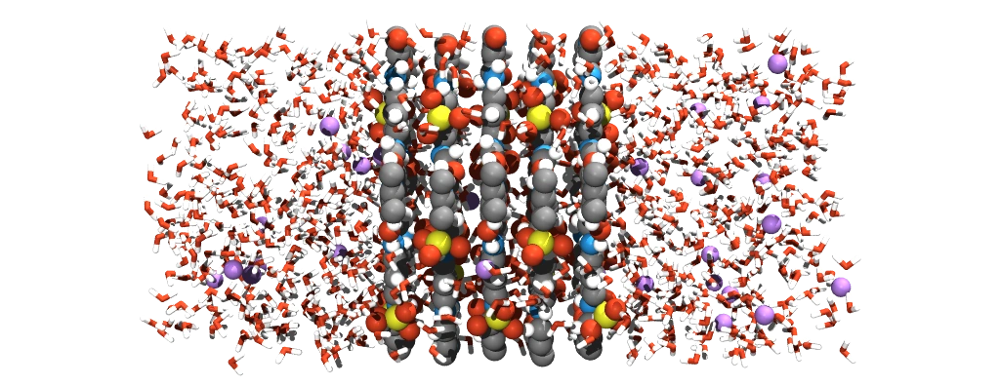
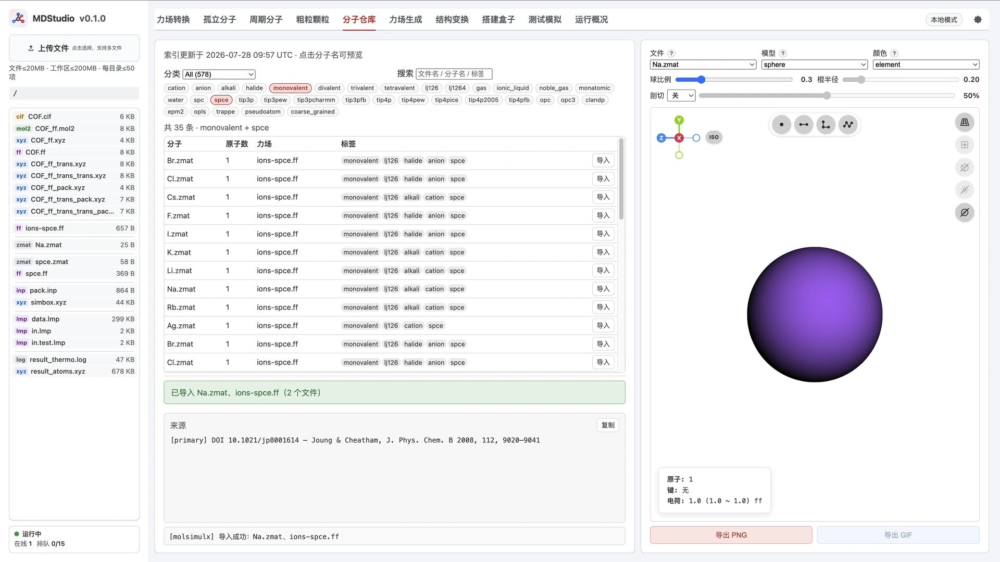
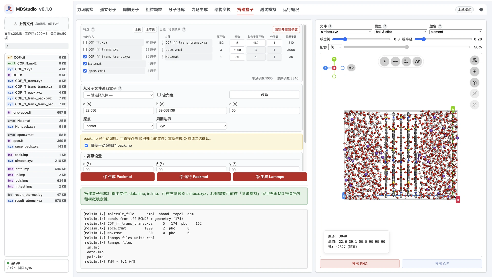
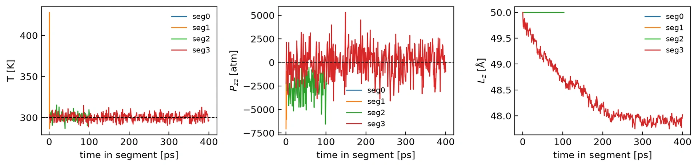
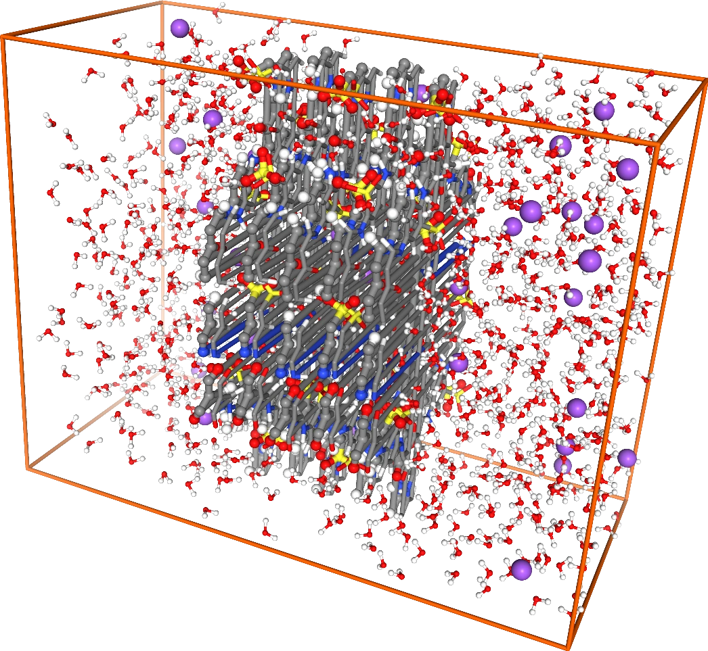

> **系列标签：** `实战案例` · `COF` · `水` · `Na` · `MDAnalysis` · `VMD`

承接 [多层COF膜体系搭建](C05-多层COF膜体系搭建.md) 的**五层干膜**：本篇在同一套几何上灌入 **SPC/E 水**与配套 **Na⁺**，写带 COF 骨架约束的短程 `in.lmp`，跑一小段后扫一眼热力学量，再用 **MDAnalysis 导出 XYZ / connect**，用资源包 **`vmd.tcl`** 打开即可。

文章节奏对齐 [Lammps机械控压](C02-Lammps机械控压.md) / [计算扩散与粘度](C03-计算扩散与粘度.md) / [纳米棒自组装](C04-纳米棒自组装.md)：搭模型 → 改脚本 → 怎么跑 → 分析。本篇**分析从简**（主要看 thermo）；重点在导出结构与 VMD 出图。

| 项           | 本例                                                           |
| ----------- | ------------------------------------------------------------ |
| **几何**      | 与 [多层COF膜体系搭建](C05-多层COF膜体系搭建.md) 相同：五层 COF `fixed`（$3.4\,\mathrm{Å}$；奇偶层交替 π，**弧度**），$c\approx 50$ Å |
| **水 / 反离子** | **`spce` × 1000** + 配套 **`Na` × 30**（装盒顺序：COF → 水 → Na；中和五层总电荷 −30）            |
| **COF 约束**  | 骨架 `spring/self`（或等价钉扎；平台默认 `in.lmp` **缺这一步**）               |
| **后处理重点**   | thermo 扫一眼 → MDA 导出 XYZ → VMD（`vmd.tcl`）                      |



---

## 一、体系约定

需要先完成 [多层COF膜体系搭建](C05-多层COF膜体系搭建.md)，工作区（或资源包）里至少有：**`COF_ff_trans_trans.xyz`**（精居中后的装盒结构）、配套 `.ff`，以及五层 `fixed` 的经验（$z=-6.8,-3.4,0,3.4,6.8$）。

正交单层总电荷约 **−6**，五层约 **−30** → 本例 **30 Na⁺**。离子必须与水模型**同一标签**：水体用 **SPC/E**（Simple Point Charge / Extended），就选带 **`spce`** 的 Na（如 Joung–Cheatham / `spce`），不要混 tip3p 等变体（见 [MDStudio分子仓库](../../在线工具/00-MDStudio/M08-MDStudio分子仓库.md) 第七节）。

---

## 二、搭模型（MDStudio）

### 1. 分子仓库：导入 SPC/E 与配套 Na⁺

打开 [MDStudio分子仓库](../../在线工具/00-MDStudio/M08-MDStudio分子仓库.md)：

1. 导入 **`spce`** → `spce.zmat` + `spce.ff`（**不必**再走力场生成）。  
2. 在 Ion 分类下导入带 **`spce`** 标签的 **`Na`** → `Na.zmat`（侧车多为 `ions-spce.ff`）。

确认当前文件夹里能同时看到水与 Na 文件后再搭盒。



### 2. 搭建盒子（①②③）

打开 [MDStudio搭建盒子](../../在线工具/00-MDStudio/M11-MDStudio搭建盒子.md)，几何对齐 [多层COF膜体系搭建](C05-多层COF膜体系搭建.md)：

1. 物种顺序：**`COF_ff_trans_trans.xyz`（份数 5）→ `spce.zmat`（1000）→ `Na.zmat`（30）**。  
2. 「从分子文件读取盒子」仍用 **`COF_ff_trans_trans.xyz`**；$c$ 用 **`50`**（与上篇一致）。  
3. **先备份**若工作区里还有干膜版 `pack.inp`。  
4. 点 **① 生成 Packmol**（可勾选覆盖）：写出 / 更新 `COF_ff_trans_trans_pack.xyz`、`spce_pack.xyz`、`Na_pack.xyz`，同时**覆盖**默认 `pack.inp`。  
5. 用下面脚本（或资源包 **`pack.inp`**）覆盖工作区后，点 **② 运行 Packmol** → **③ 生成 Lammps**，得到含水版 `data.lmp` / `in.lmp` / `simbox.xyz`。

五层 COF 的 `fixed` 与 [多层COF膜体系搭建](C05-多层COF膜体系搭建.md) §4 **完全相同**（层间距 $3.4\,\mathrm{Å}$；奇偶层绕 $z$ 交替 **π**；转角单位**弧度**；结构文件为精居中后的 **`COF_ff_trans_trans`**）。本篇只在其后追加水与 Na：

```text
tolerance 2.5
seed -1
filetype xyz
output simbox.xyz

# 五层 COF：沿 z 间隔 3.4 Å；奇偶层绕 z 交替旋转 π（≈180°），减轻 AA 磺酸重叠
# 文件名以搭建盒子 ① 生成的 *_pack.xyz 为准（本例为 COF_ff_trans_trans_pack.xyz）
# fixed x y z  α β γ  → 后三个为绕 x/y/z 的转角，单位是弧度（不是度）
structure COF_ff_trans_trans_pack.xyz
  number 1
  center
  fixed 0. 0. -6.8  0 0 0
end structure

structure COF_ff_trans_trans_pack.xyz
  number 1
  center
  fixed 0. 0. -3.4  0 0 3.141593
end structure

structure COF_ff_trans_trans_pack.xyz
  number 1
  center
  fixed 0. 0.  0.0  0 0 0
end structure

structure COF_ff_trans_trans_pack.xyz
  number 1
  center
  fixed 0. 0.  3.4  0 0 3.141593
end structure

structure COF_ff_trans_trans_pack.xyz
  number 1
  center
  fixed 0. 0.  6.8  0 0 0
end structure

# 水（1000）；inside box 半宽按 a/b 与 c=50 估算，再相对盒边内收约 1.5 Å 预留空隙
structure spce_pack.xyz
  number 1000
  inside box -9.8 -18.0 -23.5  9.8 18.0 23.5
end structure

# 反离子 Na+（约中和五层总电荷 −30）；与水同一填装区
structure Na_pack.xyz
  number 30
  inside box -9.8 -18.0 -23.5  9.8 18.0 23.5
end structure
```

> **Tips：** 加水 / 加 Na 必须再走 **①**（出 `*_pack.xyz`）→ 换回「五层 fixed + 水 + Na」的 `pack.inp` → ②③。不要跳过 ① 直接 ②。五层叠法细节见 [多层COF膜体系搭建](C05-多层COF膜体系搭建.md) §4（**弧度**、交替 π）。

> **边缘预留：** 水 / Na 的 `inside box` **不要贴满**读到的盒边。本例相对 $a/b$ 半宽与 $c/2=25$ **各内收约 $1.5\,\mathrm{Å}$**（约 `±9.8 / ±18.0 / ±23.5`，以你读盒为准微调），减轻贴边重叠与开局高温；份数装不下再略放宽或减水。

> **键角容差 30°（同上篇）：** 磺酸基几何 O–S–O ~93°，力场平衡角 ~120°；默认容差（常为 15°）会在 ③ 丢掉这些角，日志有警告，`-SO3` 后面撑不住。③ 前把**键角容差**调到 **30°**，再生成；警告应消失，完整拓扑写入 `data.lmp`。细节见 [多层COF膜体系搭建](C05-多层COF膜体系搭建.md) §4。

右侧应能看到：五层膜在中部，水与 Na⁺ 在两侧与孔道。



---

## 三、`in.lmp` 关键设置

资源包 `in.lmp` 已按 [纳米棒自组装](C04-纳米棒自组装.md) / [计算扩散与粘度](C03-计算扩散与粘度.md) 的分段写法改好，**不要**直接用平台③的默认脚本。整条流水线（与资源包一致）：

```text
读 data.lmp + pair.lmp
  → 冻 COF 最小化（只放松水 / Na）
  → SHAKE（水 + COF 含 H 键）+ 骨架 spring/self
  → NVT 预松弛（0.5 fs × 5000 ≈ 2.5 ps）
  → NVT 100 ps（timestep → 1 fs）
  → NPT(z) 400 ps @ 1 atm（仅 z；xy 边长不变）
  → dump 轨迹（NPT 段，xsu/ysu/zsu）
```

| 项 | 本例 |
|----|------|
| **骨架** | `group backbone type 2 3 4 5` + `fix spring/self`（同上篇；原子仍可动并进热浴） |
| **热浴** | **`all`**（NVT / NPT 均挂全体） |
| **控压** | `npt … z 1.0 1.0`，**仅 z**，$xy$ 边长不变 |
| **时长** | 先 **0.5 fs × 5000** NVT 预松弛（≈ 2.5 ps；部分键角偏离平衡角）→ 恢复 **1 fs** → NVT **100 ps** + NPT(z) **400 ps** |
| **thermo** | `temp` / `press` / `pzz` / `lx ly lz` / `density` |
| **轨迹** | NPT 段 `result_atoms.lammpstrj`（每 5 ps，`xsu ysu zsu`） |

骨架 type 以含水 `data.lmp` 的 `Masses` 为准（本例 2–5 = N/C；10/11 = Hw/Ow；12 = Na）。`Kspring` 默认 `100`，层形仍乱可加大。

可调变量（与包内一致）：

```lammps
variable        mytemp          equal   300.0           # [K]
variable        mypress         equal   1.0             # [atm]，仅 z
variable        Kspring         equal   100.0           # spring/self [kcal/mol/A^2]
variable        nvt_pre_steps   equal   5000            # 0.5 fs × 5000 ≈ 2.5 ps
variable        nvt_steps       equal   100000          # NVT 100 ps @ 1 fs
variable        npt_steps       equal   400000          # NPT(z) 400 ps
```

骨架约束与预松弛（节选）：

```lammps
group           backbone  type  2  3  4  5
fix             pinbb  backbone  spring/self  ${Kspring}

timestep        0.5
fix             mynvt  all  nvt  temp  ${mytemp}  ${mytemp}  ${tdamp}
run             ${nvt_pre_steps}
unfix           mynvt

timestep        1.0
fix             mynvt  all  nvt  temp  ${mytemp}  ${mytemp}  ${tdamp}
run             ${nvt_steps}
```

完整脚本见资源包 `in.lmp`。

---

## 四、怎么运行模拟

本机先按 [分子模拟工作平台搭建](../01-技术文档/T01-分子模拟工作平台搭建.md) 配好环境；LAMMPS 安装见 [Lammps安装简明教程](../01-技术文档/T20-Lammps安装简明教程.md)。

把 `data.lmp`、`pair.lmp`、资源包 `in.lmp` 放在同一目录，进入该目录后：

```bash
# 串行：先确认能跑通
lmp -in in.lmp

# 本机并行（核数别占满整机）
mpirun -np 4 lmp -in in.lmp
```

二进制名随安装而异（`lmp` / `lmp_mpi` / `lmp_serial` 等）。集群提交点到为止，见 [集群与SLURM简明教程](../01-技术文档/T10-集群与SLURM简明教程.md)。

本例合计约 **0.5 ns**（预松弛 + NVT + NPT），原子数约 3840；普通多核台式机通常可在可接受时间内跑完。可先把 `nvt_steps` / `npt_steps` 临时改小冒烟，确认无 NaN、膜仍在中部，再放开跑满。也可直接用资源包样例输出跑 Notebook。

跑完后当前目录应有：

| 文件 | 用途 |
|------|------|
| `log.lammps` | $T$、$P$、$P_{zz}$、$L_z$ 等 |
| `result_atoms.data` | 最小化 + 赋速后构型 |
| `result_atoms.eq.data` | NVT 末 / NPT 起点 |
| `result_atoms.lammpstrj` | NPT 段轨迹（可视化 / 导出 XYZ） |
| `result_atoms.final.data` | NPT 末构型 |

检查：log 无 NaN；膜仍在盒中部；$P_{zz}$ / $L_z$ 在 NPT 段有合理波动。

---

## 五、Notebook 分析（thermo + nglview）

打开资源包 `simul_analysis.ipynb`（依赖同目录 `_helper_functions.py`）：

1. **温度 / $P_{zz}$ / $L_z$**：`read_result_thermo` 画 NVT 与 NPT(z) 两段；保存 **`result_thermo_T_Pzz_Lz.png`**。  
2. **nglview**：与 [Lammps机械控压](C02-Lammps机械控压.md) 相同，`resnames=RESNAMES`（按 LAMMPS mol/resid：`5×COF + 1000×H2O + 30×Na`），再 **wrap（按 residue）** 快速瞄一眼。  
3. 可选：`save_nglview_frame(view, "result_nglview.png")`。



**nglview** 是 Jupyter 里的分子查看插件，挂在 Notebook / MDAnalysis 上，适合「变换后扫一眼」；**不支持动态盒子**（NPT 段 $L_z$ 变时画面里的晶胞框不会跟着更新）。分层出图用后面的 **VMD + `vmd.tcl` **。



对照：

| 工具 | 更适合 | 本系列里 |
|------|--------|----------|
| **nglview** | Notebook 里快速验结构 | 本篇 §5 |
| **Fresnel** | 粗粒球珠 / 棒珠等几何简单体系的路径追踪 | [纳米棒自组装](C04-纳米棒自组装.md) §五.6 |
| **VMD** | 全原子 / 含水体系、分层表示 | 本篇 §六–七；安装见 [VMD安装与高端渲染简明教程](../01-技术文档/T26-VMD安装与高端渲染简明教程.md) |

本篇**不**做扩散 / 粘度 / 剖面；thermo + nglview 只确认能稳着跑，**出图用资源包 `vmd.tcl` 打开即可**。安装见 [VMD安装与高端渲染简明教程](../01-技术文档/T26-VMD安装与高端渲染简明教程.md)。

---

## 六、导出 XYZ / connect（供 VMD）

Notebook 第三节调用 `write_xyz`：先 `corner → wrap(residues) → center`，再**每隔 10 帧**写出：

| 文件 | 内容 |
|------|------|
| `result_atoms.xyz` | 多帧坐标 |
| `result_box.dat` | 各帧盒边长（Å） |
| `result_connect.dat` | 可选；`connect=True` 时从拓扑写出的 **CONECT** 键表 |

**为什么要 connect：** 纯 XYZ **不带键**（connectivity）。VMD 读入后会按距离 **猜键**，氢键靠近时偶尔会把「一水的 O」和「另一水的 H」连成假键。打开 `connect=True` 后，写出 PDB 风格的 **CONECT** 表，键来自 LAMMPS / MDA 拓扑，**更准确**。

**connect 的代价：** 拓扑键是固定的。分子若被**周期边界**切开（一端在盒这边、另一端在对面），画 Licorice / Bonds 时仍可能出现 **横穿盒子的长键**——那是显示问题，不是力场真成了超长键。导出时已按 residue wrap（整分子 wrap，避免把同一水拆到两边），多数帧会好很多，但不能保证每一帧都没有。

本例 Notebook 默认 **`connect=True`**。若只要坐标、不要键表，改成 `connect=False` 即可。

---

## 七、用 `vmd.tcl` 打开

在含导出文件的目录：

```bash
vmd -e vmd.tcl
```

脚本会：

- 读 `result_atoms.xyz`、`result_box.dat`；若有 `result_connect.dat` 则用其替换 VMD 猜的键；  
- 分层：COF **VDW**（按范德华半径画球）**0.5 / 分辨率 60**；水 **Licorice**（棍棒）**0.2 / 分辨率 60**；Na **紫色 VDW 0.5 / 分辨率 60**；  
- 白底、透视投影（Perspective）、周期盒。

装好 VMD 后能 `source` / `-e` 打开即可。透明背景 / Tachyon / 分辨率等见 [VMD安装与高端渲染简明教程](../01-技术文档/T26-VMD安装与高端渲染简明教程.md) §七，本篇不展开。

水用了 Licorice，会画键：有 connect 更准，但分子被盒边切开时仍可能出现 **跨盒长键**。可改回不画键的表示（如只显示氧的 VDW / QuickSurf），或对水用 **DynamicBonds**（按当前帧距离动态连键；氢键近时仍可能误连）。

---

## 讨论

### 1. 为什么离子必须匹配 spce？

离子 LJ / 电荷是按特定水模型参数化的；混用 tip3p 离子 + spce 水会系统性地偏溶剂化与活度。仓库里选带同一水模型标签的条目即可。

### 2. 为什么默认 `in.lmp` 不能直接跑？

③ 生成的脚本通常不管「通用 FF 撑不住 COF 层间距」这件事。短程含水跑必须显式加骨架约束（见 [多层COF膜体系搭建](C05-多层COF膜体系搭建.md) 讨论），否则膜易被推散。

### 3. 分析和可视化谁是主角？

本例短程 + thermo 只为确认能跑；**nglview** 扫一眼；**`write_xyz`（含 connect）+ `vmd.tcl`** 出图。粗粒体系见 [纳米棒自组装](C04-纳米棒自组装.md) 的 Fresnel；输运 / 剖面应另开分析文。

---

## 常见问题

**Q：加水后为什么还要再点 ①？**  
A：① 才会写出 `spce_pack.xyz`、`Na_pack.xyz`。备份干膜 `pack.inp` 后点 ①，再换回含水版脚本 → ②③。

**Q：③ 生成 Lammps 时日志警告丢掉 O–S–O 角？**  
A：同 [多层COF膜体系搭建](C05-多层COF膜体系搭建.md)：`-SO3` 几何角 ~93°，力场 ~120°，默认容差会剔除。把**键角容差**调到 **30°** 再③（见 §2.2 / 上篇 §4）。

**Q：Na 和水分开导入还是一起？**  
A：仓库里分别导入；搭盒时两个物种都勾上。务必都是 **`spce` 标签**。

**Q：为什么是 1000 水、30 Na？**  
A：短程演示规模；30 Na 近似中和五层 −30。需要更稀释或更大盒可自行改份数与 `inside box`。

**Q：XYZ 和 connect 怎么选？看见很长的「水键」怎么办？**  
A：见 §六–七。无 connect 时 VMD 易猜错键；有 connect 更准，但水 **Licorice** 仍可能画出跨盒长键。可改用不画键的表示，或对水用 DynamicBonds。

---

## 小结

1. 自 [多层COF膜体系搭建](C05-多层COF膜体系搭建.md) 出发：仓库导入 **`spce` + 配套 `Na`（spce 标签）**。  
2. 搭盒：选 **`COF_ff_trans_trans.xyz`** ×5（同上篇）+ **1000 水** + **30 Na**（顺序：COF → 水 → Na），$c=50$；① → 换 `pack.inp` → ②③；**键角容差 30°**。  
3. 使用资源包 `in.lmp`：**骨架 spring/self** + **0.5 fs × 5000** NVT 预松弛 → **1 fs** + NVT 100 ps + **NPT(z)** 400 ps @ 300 K、1 atm。  
4. `simul_analysis.ipynb`：thermo + nglview；`write_xyz(..., connect=True)` → **`vmd -e vmd.tcl`** 打开。

---

## 资源下载

**资源包文件名：** `COF膜-水体系短程模拟与可视化.zip`（**VIP 下载**）

> **不含：** `result_atoms.lammpstrj`（约 11 MB）及 nglview 截图。包内已有 `log.lammps`、导出好的 `result_atoms.xyz` / `result_box.dat` / `result_connect.dat`，可直接练 Notebook 热力学与 **`vmd -e vmd.tcl`**；要完整轨迹请自行用 `in.lmp` 重跑。

| 文件                                                                  | 说明                                                            |
| ------------------------------------------------------------------- | ------------------------------------------------------------- |
| `COF_ff_trans_trans.xyz` / `COF_ff_trans_trans_pack.xyz` / `COF.ff` | 承接上篇的装盒结构与力场                                                  |
| `spce.zmat` / `spce.ff` / `spce_pack.xyz`                           | SPC/E 水（仓库导入 / Packmol）                                       |
| `Na.zmat` / `ions-spce.ff` / `Na_pack.xyz`                          | 配套 Na⁺（`spce` 标签）                                             |
| `pack.inp` / `simbox.xyz`                                           | 五层 COF + 1000 水 + 30 Na（顺序：COF → 水 → Na；交替 π，弧度）              |
| `data.lmp` / `pair.lmp`                                             | 装盒产物                                                          |
| `in.lmp`                                                            | 0.5 fs 预松弛 → 1 fs；NVT 100 ps + NPT(z) 400 ps；骨架 `spring/self` |
| `log.lammps` / `result_atoms.data`                                  | 样例运行输出（对照量级）                                                  |
| `simul_analysis.ipynb` / `_helper_functions.py`                     | thermo + nglview + 导出 XYZ / box / connect                     |
| `result_thermo_T_Pzz_Lz.png` / `result_summary_eq.csv`              | Notebook 样例图与汇总                                               |
| `result_atoms.xyz` / `result_box.dat` / `result_connect.dat`        | 供 VMD（已按 residue wrap，含 CONECT）                               |
| `vmd.tcl`                                                           | 读 xyz + box + connect；COF/Na VDW 0.5@60，水 Licorice 0.2@60     |

---

## 学习路径

**前置**

- [多层COF膜体系搭建](C05-多层COF膜体系搭建.md)
- [MDStudio分子仓库](../../在线工具/00-MDStudio/M08-MDStudio分子仓库.md)
- [MDStudio搭建盒子](../../在线工具/00-MDStudio/M11-MDStudio搭建盒子.md)
- [MDAnalysis轨迹分析入门](../01-技术文档/T22-MDAnalysis轨迹分析入门.md)
- [VMD安装与高端渲染简明教程](../01-技术文档/T26-VMD安装与高端渲染简明教程.md)

**相关**

- [Lammps机械控压](C02-Lammps机械控压.md)（约束 / 分组对照）
- [计算扩散与粘度](C03-计算扩散与粘度.md)（同为「跑完再 Notebook」节奏；本篇分析更简）
- [纳米棒自组装](C04-纳米棒自组装.md)（粗粒体系用 Fresnel；本篇全原子含水用 VMD）
