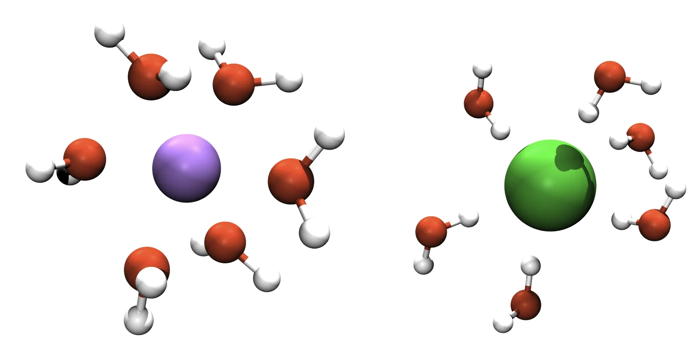
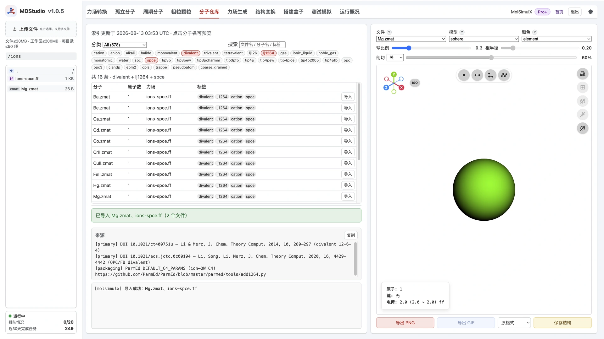
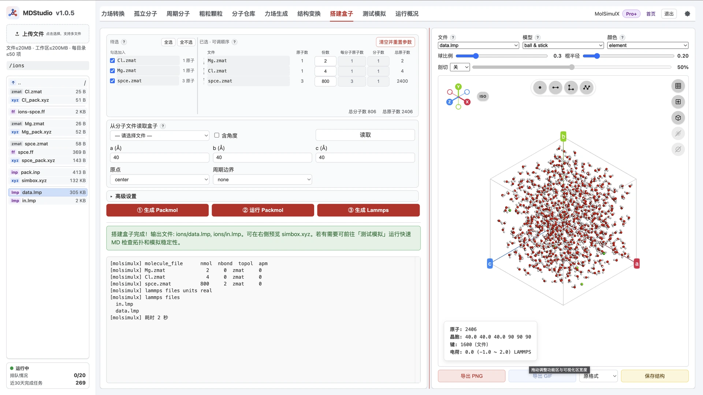
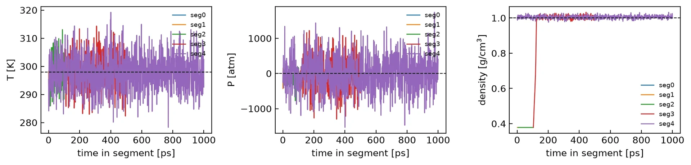
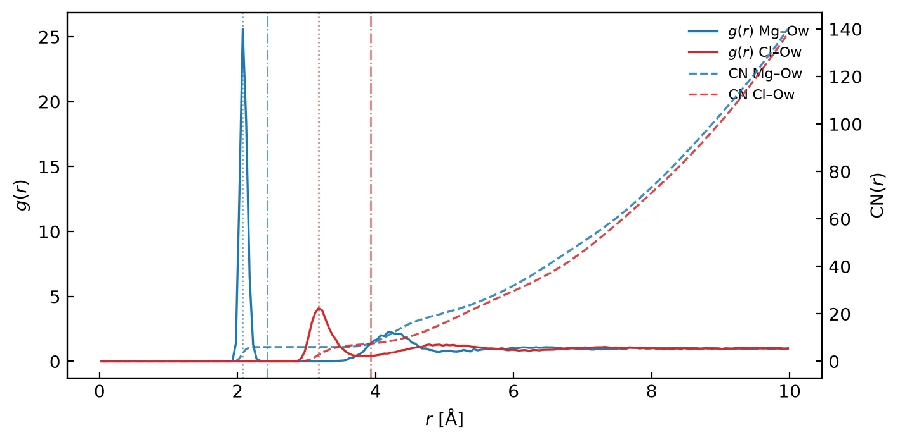
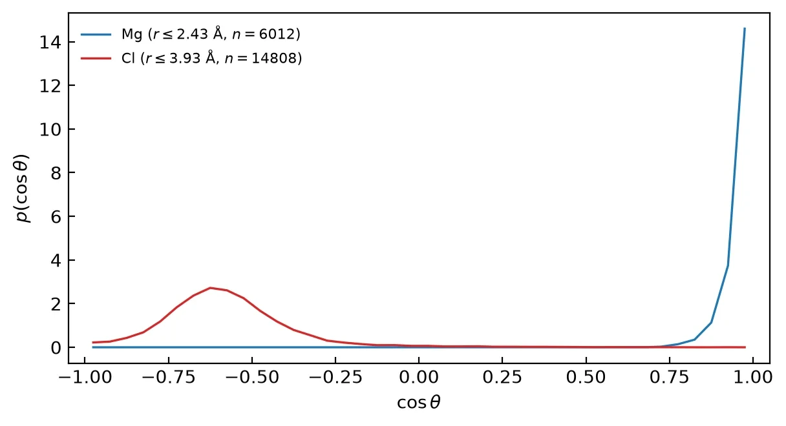

> **系列标签：** `实战案例` · `离子水合` · `lj1264` · `RDF` · `取向` · `VMD` · `MDStudio`

水溶液里，离子周围的水不是随机堆着的：最近邻一层叫**第一水合壳**，再外一层叫第二壳。壳层结构常用三个量刻画——

- **IOD**（ion–oxygen distance）：离子到第一壳水氧的最概然距离；  
- **CN**（coordination number，配位数）：第一壳里大约有几分子水；  
- **RDF**（radial distribution function，$g(r)$）：沿径向「相对体相密了多少倍」。

经典 **12-6 Lennard-Jones（LJ）+ 库仑** 对一价离子往往够用；对 **Mg²⁺、Ca²⁺、过渡金属** 等，只调 LJ 的 σ / ε 很难同时贴近实验 IOD 与水合自由能。Li/Merz 等提出的 **12-6-4** 在 12-6 上再加一项 $-C_4/r^4$，用来近似**电荷–诱导偶极**（高价离子附近水被极化的那部分）。

本篇在 **MDStudio** 里导入 **SPC/E 水 + 带 `lj1264` 标签的 Li/Merz 离子**，搭一盒 MgCl₂(aq)，再在本机/集群 LAMMPS 用 ** `hybrid/overlay` + table** 把 C4 叠上去；用 RDF / CN / 水取向对比 **Mg²⁺ 与 Cl⁻** 的第一壳，并导出壳层簇用 VMD 查看。节奏如下：

| 步骤  | 做什么                                                      | 在哪做                                                        |
| --- | -------------------------------------------------------- | ---------------------------------------------------------- |
| 1   | 导入 `spce` + `lj1264` 的 **Mg / Cl**（同为 `spce`）            | [MDStudio分子仓库](../../在线工具/00-MDStudio/M08-MDStudio分子仓库.md) |
| 2   | 搭盒：**2 Mg²⁺ + 4 Cl⁻ + 800 水**；高级设置 **LJ 输出 = all**       | [MDStudio搭建盒子](../../在线工具/00-MDStudio/M11-MDStudio搭建盒子.md) |
| 3   | 核对 `.ff` 行尾 **C4** → `simul_model.ipynb` 写表 → 改 `in.lmp` | 本机/集群                                                      |
| 4   | 最小化 → NVT/NPT **500 ps** → NPT 生产 **1 ns**（unwrap 轨迹）    | 本机/集群 LAMMPS                                               |
| 5   | thermo → RDF / CN / 取向 → 导出水合壳 → VMD                     | `simul_analysis.ipynb` / `vmd.tcl`                         |

概念背景：[轨迹分析与宏观性质](../00-知识文档/K16-轨迹分析与宏观性质.md)、[力场怎么选](../00-知识文档/K06-力场怎么选.md)。离子参数总览：[Amber Ion Parameters](https://ambermd.org/AmberModels_ions.php)。



---

## 一、本例约定（读操作前扫一眼）

| 项 | 本例 |
|----|------|
| **课题** | MgCl₂(aq) 中 **Mg²⁺ / Cl⁻** 第一水合壳（IOD、CN、RDF、取向） |
| **水** | 仓库 **`spce`**（SPC/E：三点刚性水模型） |
| **离子** | Li/Merz **12-6-4**：标签 `lj1264` + `spce` 的 Mg、Cl |
| **组成** | **2 Mg²⁺ + 4 Cl⁻ + 800 H₂O**（电中性；type 1=Mg，2=Cl，3=Hw，4=Ow） |
| **势** | `lj/cut/coul/long`（12 Å）+ PPPM 长程库仑，再 overlay 离子–Ow 的 $-C_4/r^4$ 表势 |
| **平衡 / 生产** | NVT 100 ps + NPT 400 ps（共 **500 ps**）→ NPT **1 ns**；dump **500** 帧 `xsu ysu zsu`（unwrap） |
| **分析** | thermo；RDF / CN；$\cos\theta$ 取向；水合壳 XYZ → VMD |

> **为什么选 Mg²⁺：** 二价离子是 12-6-4 最「用得上」的场景：纯 12-6 难同时贴近 IOD 与水合自由能；加 C4 后文献对 SPC/E 等有成套参数。Cl⁻ 同跑，便于阴阳对比。

> **水与离子必须同标签：** 水体是 SPC/E，就只导入带 **`spce`** 的 `lj1264` 离子。不要混 `tip3p` 离子 + `spce` 水（见 [MDStudio分子仓库](../../在线工具/00-MDStudio/M08-MDStudio分子仓库.md) 第七节）。

---

## 二、12-6-4 在说什么

非键相互作用（示意；略去截断与长程库仑实现细节）：

$$
U_{ij}(r)=\frac{A_{ij}}{r^{12}}-\frac{B_{ij}}{r^{6}}-\frac{C_{4,ij}}{r^{4}}+\frac{q_i q_j}{4\pi\varepsilon_0 r}
$$

| 项 | 角色 |
|----|------|
| $r^{-12}$ / $r^{-6}$ | 短程排斥与色散——常规 **LJ（12-6）** |
| $r^{-4}$（C4） | 近似电荷诱导偶极；高价离子附近极化贡献大时更关键 |
| 库仑 | 显式点电荷；本例用 **PPPM**（Particle–Particle Particle–Mesh，网格加速的长程静电）+ `coul/long` |

仓库里带 **`lj1264`** 的 `.ff`：`ATOMS` 行把 **σ、ε** 写成普通 `lj` 列，把 **C4** 写在**行尾 `#` 注释**（单位 **kcal·mol⁻¹·Å⁴**，与 Amber `frcmod.ions*lm_1264_*` 一致）。例如 SPC/E 下：

```text
Mg  Mg  24.305    2  lj   2.546…  0.087… # 122.2
Cl  Cl  35.453   -1  lj   3.836…  2.192… # -55
```

本例表势取行尾：**Mg–Ow** $C_4=122.2$，**Cl–Ow** $C_4=-55$。  
**当前 MDStudio 装盒 / 测试冒烟只消费 12-6 + 电荷**，不会自动写出 C4——须本机/集群叠加。

文献：

- [Li & Merz, *JCTC* 2014](https://doi.org/10.1021/ct400751u)（二价）  
- [Li et al., *JCTC* 2015](https://doi.org/10.1021/ct500918t)（一价）  
- [Li et al., *JPCB* 2015](https://doi.org/10.1021/jp505875v)（高价）  

---

## 三、操作步骤（MDStudio）

### 1. 分子仓库：导入水与 `lj1264` 离子

打开 [MDStudio分子仓库](../../在线工具/00-MDStudio/M08-MDStudio分子仓库.md)：

1. 导入 **`spce`** → `spce.zmat` + `spce.ff`（**不必**再走力场生成）。  
2. 分类 **Ion**，标签勾选 **`lj1264`、`spce`**，再按需加 `divalent` / `monovalent`：  
   - **Mg** → `Mg.zmat` + 侧车 `ions-spce.ff`；  
   - **Cl** → `Cl.zmat`（工作区已有 `ions-spce.ff` 时，仓库会**合并**缺的原子类型）。  
3. 点分子名看底部**来源**：应能看到 Li/Merz 12-6-4 与对应 Amber `frcmod` 线索。

确认文件夹里同时有水、Mg、Cl 的结构与力场后再搭盒。



### 2. 核对 `.ff` 里的 C4

在 [MDStudio资源管理器](../../在线工具/00-MDStudio/M04-MDStudio资源管理器.md) **双击** `ions-spce.ff`：

- 表头应写明 **12-6-4**、目标水模型 **SPC/E**、文献 / DOI。  
- `ATOMS` 中 Mg、Cl 行末有 `# …` 形式的 C4（本例 **122.2** / **−55**）。  
- `spce.ff` 是三点水 12-6，没有离子那种 C4 注释；C4 加在**离子–水氧**表势上。

> **Tips：** 一价 / 二价目录下文件名常同为 `ions-spce.ff`，内容不同。先导 Mg 再导 Cl 依赖自动合并；不对时可删工作区 `ions-*.ff` 后按「先二价、再一价」重导，或直接用资源包文件。

### 3. 搭建盒子

打开 [MDStudio搭建盒子](../../在线工具/00-MDStudio/M11-MDStudio搭建盒子.md)：

1. 物种顺序：**`Mg.zmat`（2）→ `Cl.zmat`（4）→ `spce.zmat`（800）**——离子在前，type 编号与后面 `pair_coeff` 一致。  
2. 盒子：立方；本例装盒半宽约 **16.25 Å**（见 `pack.inp`），正式跑前用 NPT 把密度收到 ~1 g·cm⁻³。  
3. **高级设置 → LJ 输出规则选 `all`**：本例要在 LAMMPS 里对**全部原子类型对 I–J** 显式写 `pair_coeff`，再单独叠 C4。选 `same` 往往只出对角项，交叉项靠 `pair_modify mix`；而 **`hybrid/overlay` 下 mix 不可靠**，缺 Mg–Ow / Cl–Ow 的 12-6 排斥时容易炸盒（`Out of range atoms - cannot compute PPPM`）。选 **`all`** 可把完整交叉表落到 `pair.lmp`（或手抄进 `in.lmp`）。  
4. **① 生成 Packmol** → **② 运行 Packmol** → **③ 生成 Lammps**，得到 `data.lmp`、平台版 `in.lmp` / `pair.lmp` 与 `simbox.xyz`。

体相溶液一般**不必**手改 `pack.inp`（与 [受限溶液建模](C01-受限溶液建模.md) 不同）。



### 4. 测试冒烟（可选）

[MDStudio测试模拟](../../在线工具/00-MDStudio/M12-MDStudio测试模拟.md) 仍按**普通 12-6 + 截断库仑**冒烟，只确认拓扑、SHAKE、盒子没炸。  
**不要**把冒烟轨迹当成「已启用 12-6-4」。正式分析用资源包改过的本机/集群 `in.lmp`。

### 5. 下载

打包下载工作区；后续以资源包中的 **`in.lmp`（含 C4 overlay）**、**`C4_*.table`** 与 **`simul_model.ipynb`** 为准。

---

## 四、写出 C4 表势并改 `in.lmp`

### 1. 平台默认缺了什么

③ 写出的脚本通常是 `lj/cut/coul/long` + 仅 ε、σ 的 `pair_coeff`，**等价于 C4 = 0**。`.ff` 行尾注释不会进 LAMMPS。

### 2. 用 `simul_model.ipynb` 生成 `{name}.table`

输入 **C4、cutoff、name**，写出表势文件。能量与力：

$$
E(r)=-\frac{C_4}{r^4},\qquad F(r)=-\frac{\mathrm{d}E}{\mathrm{d}r}=-\frac{4C_4}{r^5}
$$

单位 **`units real`**：$C_4$ 为 **kcal·mol⁻¹·Å⁴**。本例：

| 文件 | $C_4$ | 用途 |
|------|-------|------|
| `C4_Mg_Ow.table` | 122.2 | type 1–4（Mg–Ow） |
| `C4_Cl_Ow.table` | −55 | type 2–4（Cl–Ow） |

表内 section 名 **`C4_POT`**；`N 1000 R 0.5 12`（均匀 $r$ 网格，与 12 Å 截断对齐）。

### 3. `hybrid/overlay` 骨架（与资源包一致）

**`hybrid/overlay`**：同一对原子上把多种 `pair_style` 的能量/力**相加**。本例 = 完整 12-6+库仑 **再叠加** C4 表势。  
type：**1=Mg，2=Cl，3=Hw，4=Ow**。

```lammps
pair_style      hybrid/overlay &
                lj/cut/coul/long 12.0 12.0 &
                table linear 1000
pair_modify     shift yes
kspace_style    pppm  1.0e-5

# 须写齐全部 I–J（几何 ε + 算术 σ；与资源包 in.lmp 一致）
pair_coeff      1 1 lj/cut/coul/long   0.020934   2.546189   # Mg-Mg
pair_coeff      1 2 lj/cut/coul/long   0.104739   3.191199   # Mg-Cl
pair_coeff      1 3 lj/cut/coul/long   0.000000   1.273094   # Mg-Hw
pair_coeff      1 4 lj/cut/coul/long   0.057018   2.856094   # Mg-Ow
pair_coeff      2 2 lj/cut/coul/long   0.524046   3.836210   # Cl-Cl
pair_coeff      2 3 lj/cut/coul/long   0.000000   1.918105   # Cl-Hw
pair_coeff      2 4 lj/cut/coul/long   0.285279   3.501105   # Cl-Ow
pair_coeff      3 3 lj/cut/coul/long   0.000000   0.000000   # Hw-Hw
pair_coeff      3 4 lj/cut/coul/long   0.000000   1.583000   # Hw-Ow
pair_coeff      4 4 lj/cut/coul/long   0.155300   3.166000   # Ow-Ow

pair_coeff      1 4 table C4_Mg_Ow.table C4_POT
pair_coeff      2 4 table C4_Cl_Ow.table C4_POT
```

`fix shake` 约束 SPC/E 的 bond **1** 与 angle **1**（以 `data.lmp` 为准），与是否叠 C4 无关。

### 4. 跑不通时

| 现象                                         | 处理                                                                  |
| ------------------------------------------ | ------------------------------------------------------------------- |
| `Unrecognized pair style`                  | 确认编译含 TABLE 等 package（见 [Lammps安装简明教程](../01-技术文档/T20-Lammps安装简明教程.md)） |
| `Out of range atoms - cannot compute PPPM` | 检查是否写齐 Mg–Ow / Cl–Ow 的 **12-6**；开局可先小步长预松弛                          |
| 能量 NaN / 炸盒                                | 先确认无 table 的 12-6 基线可跑；再查表势短程与截断                                    |

---

## 五、`in.lmp` 关键设置

与资源包 `in.lmp` 对齐：

```text
读 data.lmp
  → hybrid/overlay：lj/cut/coul/long + C4 table
  → shake 水
  → 最小化 →（可选预松弛）→ NVT 100 ps + NPT 400 ps
  → NPT 生产 1 ns：dump 500 帧 unwrap（xsu ysu zsu）
```

| 段 | 本例 | 目的 |
|----|------|------|
| 最小化 | `minimize` | 消硬重叠 |
| NVT | 100 ps @ 298 K | 热化（固定体积，调温度） |
| NPT | 400 ps @ 1 atm | 定密度（与 NVT 合计 **500 ps**） |
| 生产 | NPT **1 ns**；`dump_every = 2000`（1 fs 步 → **500** 帧） | 结构采样 |

要点：

- 温度 **298 K**（与常见离子参数化一致）。  
- 轨迹字段 **`xsu ysu zsu`**：**unwrap**（解开周期边界折叠的连续坐标），利于后续距离 / 取向分析。  
- thermo 看密度、温度、能量；NPT 段密度宜贴近 ~1 g·cm⁻³。

---

## 六、分析

用资源包 **`simul_analysis.ipynb`**（[MDAnalysis轨迹分析入门](../01-技术文档/T22-MDAnalysis轨迹分析入门.md)），**先热力学确认盒子靠谱 → 再比 Mg / Cl 结构 → 最后导出壳层用 VMD 验取向**。

### 1. 热力学：温度、压力、密度

读 `log.lammps` 各段 thermo。生产段目标 **298 K / 1 atm**。体相溶液优先看密度是否贴近 **~1 g·cm⁻³**——小盒子瞬时压涨落很大，$\langle P\rangle$ 偏一点不必单独判失败。



本例生产段：$\langle T\rangle\approx 298\,\mathrm{K}$，$\langle\rho\rangle\approx 1.005\,\mathrm{g\,cm^{-3}}$——**密度正常**，NPT 收盒成功，后面的 RDF / CN 可以当真。

### 2. RDF、配位数与第一壳取向（Mg vs Cl）

先交代三个量怎么读：

| 量 | 含义（一句话） |
|----|----------------|
| **$g(r)$（RDF）** | 距中心离子 $r$ 处，水氧相对「均匀体相」的富集倍数；$g=1$ 为体相 |
| **第一峰位 ≈ IOD** | 第一壳最概然的离子–Ow 距离 |
| **第一谷 $r_{\min}$** | 第一壳与第二壳的分界；作 CN 积分上限、导出壳层的截断 |
| **CN$(r)$** | 从 0 积到 $r$ 的累积配位数；取 $r=r_{\min}$ ≈ 第一壳水分子数 |
| **$\cos\theta$** | 水偶极单位向量 $\hat{\boldsymbol{\mu}}$ 与「离子→Ow」单位向量 $\hat{\mathbf{r}}$ 的点积：$+1$ 偶极背离离子，$-1$ 指向离子 |

$$
\mathrm{CN}(r_{\min})=4\pi\rho\int_0^{r_{\min}} r^2 g(r)\,dr
$$

Notebook 把 Mg–Ow / Cl–Ow 的 $g(r)$（左轴）与 CN$(r)$（右轴）画在**同一张图**；$p(\cos\theta)$ 也同图画对比。





本例样例数值：

| 量 | Mg²⁺ | Cl⁻ |
|----|------|-----|
| IOD | ≈ **2.08 Å**（近） | ≈ **3.18 Å**（远） |
| $g(r)$ 峰形 | 高、窄 | 矮、宽 |
| $r_{\min}$ | ≈ **2.43 Å** | ≈ **3.93 Å** |
| CN$(r_{\min})$ | ≈ **6.0**（八面体） | ≈ **7.5**（更松） |
| $\langle\cos\theta\rangle$ | ≈ **+0.96** | ≈ **−0.57** |

结构图像：

- **Mg²⁺**：电荷高、半径小 → 第一壳**近且硬**：尖峰、深谷、CN 钉在 6；氧朝向离子，偶极几乎径向**背离**离子（$\cos\theta\to +1$）。  
- **Cl⁻**：电荷低、半径大 → 第一壳**远且软**：峰矮、谷浅、CN ~7–8 且对截断更敏感；倾向氢朝向阴离子，偶极**指向**离子（$\cos\theta$ 偏负），分布不如 Mg 极端。

若 Mg 的 CN 明显偏到 5 / 7，先查：是否忘了 C4、水–离子是否同标签、生产段是否够长、有无离子对贴太近干扰第一壳。

### 3. 水合壳 XYZ 与 VMD 可视化

`_extract_hydrated_ions.py`（Notebook 调用）对每个离子、选定帧：把 Ow 落在 $r_{\min}$ 内的**整分子水**写出到 `hydrated_ion/{Ion}{ii}_f{frame}.xyz`。坐标把**离子放在原点 $(0,0,0)$**，水相对离子做 **MIC**（minimum-image convention，周期盒最短镜像位移）——多帧连看时中心不漂。

资源包 **`vmd.tcl`**（CPK + 中心离子略放大）。在含 `hydrated_ion/` 的目录：

```bash
vmd -e vmd.tcl -args Mg01
vmd -e vmd.tcl -args Cl01 hydrated_ion/Cl01_f0000.xyz
```

已打开的控制台：

```tcl
set argv {Mg01}
source vmd.tcl
```

脚本每次导出前会**删掉同标签旧 XYZ**（避免旧绝对坐标与新原点坐标混在一起，Animate 时离子飞出视野）。`vmd.tcl` 加载后也会把每帧 index 0 再对齐到原点一次。

**每帧原子数是否相同，决定怎么播：**

| 情况 | 行为 |
|------|------|
| 原子数**相同**（Mg 常见，CN≈6） | `mol addfile` 合成轨迹，用 VMD **Animate** |
| 原子数**不同**（Cl 壳更松时常见） | 轨迹模式要求固定原子数；脚本改为每帧一个 molecule，用 `c07_next` / `c07_prev` / `c07_show <i>` 切换 |


从图上可直接读到与 $\cos\theta$ 一致的取向：

- **左（紫，Mg²⁺）**：约六分子水呈八面体；**红氧贴离子、白氢朝外**——偶极背离阳离子。  
- **右（绿，Cl⁻）**：壳更松散；**白氢朝离子、红氧朝外**——偶极指向阴离子（常表现为一侧 O–H 指向 Cl⁻ 的氢键几何）。

> **高级渲染**（透明背景、Tachyon / POV-Ray、分辨率等）按 [COF膜-水体系短程模拟与可视化](C06-COF膜-水体系短程模拟与可视化.md) 第七节及 [VMD安装与高端渲染简明教程](../01-技术文档/T26-VMD安装与高端渲染简明教程.md) 操作；本篇能 `vmd -e vmd.tcl` 看清第一壳即可。

---

## 七、讨论

### 1. 为什么 Web 装盒不直接写 C4？

12-6-4 的混合规则与引擎实现不完全统一；流水线先保证通用 **12-6 + 库仑**。C4 留在 `.ff` 注释里溯源，由本篇在 LAMMPS 侧显式叠加，避免「标签像 1264、实际仍是 126」。

### 2. 和 Joung–Cheatham 12-6（`lj126`）怎么选？

| 需求 | 更倾向 |
|------|--------|
| 一价碱金属 / 卤素，跟经典 SPC/E 教程走 | Joung–Cheatham **`lj126`** 往往足够 |
| 二价 / 高价，要同时看 IOD 与水合热力学 | Li/Merz **`lj1264`** |
| 只做冒烟 | 两者皆可；报水合结构前须说清用了哪种 |

同一文章里**不要**混用两套离子表。

### 3. 有限尺寸与浓度

本例 **2 Mg + 4 Cl + 800 水** 已能稳定读第一壳；要更接近无限稀、减弱离子–离子相关，需更大盒 / 更低浓度（见 [有限尺寸效应](../00-知识文档/K18-有限尺寸效应.md)）。本篇优先把 **C4 启用 + 结构分析流程** 跑通。

### 4. 为什么 Mg 的取向比 Cl「更极端」？

Mg²⁺ 场强高，第一壳交换慢、几何硬，氧几乎钉在径向内侧，$\langle\cos\theta\rangle$ 贴近 +1。Cl⁻ 场强弱、壳厚且交换快，水可一侧成氢键、也可略倾斜，故 $p(\cos\theta)$ 更宽、均值只偏到约 −0.6。导出 XYZ 时 Cl 各帧原子数也更容易变化——与「软壳」同一物理图像。

### 5. C4 符号与叠加范围

本例 C4 只叠在 **离子–Ow** 上（极化贡献主要发生在离子–水氧之间）；Hw 仍靠库仑 + SHAKE。$C_4$ 可正可负，取决于该离子–水对参数化目标，**不要**凭直觉改符号；以 Amber / 仓库行尾值为准。

### 6. 本例结果可靠到什么程度？

密度 ~1.00 g·cm⁻³、Mg IOD ~2.1 Å、CN≈6、取向符号正确——与 SPC/E + Li/Merz 文献图像一致，适合教学与流程验证。未做水合自由能、未系统扫浓度 / 有限尺寸；写进论文前应加长生产、做块平均，并与实验 / 同参数文献逐项对照。

---

## 常见问题

**Q：导入了 `lj1264`，测试模拟算不算用了 12-6-4？**  
A：不算。冒烟与默认 `in.lmp` 仍是 12-6。必须叠 C4 table（或改用原生支持 12-6-4 的引擎）。

**Q：`.ff` 行尾的数是 σ 还是 C4？**  
A：σ、ε 在 `lj` 后面两列；**`#` 之后**才是 C4。

**Q：为什么搭盒要选 LJ 输出 = all？**  
A：后面要用 `hybrid/overlay` 并**手写全部交叉 `pair_coeff`**。`all` 便于对照 / 抄全表；只靠 mix 容易在 overlay 下漏掉离子–Ow 的 12-6。

**Q：Cl 也要 C4 吗？**  
A：要。本例对 Cl–Ow 同样叠加 `C4_Cl_Ow.table`（$C_4=-55$）。

**Q：`table linear 1000` 里的 1000 是什么？**  
A：表势插值用的采样点数，须与 `.table` 文件头里的 `N 1000` 一致；`linear` 表示线性插值。

**Q：为什么轨迹要 dump `xsu ysu zsu`？**  
A：unwrap 坐标。分析 RDF / 壳层时仍用当前盒做 PBC；导出簇时相对离子做 MIC。unwrap 避免分子被盒边「折回」后几何难读。

**Q：VMD 里 Animate 灰了 / 帧数不对？**  
A：多半是各帧原子数不同。看控制台提示：变长壳层请用 `c07_next` / `c07_prev`，不要硬用 Animate。

**Q：第一谷取错会怎样？**  
A：截断偏小 → CN 偏低、壳不完整；偏大 → 掺进第二壳水，取向分布变「糊」。以 RDF 第一谷为准，并与 CN 平台是否出现对照。

---

## 小结

1. 课题：MgCl₂(aq) 中 **Mg²⁺ / Cl⁻** 第一水合壳；力场亮点是仓库 **`lj1264`（Li/Merz 12-6-4）**。  
2. 组成：**2 Mg²⁺ + 4 Cl⁻ + 800 SPC/E**；搭盒时 **LJ 输出 = all**。  
3. 用 **`simul_model.ipynb`** 写 `C4_*.table`；`in.lmp` 用 **`hybrid/overlay` + `table linear 1000`**，并写齐全部 LJ 交叉项。  
4. 平衡 **500 ps** → 生产 **1 ns** unwrap → RDF / CN / 取向；离子置原点导出壳层 → `vmd.tcl`。  
5. 水与离子**同一水模型标签**；冒烟 ≠ 已启用 12-6-4；刊用级渲染见 [COF膜-水体系短程模拟与可视化](C06-COF膜-水体系短程模拟与可视化.md)、[VMD安装与高端渲染简明教程](../01-技术文档/T26-VMD安装与高端渲染简明教程.md)。

---

## 资源下载

**资源包文件名：** `离子水合结构与lj1264力场.zip`

解压后为扁平目录（无子文件夹）。**不含**生产轨迹 `result_atoms.lammpstrj` / `result_atoms.eq.data`（体积大，需自行跑完再分析），也不含已导出的 `hydrated_ion/*.xyz`（用 Notebook / `_extract_hydrated_ions.py` 从轨迹生成）。

| 文件 | 说明 |
|------|------|
| `spce.zmat` / `spce.ff` | SPC/E |
| `Mg.zmat` / `Cl.zmat` / `ions-spce.ff` | Li/Merz 12-6-4（spce） |
| `pack.inp` / `Mg_pack.xyz` / `Cl_pack.xyz` / `spce_pack.xyz` / `simbox.xyz` | Packmol 输入与装盒结构 |
| `data.lmp` | LAMMPS 拓扑（2 Mg + 4 Cl + 800 水） |
| `in.lmp` | 含 C4 overlay 的生产脚本 |
| `C4_Mg_Ow.table` / `C4_Cl_Ow.table` | 离子–Ow 表势 |
| `simul_model.ipynb` | 由 C4 / cutoff / name 生成 `{name}.table` |
| `simul_analysis.ipynb` / `_helper_functions.py` | thermo / RDF·CN / 取向 / 汇总 |
| `_extract_hydrated_ions.py` / `_water_orientation.py` | 水合壳 XYZ（离子@原点）；第一壳 $\cos\theta$ |
| `vmd.tcl` | 水合簇可视化（定长轨迹 / 变长分 mol） |
| `result_atoms.data` | 样例运行后的 data（非 unwrap 轨迹） |
| `log.lammps` | 样例热力学日志 |
| `result_rdf_Mg_Ow.dat` / `result_rdf_Cl_Ow.dat` | 样例 RDF / CN 曲线数据 |
| `result_orientation_Mg.dat` / `result_orientation_Cl.dat` | 样例 $p(\cos\theta)$ |
| `result_summary.csv` | 样例汇总（$T$、$P$、密度、IOD、CN、取向等） |

---

## 学习路径

**前置**

- [MDStudio分子仓库](../../在线工具/00-MDStudio/M08-MDStudio分子仓库.md)（第七节离子与 `lj1264`）
- [MDStudio搭建盒子](../../在线工具/00-MDStudio/M11-MDStudio搭建盒子.md)
- [轨迹分析与宏观性质](../00-知识文档/K16-轨迹分析与宏观性质.md)
- [MDAnalysis轨迹分析入门](../01-技术文档/T22-MDAnalysis轨迹分析入门.md)
- [Lammps安装简明教程](../01-技术文档/T20-Lammps安装简明教程.md)

**相关**

- [COF膜-水体系短程模拟与可视化](C06-COF膜-水体系短程模拟与可视化.md)（装盒节奏；VMD 高级渲染入口）
- [VMD安装与高端渲染简明教程](../01-技术文档/T26-VMD安装与高端渲染简明教程.md)
- [计算扩散与粘度](C03-计算扩散与粘度.md)（Notebook 后处理节奏）
- [力场怎么选](../00-知识文档/K06-力场怎么选.md)
