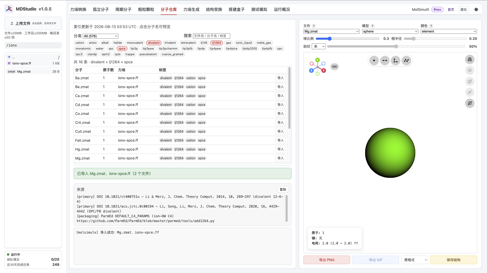
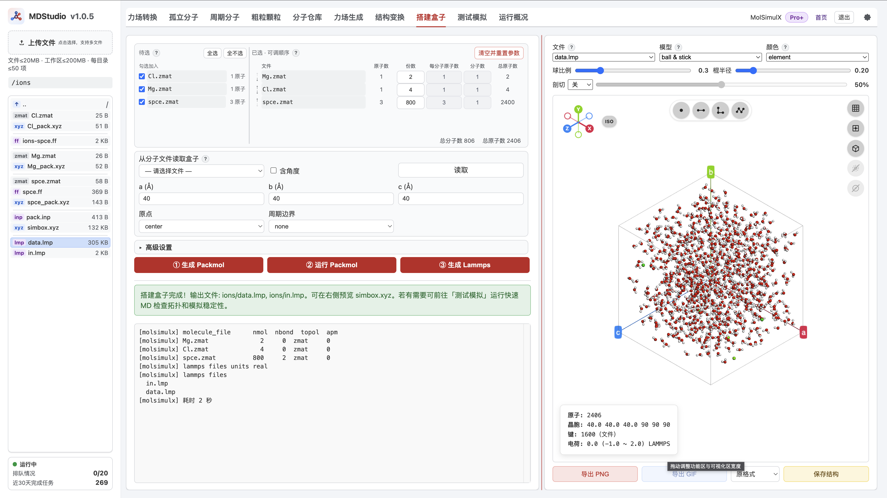

> **系列标签：** `实战案例` · `离子水合` · `lj1264` · `RDF` · `MDStudio`

金属离子周围第一、二水合壳怎么排布——**离子–氧距离（IOD）**、**配位数（CN）**、径向分布 $g_{\mathrm{ion\text{-}O}}(r)$——是电解质、酶活性中心与孔道输运的共同起点。经典 **12-6 LJ + 库仑** 对一价离子往往够用，但对 **Mg²⁺、Ca²⁺、过渡金属** 等，仅调 σ / ε 很难同时拟合水合自由能与第一壳几何；Li/Merz 等提出的 **12-6-4** 在 12-6 上再加 $-C_4/r^4$，显式补上电荷诱导偶极贡献。

本篇在 **MDStudio** 里从分子仓库导入 **SPC/E 水 + Li/Merz `lj1264` 离子**，搭一盒 MgCl₂ 水溶液，再在 LAMMPS 里用 **`hybrid/overlay` + table** 叠上 C4，用 $g_{\mathrm{Mg\text{-}Ow}}(r)$ / CN 读水合结构。节奏对齐 [COF膜-水体系短程模拟与可视化](C06-COF膜-水体系短程模拟与可视化.md) / [计算扩散与粘度](C03-计算扩散与粘度.md)：仓库导入 → 装盒 → 写表势 / 改脚本 → 跑 → Notebook 分析。

| 步骤 | 做什么 | 在哪做 |
|------|--------|--------|
| 1 | 导入 `spce` + `lj1264` 标签的 **Mg / Cl**（同为 `spce`） | [分子仓库](../../在线工具/00-MDStudio/M08-MDStudio分子仓库.md) |
| 2 | 搭盒：**2 Mg²⁺ + 4 Cl⁻ + 800 水** → ①②③（高级设置 **LJ 输出 = all**） | [搭建盒子](../../在线工具/00-MDStudio/M11-MDStudio搭建盒子.md) |
| 3 | 核对 `.ff` 行尾 **C4**；用 `simul_model.ipynb` 写 `C4_*.table`；改 `in.lmp` | 本机 Notebook + 编辑 |
| 4 | 最小化 → NVT/NPT 共 500 ps → NPT 生产 1 ns（500 帧 unwrap） | 本机 LAMMPS |
| 5 | 算 $g_{\mathrm{Mg\text{-}Ow}}(r)$ / $g_{\mathrm{Cl\text{-}Ow}}(r)$、第一峰位、配位数；导出水合壳 | `simul_analysis.ipynb` / MDAnalysis |

概念背景见 [轨迹分析与宏观性质](../00-知识文档/K16-轨迹分析与宏观性质.md)、[力场怎么选](../00-知识文档/K06-力场怎么选.md)。离子参数总览见 [Amber Ion Parameters](https://ambermd.org/AmberModels_ions.php)。


---

## 一、本例约定（读操作前扫一眼）

| 项 | 本例 |
|----|------|
| **课题** | 水溶液中 **Mg²⁺** 的第一水合壳结构（IOD / CN / RDF） |
| **水** | 分子仓库 **`spce`**（SPC/E） |
| **离子** | Li/Merz **12-6-4**：`lj1264` + `spce` 的 **Mg**、**Cl**（`ion/Li_Merz_1264_divalent/spce/`、`…/monvalent/spce/`） |
| **组成** | **2 Mg²⁺ + 4 Cl⁻ + 800 H₂O**（电中性；`data.lmp` type：1=Mg，2=Cl，3=Hw，4=Ow） |
| **势** | `lj/cut/coul/long` 12 Å + PPPM，再 overlay **Mg–Ow / Cl–Ow** 的 $-C_4/r^4$ 表势 |
| **平衡 / 生产** | NVT 100 ps + NPT 400 ps（共 **500 ps**）→ NPT **1 ns**；dump **500** 帧 `xsu ysu zsu` |
| **分析** | $g_{\mathrm{Mg\text{-}Ow}}(r)$ / $g_{\mathrm{Cl\text{-}Ow}}(r)$ 第一峰 → IOD；积分到第一谷 → CN；`_extract_hydrated_ions.py` 导出壳层 |

> **为什么选 Mg²⁺：** 二价离子是 12-6-4 最「用得上」的场景之一：纯 12-6 很难同时贴近实验 IOD 与水合自由能；加 C4 后文献参数（见下）对 SPC/E 等有成套表。

> **水与离子必须同标签：** 水体用 SPC/E，就只导入带 **`spce`** 的 `lj1264` 离子。不要混 `tip3p` 离子 + `spce` 水（见 [分子仓库](../../在线工具/00-MDStudio/M08-MDStudio分子仓库.md) 第七节）。

---

## 二、12-6-4 在说什么

非键势（示意，略去截断与长程库仑细节）：

$$
U_{ij}(r)=\frac{A_{ij}}{r^{12}}-\frac{B_{ij}}{r^{6}}-\frac{C_{4,ij}}{r^{4}}+\frac{q_i q_j}{4\pi\varepsilon_0 r}
$$

| 项 | 角色 |
|----|------|
| $r^{-12}$ / $r^{-6}$ | 短程排斥与色散（常规 LJ） |
| $r^{-4}$ | 近似**电荷–诱导偶极**；高价离子附近水的极化不可忽略时特别重要 |
| 库仑 | 显式点电荷；本例用 PPPM / `coul/long` |

仓库里带 **`lj1264`** 的 `.ff` 在 `ATOMS` 行把 **σ、ε** 写成常规 `lj` 列，把 **C4** 写在**行尾注释**（单位 **kcal·mol⁻¹·Å⁴**，与 Amber `frcmod.ions*lm_1264_*` 一致）。例如 SPC/E 下：

```text
Mg  Mg  24.305    2  lj   2.546…  0.087… # 122.2
Cl  Cl  35.453   -1  lj   3.836…  2.192… # -55
```

本例表势直接取行尾值写 **Mg–Ow**（$C_4=122.2$）、**Cl–Ow**（$C_4=-55$）。**当前 MDStudio 装盒 / 测试冒烟只消费 12-6 + 电荷**，不会自动写出 C4——须本机叠加。

- [Li & Merz, *J. Chem. Theory Comput.* 2014, 10, 289](https://doi.org/10.1021/ct400751u)（二价 12-6-4）  
- [Li et al., *J. Chem. Theory Comput.* 2015, 11, 1645](https://doi.org/10.1021/ct500918t)（一价）  
- [Li et al., *J. Phys. Chem. B* 2015, 119, 883](https://doi.org/10.1021/jp505875v)（高价）  

---

## 三、操作步骤（MDStudio）

### 1. 分子仓库：导入水与 `lj1264` 离子

打开 [MDStudio分子仓库](../../在线工具/00-MDStudio/M08-MDStudio分子仓库.md)：

1. 导入 **`spce`** → `spce.zmat` + `spce.ff`（**不必**再走力场生成）。  
2. 分类 **Ion**，标签勾选 **`lj1264`、`spce`**，再按需加 `divalent` / `monovalent`：  
   - 导入 **Mg** → `Mg.zmat` + 侧车 `ions-spce.ff`；  
   - 导入 **Cl** → `Cl.zmat`（若工作区已有 `ions-spce.ff`，仓库会**合并**缺的原子类型）。  
3. 点分子名看底部**来源**：应能看到 Li/Merz 12-6-4 与对应 Amber `frcmod` 线索。

确认当前文件夹里同时有水、Mg、Cl 的结构与力场后再搭盒。



### 2. 核对 `.ff` 里的 C4

在 [资源管理器](../../在线工具/00-MDStudio/M04-MDStudio资源管理器.md) **双击** `ions-spce.ff`：

- 表头应写明 **12-6-4**、目标水模型 **SPC/E**、文献 / DOI。  
- `ATOMS` 中 **Mg**、**Cl** 行末有 `# …` 形式的 C4（本例 **122.2** / **−55**）。  
- `spce.ff` 是三点水 12-6，没有离子那种 C4 注释；C4 加在**离子–水氧**表势上。

> **Tips：** 一价 / 二价目录下共享文件名常同为 `ions-spce.ff`，但库内内容不同。先导 Mg 再导 Cl 时依赖自动合并；参数不对时可删掉工作区 `ions-*.ff` 后按「先二价、再一价」重导，或直接用资源包文件。

### 3. 搭建盒子

打开 [MDStudio搭建盒子](../../在线工具/00-MDStudio/M11-MDStudio搭建盒子.md)：

1. 物种顺序：**`Mg.zmat`（2）→ `Cl.zmat`（4）→ `spce.zmat`（800）**（离子在前，type 顺序与后面 `pair_coeff` 一致）。  
2. 盒子：立方；本例装盒半宽约 **16.25 Å**（见资源包 `pack.inp`），正式跑前可用 NPT 把密度收到 ~1 g·cm⁻³。  
3. **高级设置 → LJ 输出规则选 `all`**：本例要在 LAMMPS 里对 **全部 I–J** 显式写 `pair_coeff`（再单独叠 C4）。选 `same` 往往只出对角项，交叉项靠 `pair_modify mix`；而 **`hybrid/overlay` 下混合不可靠**，缺 Mg–Ow / Cl–Ow 的 12-6 排斥时容易炸盒（`Out of range atoms - cannot compute PPPM`）。选 **`all`** 可把完整交叉表落到 `pair.lmp`（或你按同表手写进 `in.lmp`），再改成 overlay 脚本。  
4. **① 生成 Packmol** → **② 运行 Packmol** → **③ 生成 Lammps**，得到 `data.lmp`、平台版 `in.lmp` / `pair.lmp` 与 `simbox.xyz`。

体相溶液一般**不必**手改 `pack.inp` （与 [受限溶液建模](C01-受限溶液建模.md) 不同）。



### 4. 测试冒烟（可选）

[测试模拟](../../在线工具/00-MDStudio/M12-MDStudio测试模拟.md) 仍按**普通 12-6 + 截断库仑**冒烟，只确认拓扑、SHAKE、盒子没炸。  
**不要**把冒烟轨迹当成「已启用 12-6-4」。正式分析用资源包改过的本机 `in.lmp`。

### 5. 下载

打包下载工作区文件；后续以资源包中的 **`in.lmp`（含 C4 overlay）**、**`C4_*.table`** 与 **`simul_model.ipynb`** 为准。

---

## 四、写出 C4 表势并改 `in.lmp`

### 1. 平台默认缺了什么

③ 写出的脚本通常是 `lj/cut/coul/long` + 仅 ε、σ 的 `pair_coeff`，**等价于 C4 = 0**。`.ff` 行尾注释不会进 LAMMPS。

### 2. 用 `simul_model.ipynb` 生成 `name.table`

资源包提供 **`simul_model.ipynb`**：输入 **C4**、**cutoff**、**name** 等，写出 `{name}.table`。

$$
E(r)=-\frac{C_4}{r^4},\qquad F(r)=-\frac{\mathrm{d}E}{\mathrm{d}r}=-\frac{4C_4}{r^5}
$$

单位 **`units real`**：$C_4$ 为 **kcal·mol⁻¹·Å⁴**。本例已生成：

| 文件 | $C_4$ | 用途 |
|------|-------|------|
| `C4_Mg_Ow.table` | 122.2 | type 1–4（Mg–Ow） |
| `C4_Cl_Ow.table` | −55 | type 2–4（Cl–Ow） |

表内 section 名 **`C4_POT`**；`N 1000 R 0.5 12`（均匀 $r$ 网格，与 12 Å 截断对齐）。

### 3. `hybrid/overlay` 骨架（与资源包一致）

type：**1=Mg，2=Cl，3=Hw，4=Ow**。

```lammps
pair_style      hybrid/overlay &
                lj/cut/coul/long 12.0 12.0 &
                table linear 1000
pair_modify     shift yes
kspace_style    pppm  1.0e-5

# 须写齐全部 I–J（几何 ε + 算术 σ；与资源包 in.lmp 一致）
pair_coeff      1 1 lj/cut/coul/long   0.020934   2.546189   # Mg-Mg
pair_coeff      1 2 lj/cut/coul/long   0.104739   3.191199   # Mg-Cl
pair_coeff      1 3 lj/cut/coul/long   0.000000   1.273094   # Mg-Hw
pair_coeff      1 4 lj/cut/coul/long   0.057018   2.856094   # Mg-Ow
pair_coeff      2 2 lj/cut/coul/long   0.524046   3.836210   # Cl-Cl
pair_coeff      2 3 lj/cut/coul/long   0.000000   1.918105   # Cl-Hw
pair_coeff      2 4 lj/cut/coul/long   0.285279   3.501105   # Cl-Ow
pair_coeff      3 3 lj/cut/coul/long   0.000000   0.000000   # Hw-Hw
pair_coeff      3 4 lj/cut/coul/long   0.000000   1.583000   # Hw-Ow
pair_coeff      4 4 lj/cut/coul/long   0.155300   3.166000   # Ow-Ow

pair_coeff      1 4 table C4_Mg_Ow.table C4_POT
pair_coeff      2 4 table C4_Cl_Ow.table C4_POT
```

`fix shake` 约束 SPC/E 的 bond **1** 与 angle **1**（以 `data.lmp` 为准），与是否叠 C4 无关。

### 4. 跑不通时

| 现象                                         | 处理                                                                         |
| ------------------------------------------ | -------------------------------------------------------------------------- |
| `Unrecognized pair style`                  | 确认编译含 TABLE 等 package（见 [Lammps安装](../01-技术文档/T20-Lammps安装简明教程.md)）        |
| `Out of range atoms - cannot compute PPPM` | 检查是否写齐 Mg–Ow / Cl–Ow 的 **12-6**；`comm_modify cutoff` 略大于截断+skin；开局可先小步长预松弛 |
| 能量 NaN / 炸盒                                | 先确认无 table 的 12-6 基线可跑；再查表势短程与截断                                           |

---

## 五、`in.lmp` 关键设置

与资源包 `in.lmp` 对齐：

```text
读 data.lmp
  → hybrid/overlay：lj/cut/coul/long + C4 table
  → shake 水
  → 最小化 →（可选预松弛）→ NVT 100 ps + NPT 400 ps
  → NPT 生产 1 ns：dump 500 帧 unwrap（xsu ysu zsu）
```

| 段 | 本例 | 目的 |
|----|------|------|
| 最小化 | `minimize` | 消硬重叠 |
| NVT | 100 ps @ 298 K | 热化 |
| NPT | 400 ps @ 1 atm | 定密度（与 NVT 合计 **500 ps**） |
| 生产 | NPT **1 ns**；`dump_every = 2000`（1 fs 步长 → **500 帧**） | RDF |

要点：

- 温度 **298 K**（与常见离子参数化一致）。  
- 轨迹字段 **`xsu ysu zsu`**（unwrap）；分析 Mg–Ow RDF 够用。  
- thermo 看密度、温度、能量；NPT 段密度宜贴近 ~1 g·cm⁻³。

---

## 六、分析：水合结构

用资源包 **`simul_analysis.ipynb`** / MDAnalysis（见 [MDAnalysis轨迹分析入门](../01-技术文档/T22-MDAnalysis轨迹分析入门.md)、[轨迹分析与宏观性质](../00-知识文档/K16-轨迹分析与宏观性质.md)）。

### 1. 径向分布 $g_{\mathrm{Mg\text{-}Ow}}(r)$

以 Mg 为中心、水氧为配体：

| 量 | 读法 |
|----|------|
| **第一峰位置** | ≈ 文献 **IOD**（Mg–O 常约 2.0–2.1 Å 量级） |
| **第一峰高度** | 壳层有序程度（教学定性） |
| **第一谷 $r_{\min}$** | 第一壳外缘，作 CN 积分上限 |

### 2. 配位数

$$
\mathrm{CN}(r_{\min})=4\pi\rho\int_0^{r_{\min}} r^2 g(r)\,dr
$$

Mg²⁺ 第一壳 CN 文献上多为 **6** 左右（八面体）。若明显偏到 5 / 7，先查：是否忘了 C4、水模型是否匹配、生产段是否够长、有无 Mg–Cl 接触对干扰第一壳。

### 3. 结果怎么记

建议记录：水模型、组成（2 Mg / 4 Cl / 800 水）、IOD、CN、$r_{\min}$、生产时长；与 Li/Merz / Amber 离子页目标对照。教学短跑不要求自由能级精度。

---

## 七、讨论

### 1. 为什么 Web 装盒不直接写 C4？

12-6-4 的混合与引擎实现不完全统一；流水线先保证通用 **12-6 + 库仑**。C4 留在 `.ff` 注释里溯源，由本篇在 LAMMPS 侧显式叠加，避免「标签像 1264、实际仍是 126」。

### 2. 和 Joung–Cheatham 12-6 怎么选？

| 需求 | 更倾向 |
|------|--------|
| 一价碱金属 / 卤素，跟经典 SPC/E 教程走 | Joung–Cheatham **`lj126`** 往往足够 |
| 二价 / 高价，要同时看 IOD 与水合热力学 | Li/Merz **`lj1264`** |
| 只做冒烟 | 两者皆可；报水合结构前须说清用了哪种 |

同一文章里**不要**混用两套离子表。

### 3. 有限尺寸与浓度

本例 **2 Mg + 4 Cl + 800 水** 已能画第一壳；要更接近无限稀或减弱离子相关，需更大盒 / 更低浓度（见 [有限尺寸效应](../00-知识文档/K18-有限尺寸效应.md)）。本篇优先把 **C4 启用 + RDF 流程** 跑通。

---

## 常见问题

**Q：导入了 `lj1264`，测试模拟算不算用了 12-6-4？**  
A：不算。冒烟与默认 `in.lmp` 仍是 12-6。必须叠 C4 table（或改用原生支持 12-6-4 的引擎）。

**Q：`.ff` 行尾的数是 σ 还是 C4？**  
A：σ、ε 在 `lj` 后面两列；**`#` 之后**才是 C4。

**Q：为什么搭盒要选 LJ 输出 = all？**  
A：后面要用 `hybrid/overlay` 并**手写全部交叉 `pair_coeff`**。`all` 便于对照 / 抄全表；只靠 mix 容易在 overlay 下漏掉离子–Ow 的 12-6。

**Q：Cl 也要 C4 吗？**  
A：要。本例对 Cl–Ow 同样叠加 `C4_Cl_Ow.table`（$C_4=-55$）。

---

## 小结

1. 课题：水溶液 **Mg²⁺** 水合结构；力场亮点是仓库 **`lj1264`（Li/Merz 12-6-4）**。  
2. 组成：**2 Mg²⁺ + 4 Cl⁻ + 800 SPC/E**；搭盒时 **LJ 输出 = all**。  
3. 用 **`simul_model.ipynb`** 写 `C4_*.table`；`in.lmp` 用 **`hybrid/overlay` + `table linear 1000`**，并写齐全部 LJ 交叉项。  
4. 平衡 **500 ps** → 生产 **1 ns**、**500** 帧 unwrap → $g_{\mathrm{Mg\text{-}Ow}}$ / CN。  
5. 水与离子**同一水模型标签**；冒烟 ≠ 已启用 12-6-4。

---

## 资源下载

**资源包文件名：** `离子水合结构与lj1264力场.zip`

| 文件 | 说明 |
|------|------|
| `spce.zmat` / `spce.ff` | SPC/E |
| `Mg.zmat` / `Cl.zmat` / `ions-spce.ff` | Li/Merz 12-6-4（spce） |
| `pack.inp` / `simbox.xyz` / `data.lmp` | 装盒产物（2 Mg + 4 Cl + 800 水） |
| `in.lmp` | 含 C4 overlay 的生产脚本 |
| `C4_Mg_Ow.table` / `C4_Cl_Ow.table` | 离子–Ow 表势 |
| `simul_model.ipynb` | 由 C4 / cutoff / name 生成 `{name}.table` |
| `simul_analysis.ipynb` / `_helper_functions.py` | RDF / CN 等后处理 |
| `log.lammps` 等 | 样例输出（轨迹过大可不打包） |

---

## 学习路径

**前置**

- [MDStudio分子仓库](../../在线工具/00-MDStudio/M08-MDStudio分子仓库.md)（第七节离子与 `lj1264`）
- [MDStudio搭建盒子](../../在线工具/00-MDStudio/M11-MDStudio搭建盒子.md)
- [轨迹分析与宏观性质](../00-知识文档/K16-轨迹分析与宏观性质.md)
- [MDAnalysis轨迹分析入门](../01-技术文档/T22-MDAnalysis轨迹分析入门.md)
- [Lammps安装简明教程](../01-技术文档/T20-Lammps安装简明教程.md)

**相关**

- [COF膜-水体系短程模拟与可视化](C06-COF膜-水体系短程模拟与可视化.md)（仓库离子 + 水的装盒节奏）
- [计算扩散与粘度](C03-计算扩散与粘度.md)（Notebook 后处理节奏）
- [力场怎么选](../00-知识文档/K06-力场怎么选.md)
